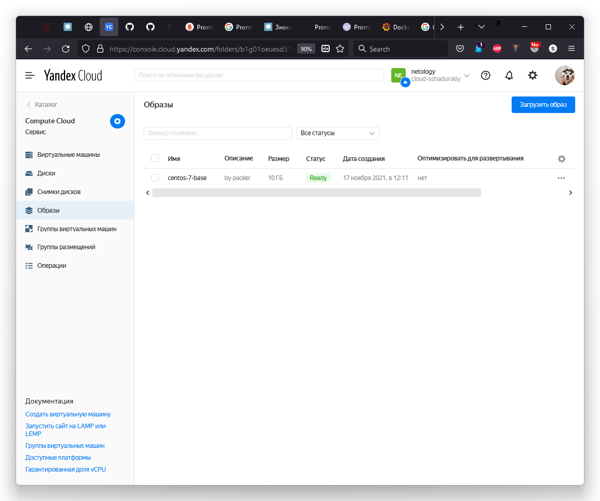
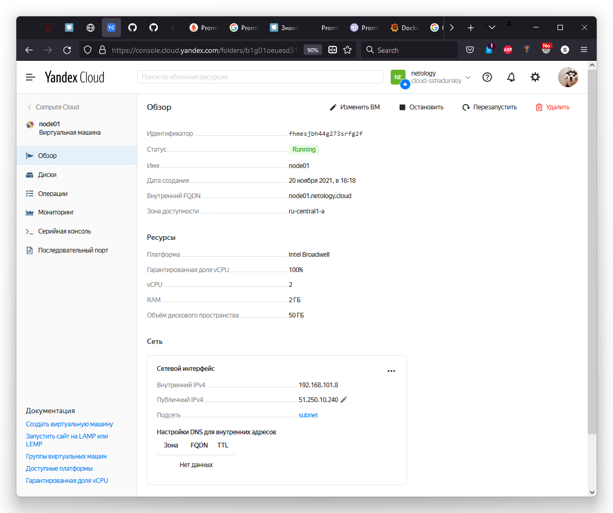
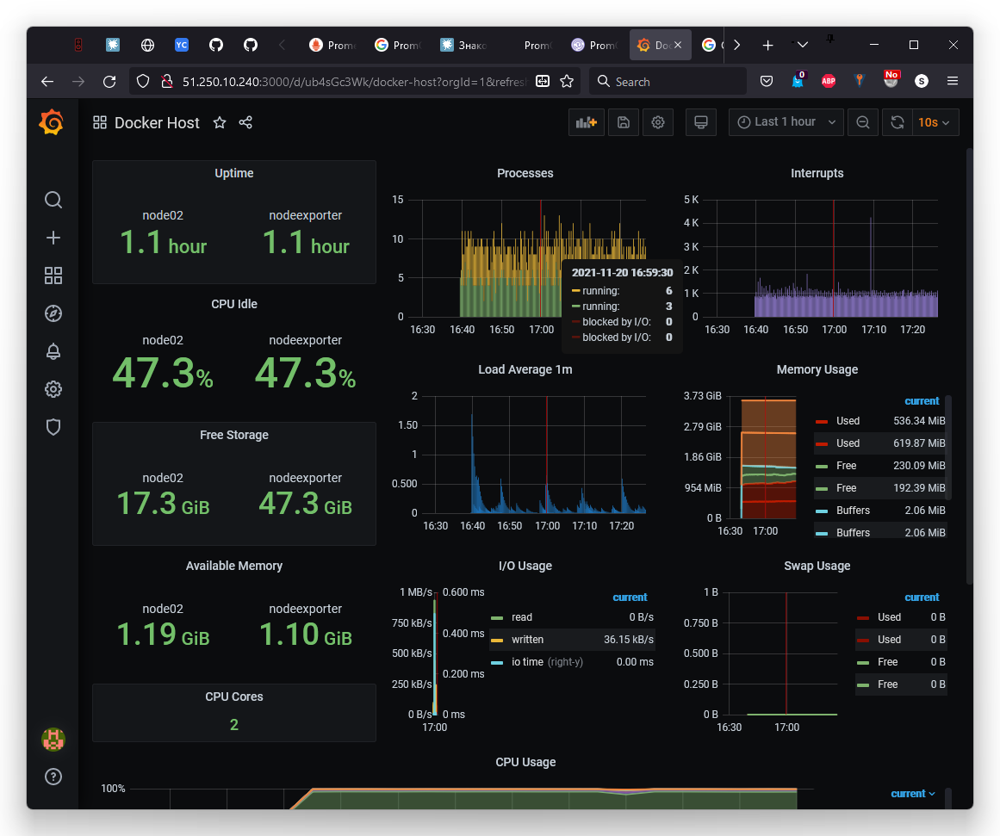

devops-netology
===============

# Домашнее задание к занятию "5.4. Оркестрация группой Docker контейнеров на примере Docker Compose"

## Задача 1

<details>
<summary>.</summary>

> Создать собственный образ операционной системы с помощью Packer.
> 
> Для получения зачета, вам необходимо предоставить:
> - Скриншот страницы, как на слайде из презентации (слайд 37).

</details>



## Задача 2

<details>
<summary>.</summary>

> Создать вашу первую виртуальную машину в Яндекс.Облаке.
> 
> Для получения зачета, вам необходимо предоставить:
> - Скриншот страницы свойств созданной ВМ, как на примере ниже:
> 
> <p align="center">
>   
> </p>

</details>



## Задача 3

<details>
<summary>.</summary>

> Создать ваш первый готовый к боевой эксплуатации компонент мониторинга, состоящий из стека микросервисов.
> 
> Для получения зачета, вам необходимо предоставить:
> - Скриншот работающего веб-интерфейса Grafana с текущими метриками, как на примере ниже
> <p align="center">
>   
> </p>

</details>


## Задача 4 (*)

<details>
<summary>.</summary>

> Создать вторую ВМ и подключить её к мониторингу развёрнутому на первом сервере.
> 
> Для получения зачета, вам необходимо предоставить:
> - Скриншот из Grafana, на котором будут отображаться метрики добавленного вами сервера.

</details>



Чтобы добавить в мониторинг вторую ноду, потребовалось:

- Поправить `prometheus.yml` на `node01`, добавить `basic_auth` и второй `target`
  ```yaml
  scrape_configs:
    - job_name: 'nodeexporter'
      scrape_interval: 5s
      basic_auth:
        username: admin
        password: admin
      static_configs:
        - targets: ['nodeexporter:9100']
        - targets: ['node02:9100']
  ```
- Поправить `Caddyfile` на `node02`, добавить прокси порта `node_exporter`
  ```
  ...
  :9100 {
      basicauth / {$ADMIN_USER} {$ADMIN_PASSWORD}
      proxy / nodeexporter:9100 {
              transparent
          }
  
      errors stderr
      tls off
  }
  ...
  ```
- Поправить `docker-compose.yaml` на `node02`, добавить проброс порта `9100`
  ```yaml
  ...
    caddy:
      image: stefanprodan/caddy
      container_name: caddy
      ports:
        ...
        - "0.0.0.0:9100:9100"
  ...
  ```
- Изменить графики в `Grafana`: выбрать другие типы визуализации, добавить `{{instance}}` в Legend, где-то поправить фильтры, например `sum by(instance)(...)` вместо `sum(...)`
