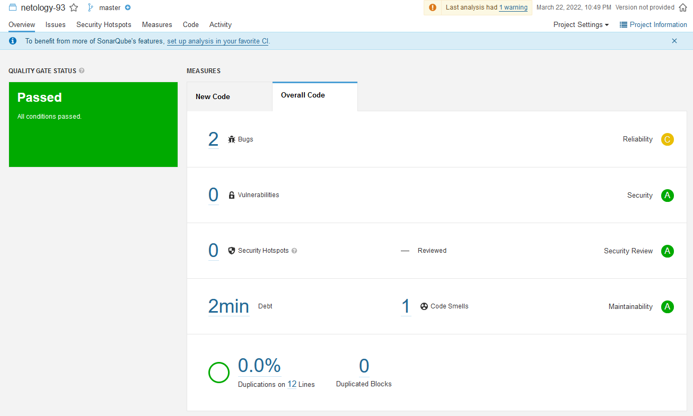
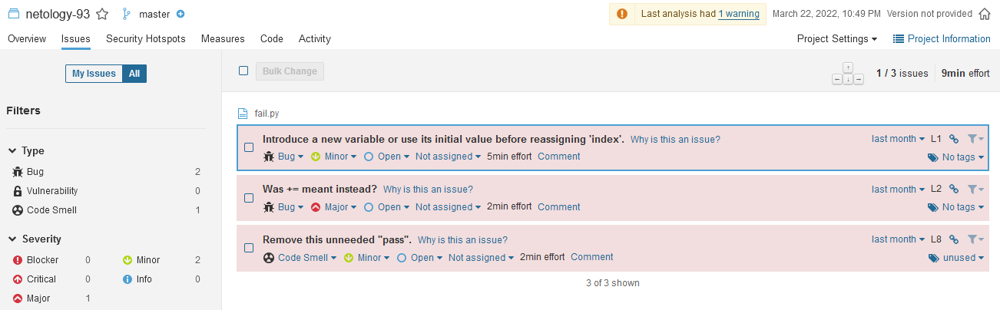
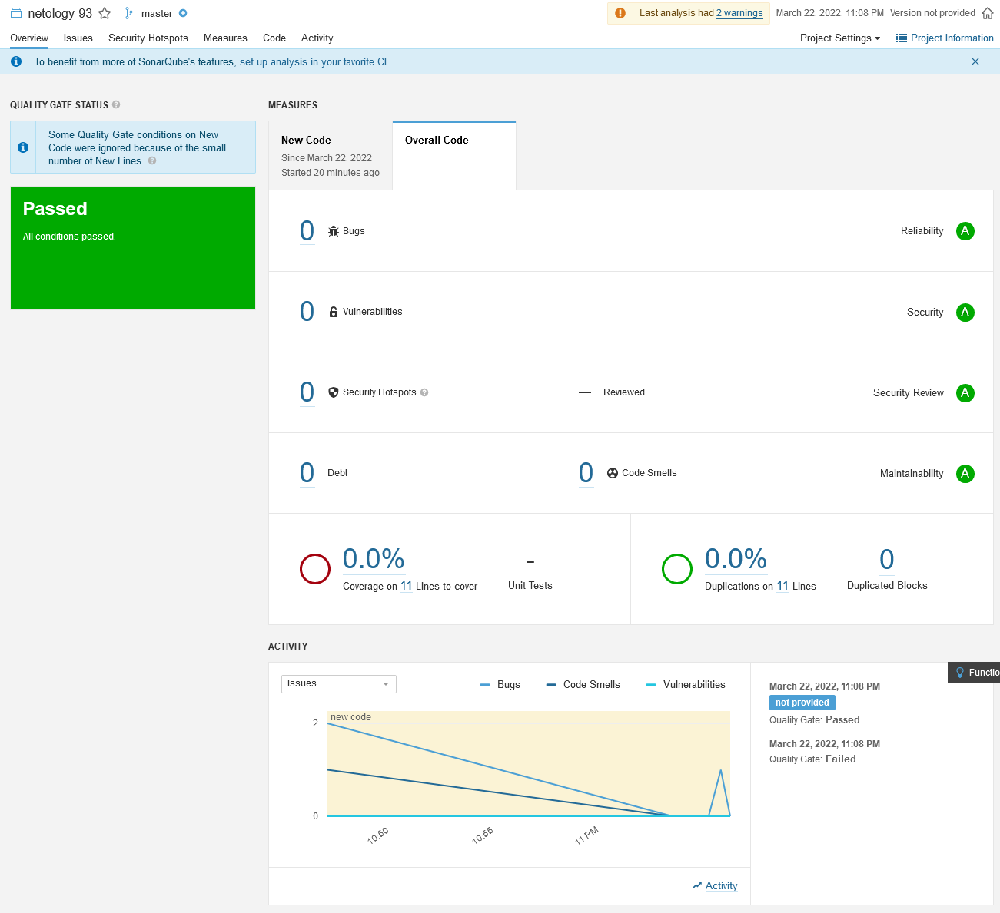
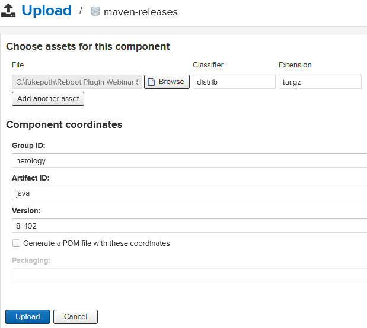
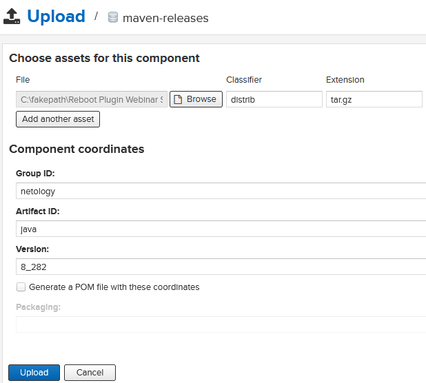
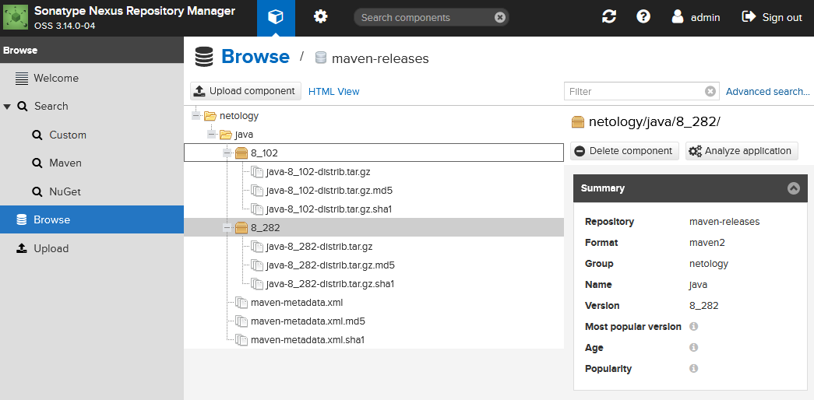

devops-netology
===============

# Домашнее задание к занятию "09.03 CI\CD"

</details>  

## Подготовка к выполнению

<details><summary>.</summary>

1. Создаём 2 VM в yandex cloud со следующими параметрами: 2CPU 4RAM Centos7(остальное по минимальным требованиям)
2. Прописываем в [inventory](./infrastructure/inventory/cicd/hosts.yml) [playbook'a](./infrastructure/site.yml) созданные хосты
3. Добавляем в [files](./infrastructure/files/) файл со своим публичным ключом (id_rsa.pub). Если ключ называется иначе - найдите таску в плейбуке, которая использует id_rsa.pub имя и исправьте на своё
4. Запускаем playbook, ожидаем успешного завершения
5. Проверяем готовность Sonarqube через [браузер](http://localhost:9000)
6. Заходим под admin\admin, меняем пароль на свой
7.  Проверяем готовность Nexus через [бразуер](http://localhost:8081)
8. Подключаемся под admin\admin123, меняем пароль, сохраняем анонимный доступ

</details>  

## Знакомоство с SonarQube

<details><summary>.</summary>

### Основная часть

1. Создаём новый проект, название произвольное
2. Скачиваем пакет sonar-scanner, который нам предлагает скачать сам sonarqube
3. Делаем так, чтобы binary был доступен через вызов в shell (или меняем переменную PATH или любой другой удобный вам способ)
4. Проверяем `sonar-scanner --version`
   ```log
   22:39:04 ~ sergey@Netangels-CSVM:~/Downloads/sonar-scanner-4.7.0.2747-linux/bin
   $ sonar-scanner --version
   INFO: Scanner configuration file: /home/sergey/Downloads/sonar-scanner-4.7.0.2747-linux/conf/sonar-scanner.properties
   INFO: Project root configuration file: NONE
   INFO: SonarScanner 4.7.0.2747
   INFO: Java 11.0.14.1 Eclipse Adoptium (64-bit)
   INFO: Linux 4.19.0-18-amd64 amd64
   ```
5. Запускаем анализатор против кода из директории [example](./example) с дополнительным ключом `-Dsonar.coverage.exclusions=fail.py`
   ```log
   $ sonar-scanner \
   ctKey=n>   -Dsonar.projectKey=netology-93 \
   Dsonar.>   -Dsonar.sources=. \
   sonar.h>   -Dsonar.host.url=http://51.250.67.88:9000 \
   >   -Dsonar.login=27ec8b753de62e3c33489fda0469ff5faf66b071 \
   >   -Dsonar.coverage.exclusions=fail.py
   INFO: Scanner configuration file: /home/sergey/Downloads/sonar-scanner-4.7.0.2747-linux/conf/sonar-scanner.properties
   INFO: Project root configuration file: NONE
   INFO: SonarScanner 4.7.0.2747
   INFO: Java 11.0.14.1 Eclipse Adoptium (64-bit)
   INFO: Linux 4.19.0-18-amd64 amd64
   INFO: User cache: /home/sergey/.sonar/cache
   INFO: Scanner configuration file: /home/sergey/Downloads/sonar-scanner-4.7.0.2747-linux/conf/sonar-scanner.properties
   INFO: Project root configuration file: NONE
   INFO: Analyzing on SonarQube server 9.1.0
   INFO: Default locale: "en_US", source code encoding: "UTF-8" (analysis is platform dependent)
   INFO: Load global settings
   INFO: Load global settings (done) | time=171ms
   INFO: Server id: 9CFC3560-AX-yYc0zWmjA1HwaageJ
   INFO: User cache: /home/sergey/.sonar/cache
   INFO: Load/download plugins
   INFO: Load plugins index
   INFO: Load plugins index (done) | time=85ms
   INFO: Load/download plugins (done) | time=186ms
   INFO: Process project properties
   INFO: Process project properties (done) | time=10ms
   INFO: Execute project builders
   INFO: Execute project builders (done) | time=2ms
   INFO: Project key: netology-93
   INFO: Base dir: /home/sergey/git/devops-netology/03-mnt-homeworks/09-ci-03-cicd/example
   INFO: Working dir: /home/sergey/git/devops-netology/03-mnt-homeworks/09-ci-03-cicd/example/.scannerwork
   INFO: Load project settings for component key: 'netology-93'
   INFO: Load project settings for component key: 'netology-93' (done) | time=40ms
   INFO: Load quality profiles
   INFO: Load quality profiles (done) | time=103ms
   INFO: Load active rules
   INFO: Load active rules (done) | time=2407ms
   INFO: Indexing files...
   INFO: Project configuration:
   INFO:   Excluded sources for coverage: fail.py
   INFO: 1 file indexed
   INFO: 0 files ignored because of scm ignore settings
   INFO: Quality profile for py: Sonar way
   INFO: ------------- Run sensors on module netology-93
   INFO: Load metrics repository
   INFO: Load metrics repository (done) | time=55ms
   INFO: Sensor Python Sensor [python]
   WARN: Your code is analyzed as compatible with python 2 and 3 by default. This will prevent the detection of issues specific to python 2 or python 3. You can get a more precise analysis by setting a python version in your configuration via the parameter "sonar.python.version"
   INFO: Starting global symbols computation
   INFO: 1 source file to be analyzed
   INFO: Load project repositories
   INFO: Load project repositories (done) | time=40ms
   INFO: 1/1 source file has been analyzed
   INFO: Starting rules execution
   INFO: 1 source file to be analyzed
   INFO: 1/1 source file has been analyzed
   INFO: Sensor Python Sensor [python] (done) | time=955ms
   INFO: Sensor Cobertura Sensor for Python coverage [python]
   INFO: Sensor Cobertura Sensor for Python coverage [python] (done) | time=10ms
   INFO: Sensor PythonXUnitSensor [python]
   INFO: Sensor PythonXUnitSensor [python] (done) | time=1ms
   INFO: Sensor CSS Rules [cssfamily]
   INFO: No CSS, PHP, HTML or VueJS files are found in the project. CSS analysis is skipped.
   INFO: Sensor CSS Rules [cssfamily] (done) | time=1ms
   INFO: Sensor JaCoCo XML Report Importer [jacoco]
   INFO: 'sonar.coverage.jacoco.xmlReportPaths' is not defined. Using default locations: target/site/jacoco/jacoco.xml,target/site/jacoco-it/jacoco.xml,build/reports/jacoco/test/jacocoTestReport.xml
   INFO: No report imported, no coverage information will be imported by JaCoCo XML Report Importer
   INFO: Sensor JaCoCo XML Report Importer [jacoco] (done) | time=4ms
   INFO: Sensor C# Project Type Information [csharp]
   INFO: Sensor C# Project Type Information [csharp] (done) | time=1ms
   INFO: Sensor C# Analysis Log [csharp]
   INFO: Sensor C# Analysis Log [csharp] (done) | time=17ms
   INFO: Sensor C# Properties [csharp]
   INFO: Sensor C# Properties [csharp] (done) | time=1ms
   INFO: Sensor JavaXmlSensor [java]
   INFO: Sensor JavaXmlSensor [java] (done) | time=1ms
   INFO: Sensor HTML [web]
   INFO: Sensor HTML [web] (done) | time=4ms
   INFO: Sensor VB.NET Project Type Information [vbnet]
   INFO: Sensor VB.NET Project Type Information [vbnet] (done) | time=1ms
   INFO: Sensor VB.NET Analysis Log [vbnet]
   INFO: Sensor VB.NET Analysis Log [vbnet] (done) | time=17ms
   INFO: Sensor VB.NET Properties [vbnet]
   INFO: Sensor VB.NET Properties [vbnet] (done) | time=1ms
   INFO: ------------- Run sensors on project
   INFO: Sensor Zero Coverage Sensor
   INFO: Sensor Zero Coverage Sensor (done) | time=0ms
   INFO: SCM Publisher SCM provider for this project is: git
   INFO: SCM Publisher 1 source file to be analyzed
   INFO: SCM Publisher 1/1 source file have been analyzed (done) | time=230ms
   INFO: CPD Executor Calculating CPD for 1 file
   INFO: CPD Executor CPD calculation finished (done) | time=9ms
   INFO: Analysis report generated in 104ms, dir size=103.1 kB
   INFO: Analysis report compressed in 46ms, zip size=14.3 kB
   INFO: Analysis report uploaded in 74ms
   INFO: ANALYSIS SUCCESSFUL, you can browse http://51.250.67.88:9000/dashboard?id=netology-93
   INFO: Note that you will be able to access the updated dashboard once the server has processed the submitted analysis report
   INFO: More about the report processing at http://51.250.67.88:9000/api/ce/task?id=AX-yv5jPWmjA1Hwaaljl
   INFO: Analysis total time: 6.525 s
   INFO: ------------------------------------------------------------------------
   INFO: EXECUTION SUCCESS
   INFO: ------------------------------------------------------------------------
   INFO: Total time: 8.165s
   INFO: Final Memory: 8M/30M
   INFO: ------------------------------------------------------------------------
   ```
6. Смотрим результат в интерфейсе
   
   
7. Исправляем ошибки, которые он выявил(включая warnings)
   ```py
   def increment(param):
      param += 1
      return param
   def get_square(numb):
      return numb*numb
   def print_numb(numb):
      print("Number is {}".format(numb))

   index = 0
   while (index < 10):
      index = increment(index)
      print(get_square(index))
   ```
8. Запускаем анализатор повторно - проверяем, что QG пройдены успешно

</details>  

# 9. Делаем скриншот успешного прохождения анализа, прикладываем к решению ДЗ
   

## Знакомство с Nexus

### Основная часть

<details><summary>.</summary>

1. В репозиторий `maven-public` загружаем артефакт с GAV параметрами:
   1. groupId: netology
   2. artifactId: java
   3. version: 8_282
   4. classifier: distrib
   5. type: tar.gz
   
2. В него же загружаем такой же артефакт, но с version: 8_102
   
3. Проверяем, что все файлы загрузились успешно
   

</details>

#### 4. В ответе присылаем файл `maven-metadata.xml` для этого артефекта

[maven-metadata.xml](media/maven-metadata.xml)

### Знакомство с Maven

### Подготовка к выполнению

1. Скачиваем дистрибутив с [maven](https://maven.apache.org/download.cgi)
2. Разархивируем, делаем так, чтобы binary был доступен через вызов в shell (или меняем переменную PATH или любой другой удобный вам способ)
3. Удаляем из `apache-maven-<version>/conf/settings.xml` упоминание о правиле, отвергающем http соединение( раздел mirrors->id: my-repository-http-unblocker)
4. Проверяем `mvn --version`
5. Забираем директорию [mvn](./mvn) с pom

### Основная часть

1. Меняем в `pom.xml` блок с зависимостями под наш артефакт из первого пункта задания для Nexus (java с версией 8_282)
2. Запускаем команду `mvn package` в директории с `pom.xml`, ожидаем успешного окончания
3. Проверяем директорию `~/.m2/repository/`, находим наш артефакт
4. В ответе присылаем исправленный файл `pom.xml`

