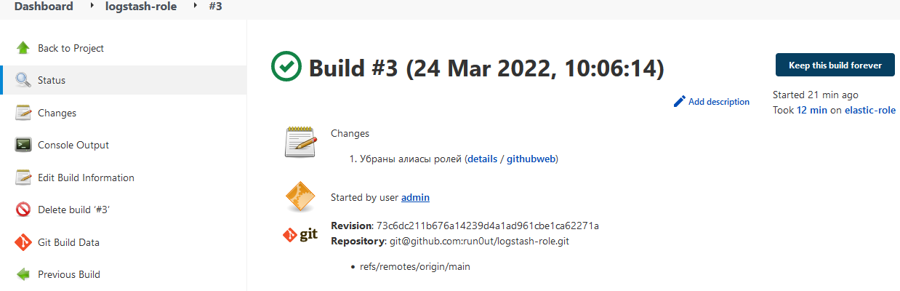

devops-netology
===============

# Домашнее задание к занятию "09.04 Jenkins"

</details>  

## Подготовка к выполнению

<details><summary>.</summary>

1. Создать 2 VM: для jenkins-master и jenkins-agent.
2. Установить jenkins при помощи playbook'a.
3. Запустить и проверить работоспособность.
4. Сделать первоначальную настройку.

</details>  

## Основная часть

<!-- <details><summary>.</summary> -->

1. Сделать Freestyle Job, который будет запускать `molecule test` из любого вашего репозитория с ролью.

    
    - <details><summary>Скриншот настроек проекта</summary>

        

      </details>

    - Скриншот успешного выполнения тестирования
        

    - <details><summary>Лог</summary>

        ```log
        Started by user admin
        Running as SYSTEM
        Building remotely on elastic-role (linux centos ansible docker) in workspace /opt/jenkins_agent/workspace/logstash-role
        [WS-CLEANUP] Deleting project workspace...
        [WS-CLEANUP] Deferred wipeout is used...
        [WS-CLEANUP] Done
        The recommended git tool is: NONE
        using credential 0b54df1a-ee4b-40da-b8bb-a70fcf46e73f
        Cloning the remote Git repository
        Cloning repository git@github.com:run0ut/logstash-role.git
        > git init /opt/jenkins_agent/workspace/logstash-role # timeout=10
        Fetching upstream changes from git@github.com:run0ut/logstash-role.git
        > git --version # timeout=10
        > git --version # 'git version 1.8.3.1'
        using GIT_SSH to set credentials 
        [INFO] Currently running in a labeled security context
        [INFO] Currently SELinux is 'enforcing' on the host
        > /usr/bin/chcon --type=ssh_home_t /opt/jenkins_agent/workspace/logstash-role@tmp/jenkins-gitclient-ssh9952867966923783546.key
        > git fetch --tags --progress git@github.com:run0ut/logstash-role.git +refs/heads/*:refs/remotes/origin/* # timeout=10
        > git config remote.origin.url git@github.com:run0ut/logstash-role.git # timeout=10
        > git config --add remote.origin.fetch +refs/heads/*:refs/remotes/origin/* # timeout=10
        Avoid second fetch
        > git rev-parse refs/remotes/origin/main^{commit} # timeout=10
        Checking out Revision 73c6dc211b676a14239d4a1ad961cbe1ca62271a (refs/remotes/origin/main)
        > git config core.sparsecheckout # timeout=10
        > git checkout -f 73c6dc211b676a14239d4a1ad961cbe1ca62271a # timeout=10
        Commit message: "Убраны алиасы ролей"
        > git rev-list --no-walk 68ef278238efadfad1f6583d2aa18b06df7c6619 # timeout=10
        [logstash-role] $ /bin/sh -xe /tmp/jenkins706845719141414921.sh
        + pip3 install -r test-requirements.txt
        Defaulting to user installation because normal site-packages is not writeable
        Requirement already satisfied: molecule==3.6.1 in /home/jenkins/.local/lib/python3.6/site-packages (from -r test-requirements.txt (line 1)) (3.6.1)
        Requirement already satisfied: molecule_docker in /home/jenkins/.local/lib/python3.6/site-packages (from -r test-requirements.txt (line 2)) (1.1.0)
        Requirement already satisfied: molecule_podman in /home/jenkins/.local/lib/python3.6/site-packages (from -r test-requirements.txt (line 3)) (1.1.0)
        Requirement already satisfied: docker in /home/jenkins/.local/lib/python3.6/site-packages (from -r test-requirements.txt (line 4)) (5.0.3)
        Requirement already satisfied: ansible-lint in /home/jenkins/.local/lib/python3.6/site-packages (from -r test-requirements.txt (line 5)) (5.4.0)
        Requirement already satisfied: yamllint in /home/jenkins/.local/lib/python3.6/site-packages (from -r test-requirements.txt (line 6)) (1.26.3)
        Requirement already satisfied: packaging in /usr/local/lib/python3.6/site-packages (from molecule==3.6.1->-r test-requirements.txt (line 1)) (21.3)
        Requirement already satisfied: click-help-colors>=0.9 in /home/jenkins/.local/lib/python3.6/site-packages (from molecule==3.6.1->-r test-requirements.txt (line 1)) (0.9.1)
        Requirement already satisfied: importlib-metadata in /home/jenkins/.local/lib/python3.6/site-packages (from molecule==3.6.1->-r test-requirements.txt (line 1)) (4.8.3)
        Requirement already satisfied: ansible-compat>=1.0.0 in /home/jenkins/.local/lib/python3.6/site-packages (from molecule==3.6.1->-r test-requirements.txt (line 1)) (1.0.0)
        Requirement already satisfied: rich>=9.5.1 in /home/jenkins/.local/lib/python3.6/site-packages (from molecule==3.6.1->-r test-requirements.txt (line 1)) (12.0.1)
        Requirement already satisfied: cookiecutter>=1.7.3 in /home/jenkins/.local/lib/python3.6/site-packages (from molecule==3.6.1->-r test-requirements.txt (line 1)) (1.7.3)
        Requirement already satisfied: enrich>=1.2.7 in /home/jenkins/.local/lib/python3.6/site-packages (from molecule==3.6.1->-r test-requirements.txt (line 1)) (1.2.7)
        Requirement already satisfied: paramiko<3,>=2.5.0 in /home/jenkins/.local/lib/python3.6/site-packages (from molecule==3.6.1->-r test-requirements.txt (line 1)) (2.10.3)
        Requirement already satisfied: cerberus!=1.3.3,!=1.3.4,>=1.3.1 in /home/jenkins/.local/lib/python3.6/site-packages (from molecule==3.6.1->-r test-requirements.txt (line 1)) (1.3.2)
        Requirement already satisfied: PyYAML>=5.1 in /usr/local/lib64/python3.6/site-packages (from molecule==3.6.1->-r test-requirements.txt (line 1)) (6.0)
        Requirement already satisfied: dataclasses in /home/jenkins/.local/lib/python3.6/site-packages (from molecule==3.6.1->-r test-requirements.txt (line 1)) (0.8)
        Requirement already satisfied: pluggy<2.0,>=0.7.1 in /home/jenkins/.local/lib/python3.6/site-packages (from molecule==3.6.1->-r test-requirements.txt (line 1)) (1.0.0)
        Requirement already satisfied: Jinja2>=2.11.3 in /usr/local/lib/python3.6/site-packages (from molecule==3.6.1->-r test-requirements.txt (line 1)) (3.0.3)
        Requirement already satisfied: click<9,>=8.0 in /home/jenkins/.local/lib/python3.6/site-packages (from molecule==3.6.1->-r test-requirements.txt (line 1)) (8.0.4)
        Requirement already satisfied: requests in /home/jenkins/.local/lib/python3.6/site-packages (from molecule_docker->-r test-requirements.txt (line 2)) (2.27.1)
        Requirement already satisfied: selinux in /usr/local/lib/python3.6/site-packages (from molecule_docker->-r test-requirements.txt (line 2)) (0.2.1)
        Requirement already satisfied: websocket-client>=0.32.0 in /home/jenkins/.local/lib/python3.6/site-packages (from docker->-r test-requirements.txt (line 4)) (1.3.1)
        Requirement already satisfied: tenacity in /home/jenkins/.local/lib/python3.6/site-packages (from ansible-lint->-r test-requirements.txt (line 5)) (8.0.1)
        Requirement already satisfied: wcmatch>=7.0 in /home/jenkins/.local/lib/python3.6/site-packages (from ansible-lint->-r test-requirements.txt (line 5)) (8.3)
        Requirement already satisfied: ruamel.yaml<1,>=0.15.34 in /home/jenkins/.local/lib/python3.6/site-packages (from ansible-lint->-r test-requirements.txt (line 5)) (0.17.21)
        Requirement already satisfied: typing-extensions in /home/jenkins/.local/lib/python3.6/site-packages (from ansible-lint->-r test-requirements.txt (line 5)) (4.1.1)
        Requirement already satisfied: pathspec>=0.5.3 in /home/jenkins/.local/lib/python3.6/site-packages (from yamllint->-r test-requirements.txt (line 6)) (0.9.0)
        Requirement already satisfied: setuptools in /usr/local/lib/python3.6/site-packages (from yamllint->-r test-requirements.txt (line 6)) (59.6.0)
        Requirement already satisfied: subprocess-tee>=0.3.5 in /home/jenkins/.local/lib/python3.6/site-packages (from ansible-compat>=1.0.0->molecule==3.6.1->-r test-requirements.txt (line 1)) (0.3.5)
        Requirement already satisfied: cached-property~=1.5 in /home/jenkins/.local/lib/python3.6/site-packages (from ansible-compat>=1.0.0->molecule==3.6.1->-r test-requirements.txt (line 1)) (1.5.2)
        Requirement already satisfied: poyo>=0.5.0 in /home/jenkins/.local/lib/python3.6/site-packages (from cookiecutter>=1.7.3->molecule==3.6.1->-r test-requirements.txt (line 1)) (0.5.0)
        Requirement already satisfied: jinja2-time>=0.2.0 in /home/jenkins/.local/lib/python3.6/site-packages (from cookiecutter>=1.7.3->molecule==3.6.1->-r test-requirements.txt (line 1)) (0.2.0)
        Requirement already satisfied: six>=1.10 in /home/jenkins/.local/lib/python3.6/site-packages (from cookiecutter>=1.7.3->molecule==3.6.1->-r test-requirements.txt (line 1)) (1.16.0)
        Requirement already satisfied: python-slugify>=4.0.0 in /home/jenkins/.local/lib/python3.6/site-packages (from cookiecutter>=1.7.3->molecule==3.6.1->-r test-requirements.txt (line 1)) (6.1.1)
        Requirement already satisfied: binaryornot>=0.4.4 in /home/jenkins/.local/lib/python3.6/site-packages (from cookiecutter>=1.7.3->molecule==3.6.1->-r test-requirements.txt (line 1)) (0.4.4)
        Requirement already satisfied: MarkupSafe>=2.0 in /usr/local/lib64/python3.6/site-packages (from Jinja2>=2.11.3->molecule==3.6.1->-r test-requirements.txt (line 1)) (2.0.1)
        Requirement already satisfied: pynacl>=1.0.1 in /home/jenkins/.local/lib/python3.6/site-packages (from paramiko<3,>=2.5.0->molecule==3.6.1->-r test-requirements.txt (line 1)) (1.5.0)
        Requirement already satisfied: cryptography>=2.5 in /usr/local/lib64/python3.6/site-packages (from paramiko<3,>=2.5.0->molecule==3.6.1->-r test-requirements.txt (line 1)) (36.0.2)
        Requirement already satisfied: bcrypt>=3.1.3 in /home/jenkins/.local/lib/python3.6/site-packages (from paramiko<3,>=2.5.0->molecule==3.6.1->-r test-requirements.txt (line 1)) (3.2.0)
        Requirement already satisfied: zipp>=0.5 in /home/jenkins/.local/lib/python3.6/site-packages (from importlib-metadata->molecule==3.6.1->-r test-requirements.txt (line 1)) (3.6.0)
        Requirement already satisfied: certifi>=2017.4.17 in /home/jenkins/.local/lib/python3.6/site-packages (from requests->molecule_docker->-r test-requirements.txt (line 2)) (2021.10.8)
        Requirement already satisfied: urllib3<1.27,>=1.21.1 in /home/jenkins/.local/lib/python3.6/site-packages (from requests->molecule_docker->-r test-requirements.txt (line 2)) (1.26.9)
        Requirement already satisfied: charset-normalizer~=2.0.0 in /home/jenkins/.local/lib/python3.6/site-packages (from requests->molecule_docker->-r test-requirements.txt (line 2)) (2.0.12)
        Requirement already satisfied: idna<4,>=2.5 in /home/jenkins/.local/lib/python3.6/site-packages (from requests->molecule_docker->-r test-requirements.txt (line 2)) (3.3)
        Requirement already satisfied: pygments<3.0.0,>=2.6.0 in /home/jenkins/.local/lib/python3.6/site-packages (from rich>=9.5.1->molecule==3.6.1->-r test-requirements.txt (line 1)) (2.11.2)
        Requirement already satisfied: commonmark<0.10.0,>=0.9.0 in /home/jenkins/.local/lib/python3.6/site-packages (from rich>=9.5.1->molecule==3.6.1->-r test-requirements.txt (line 1)) (0.9.1)
        Requirement already satisfied: ruamel.yaml.clib>=0.2.6 in /home/jenkins/.local/lib/python3.6/site-packages (from ruamel.yaml<1,>=0.15.34->ansible-lint->-r test-requirements.txt (line 5)) (0.2.6)
        Requirement already satisfied: bracex>=2.1.1 in /home/jenkins/.local/lib/python3.6/site-packages (from wcmatch>=7.0->ansible-lint->-r test-requirements.txt (line 5)) (2.2.1)
        Requirement already satisfied: pyparsing!=3.0.5,>=2.0.2 in /usr/local/lib/python3.6/site-packages (from packaging->molecule==3.6.1->-r test-requirements.txt (line 1)) (3.0.7)
        Requirement already satisfied: distro>=1.3.0 in /usr/local/lib/python3.6/site-packages (from selinux->molecule_docker->-r test-requirements.txt (line 2)) (1.7.0)
        Requirement already satisfied: cffi>=1.1 in /usr/local/lib64/python3.6/site-packages (from bcrypt>=3.1.3->paramiko<3,>=2.5.0->molecule==3.6.1->-r test-requirements.txt (line 1)) (1.15.0)
        Requirement already satisfied: chardet>=3.0.2 in /home/jenkins/.local/lib/python3.6/site-packages (from binaryornot>=0.4.4->cookiecutter>=1.7.3->molecule==3.6.1->-r test-requirements.txt (line 1)) (4.0.0)
        Requirement already satisfied: arrow in /home/jenkins/.local/lib/python3.6/site-packages (from jinja2-time>=0.2.0->cookiecutter>=1.7.3->molecule==3.6.1->-r test-requirements.txt (line 1)) (1.2.2)
        Requirement already satisfied: text-unidecode>=1.3 in /home/jenkins/.local/lib/python3.6/site-packages (from python-slugify>=4.0.0->cookiecutter>=1.7.3->molecule==3.6.1->-r test-requirements.txt (line 1)) (1.3)
        Requirement already satisfied: pycparser in /usr/local/lib/python3.6/site-packages (from cffi>=1.1->bcrypt>=3.1.3->paramiko<3,>=2.5.0->molecule==3.6.1->-r test-requirements.txt (line 1)) (2.21)
        Requirement already satisfied: python-dateutil>=2.7.0 in /home/jenkins/.local/lib/python3.6/site-packages (from arrow->jinja2-time>=0.2.0->cookiecutter>=1.7.3->molecule==3.6.1->-r test-requirements.txt (line 1)) (2.8.2)
        + molecule test
        [DEPRECATION WARNING]: Ansible will require Python 3.8 or newer on the 
        controller starting with Ansible 2.12. Current version: 3.6.8 (default, Nov 16 
        2020, 16:55:22) [GCC 4.8.5 20150623 (Red Hat 4.8.5-44)]. This feature will be 
        removed from ansible-core in version 2.12. Deprecation warnings can be disabled
        by setting deprecation_warnings=False in ansible.cfg.
        INFO     default scenario test matrix: dependency, destroy, create, converge, verify, destroy
        INFO     Performing prerun...
        INFO     Set ANSIBLE_LIBRARY=/home/jenkins/.cache/ansible-compat/c1d6cd/modules:/home/jenkins/.ansible/plugins/modules:/usr/share/ansible/plugins/modules
        INFO     Set ANSIBLE_COLLECTIONS_PATH=/home/jenkins/.cache/ansible-compat/c1d6cd/collections:/home/jenkins/.ansible/collections:/usr/share/ansible/collections
        INFO     Set ANSIBLE_ROLES_PATH=/home/jenkins/.cache/ansible-compat/c1d6cd/roles:/home/jenkins/.ansible/roles:/usr/share/ansible/roles:/etc/ansible/roles
        INFO     Using /home/jenkins/.ansible/roles/stopfailing.logstash_role symlink to current repository in order to enable Ansible to find the role using its expected full name.
        INFO     Running default > dependency
        [DEPRECATION WARNING]: Ansible will require Python 3.8 or newer on the
        controller starting with Ansible 2.12. Current version: 3.6.8 (default, Nov 16
        2020, 16:55:22) [GCC 4.8.5 20150623 (Red Hat 4.8.5-44)]. This feature will be
        removed from ansible-core in version 2.12. Deprecation warnings can be disabled
        by setting deprecation_warnings=False in ansible.cfg.
        Starting galaxy role install process
        - extracting kibana-role to /home/jenkins/.cache/molecule/logstash-role/default/roles/kibana-role
        - kibana-role (main) was installed successfully
        - extracting elastic-role to /home/jenkins/.cache/molecule/logstash-role/default/roles/elastic-role
        - elastic-role (main) was installed successfully
        - extracting filebeat-role to /home/jenkins/.cache/molecule/logstash-role/default/roles/filebeat-role
        - filebeat-role (main) was installed successfully
        INFO     Dependency completed successfully.
        WARNING  Skipping, missing the requirements file.
        INFO     Running default > destroy
        INFO     Sanity checks: 'docker'
        [DEPRECATION WARNING]: Ansible will require Python 3.8 or newer on the
        controller starting with Ansible 2.12. Current version: 3.6.8 (default, Nov 16
        2020, 16:55:22) [GCC 4.8.5 20150623 (Red Hat 4.8.5-44)]. This feature will be
        removed from ansible-core in version 2.12. Deprecation warnings can be disabled
        by setting deprecation_warnings=False in ansible.cfg.

        PLAY [Destroy] *****************************************************************

        TASK [Destroy molecule instance(s)] ********************************************
        changed: [localhost] => (item=centos7)

        TASK [Wait for instance(s) deletion to complete] *******************************
        FAILED - RETRYING: Wait for instance(s) deletion to complete (300 retries left).
        ok: [localhost] => (item=centos7)

        TASK [Delete docker networks(s)] ***********************************************

        PLAY RECAP *********************************************************************
        localhost                  : ok=2    changed=1    unreachable=0    failed=0    skipped=1    rescued=0    ignored=0

        INFO     Running default > create
        [DEPRECATION WARNING]: Ansible will require Python 3.8 or newer on the
        controller starting with Ansible 2.12. Current version: 3.6.8 (default, Nov 16
        2020, 16:55:22) [GCC 4.8.5 20150623 (Red Hat 4.8.5-44)]. This feature will be
        removed from ansible-core in version 2.12. Deprecation warnings can be disabled
        by setting deprecation_warnings=False in ansible.cfg.

        PLAY [Create] ******************************************************************

        TASK [Log into a Docker registry] **********************************************
        skipping: [localhost] => (item=None)
        skipping: [localhost]

        TASK [Check presence of custom Dockerfiles] ************************************
        ok: [localhost] => (item={'expoed_ports': ['5601/tcp', '9200/tcp'], 'image': 'docker.io/pycontribs/centos:7', 'name': 'centos7', 'pre_build_image': True, 'published_ports': ['0.0.0.0:5601:5601/tcp', '0.0.0.0:9200:9200/tcp']})

        TASK [Create Dockerfiles from image names] *************************************
        skipping: [localhost] => (item={'expoed_ports': ['5601/tcp', '9200/tcp'], 'image': 'docker.io/pycontribs/centos:7', 'name': 'centos7', 'pre_build_image': True, 'published_ports': ['0.0.0.0:5601:5601/tcp', '0.0.0.0:9200:9200/tcp']})

        TASK [Discover local Docker images] ********************************************
        ok: [localhost] => (item={'changed': False, 'skipped': True, 'skip_reason': 'Conditional result was False', 'item': {'expoed_ports': ['5601/tcp', '9200/tcp'], 'image': 'docker.io/pycontribs/centos:7', 'name': 'centos7', 'pre_build_image': True, 'published_ports': ['0.0.0.0:5601:5601/tcp', '0.0.0.0:9200:9200/tcp']}, 'ansible_loop_var': 'item', 'i': 0, 'ansible_index_var': 'i'})

        TASK [Build an Ansible compatible image (new)] *********************************
        skipping: [localhost] => (item=molecule_local/docker.io/pycontribs/centos:7)

        TASK [Create docker network(s)] ************************************************

        TASK [Determine the CMD directives] ********************************************
        ok: [localhost] => (item={'expoed_ports': ['5601/tcp', '9200/tcp'], 'image': 'docker.io/pycontribs/centos:7', 'name': 'centos7', 'pre_build_image': True, 'published_ports': ['0.0.0.0:5601:5601/tcp', '0.0.0.0:9200:9200/tcp']})

        TASK [Create molecule instance(s)] *********************************************

        changed: [localhost] => (item=centos7)

        TASK [Wait for instance(s) creation to complete] *******************************

        FAILED - RETRYING: Wait for instance(s) creation to complete (300 retries left).

        changed: [localhost] => (item={'started': 1, 'finished': 0, 'ansible_job_id': '559873688647.29987', 'results_file': '/home/jenkins/.ansible_async/559873688647.29987', 'changed': True, 'failed': False, 'item': {'expoed_ports': ['5601/tcp', '9200/tcp'], 'image': 'docker.io/pycontribs/centos:7', 'name': 'centos7', 'pre_build_image': True, 'published_ports': ['0.0.0.0:5601:5601/tcp', '0.0.0.0:9200:9200/tcp']}, 'ansible_loop_var': 'item'})

        PLAY RECAP *********************************************************************
        localhost                  : ok=5    changed=2    unreachable=0    failed=0    skipped=4    rescued=0    ignored=0

        INFO     Running default > converge
        [DEPRECATION WARNING]: Ansible will require Python 3.8 or newer on the
        controller starting with Ansible 2.12. Current version: 3.6.8 (default, Nov 16
        2020, 16:55:22) [GCC 4.8.5 20150623 (Red Hat 4.8.5-44)]. This feature will be
        removed from ansible-core in version 2.12. Deprecation warnings can be disabled
        by setting deprecation_warnings=False in ansible.cfg.

        PLAY [Converge] ****************************************************************

        TASK [Gathering Facts] *********************************************************

        ok: [centos7]

        TASK [Include logstash-role] ***************************************************

        TASK [logstash-role : Download Logstash's rpm] *********************************
        skipping: [centos7]

        TASK [logstash-role : Copy Logstash to manage host] ****************************
        skipping: [centos7]

        TASK [logstash-role : Ensure Java is installed.] *******************************
        skipping: [centos7]

        TASK [logstash-role : Install Logstash] ****************************************

        skipping: [centos7]

        TASK [logstash-role : Configure startup options] *******************************
        skipping: [centos7]

        TASK [logstash-role : Configure JVM options] ***********************************
        skipping: [centos7]

        TASK [logstash-role : Create startup scripts] **********************************
        skipping: [centos7]

        TASK [logstash-role : Create Logstash configuration files.] ********************
        skipping: [centos7] => (item=simple_config.conf)

        TASK [logstash-role : install iproute] *****************************************
        skipping: [centos7]

        TASK [logstash-role : Recollect facts] *****************************************
        skipping: [centos7]

        TASK [logstash-role : debug] ***************************************************
        skipping: [centos7]

        TASK [logstash-role : Get Logstash tar.gz] *************************************

        ok: [centos7 -> localhost]

        TASK [logstash-role : Copy Logstash to manage host] ****************************

        changed: [centos7]

        TASK [logstash-role : Create directrory for Logstash] **************************

        changed: [centos7]

        TASK [logstash-role : Extract Logstash in the installation directory] **********

        changed: [centos7]

        TASK [logstash-role : Create java options directory] ***************************

        changed: [centos7] => (item=/opt/logstash/7.14.0/config/jvm.options.d)

        TASK [logstash-role : Configure JVM options] ***********************************

        changed: [centos7]

        TASK [logstash-role : Create Logstash configuration files.] ********************

        changed: [centos7] => (item=simple_config.conf)

        changed: [centos7] => (item=pipelines.yml)

        changed: [centos7] => (item=startup.options)

        TASK [logstash-role : Set environment Logstash] ********************************

        changed: [centos7]

        TASK [logstash-role : try start Logstash binary in Docker] *********************
        ok: [centos7 -> 127.0.0.1]

        PLAY RECAP *********************************************************************
        centos7                    : ok=10   changed=7    unreachable=0    failed=0    skipped=11   rescued=0    ignored=0

        INFO     Running default > verify
        INFO     Running Ansible Verifier

        [DEPRECATION WARNING]: Ansible will require Python 3.8 or newer on the
        controller starting with Ansible 2.12. Current version: 3.6.8 (default, Nov 16
        2020, 16:55:22) [GCC 4.8.5 20150623 (Red Hat 4.8.5-44)]. This feature will be
        removed from ansible-core in version 2.12. Deprecation warnings can be disabled
        by setting deprecation_warnings=False in ansible.cfg.

        PLAY [Verify] ******************************************************************

        TASK [Gathering Facts] *********************************************************

        ok: [centos7]

        TASK [get elastic] *************************************************************

        TASK [elastic-role : Recollect facts] ******************************************

        ok: [centos7]

        TASK [elastic-role : Download Elasticsearch's rpm] *****************************
        skipping: [centos7]

        TASK [elastic-role : Install latest Elasticsearch] *****************************
        skipping: [centos7]

        TASK [elastic-role : Configure Elasticsearch] **********************************
        skipping: [centos7]

        TASK [elastic-role : install iproute] ******************************************

        skipping: [centos7]

        TASK [elastic-role : Recollect facts] ******************************************
        skipping: [centos7]

        TASK [elastic-role : Get Elasticsearch tar.gz] *********************************

        changed: [centos7 -> localhost]

        TASK [elastic-role : Copy Elasticsearch to manage host] ************************

        changed: [centos7]

        TASK [elastic-role : Create directrory for Elasticsearch] **********************

        changed: [centos7]

        TASK [elastic-role : Extract Elasticsearch in the installation directory] ******

        changed: [centos7]

        TASK [elastic-role : Configure Elasticsearch] **********************************

        changed: [centos7] => (item={'src': 'elasticsearch.yml.j2', 'dest': '/opt/elasticsearch/7.14.0/config/elasticsearch.yml'})

        changed: [centos7] => (item={'src': 'jvm.options.j2', 'dest': '/opt/elasticsearch/7.14.0/config/jvm.options'})

        TASK [elastic-role : Set environment Elasticsearch] ****************************

        changed: [centos7]

        TASK [elastic-role : Create group] *********************************************

        changed: [centos7]

        TASK [elastic-role : Create user] **********************************************

        changed: [centos7]

        TASK [elastic-role : Create directories] ***************************************

        changed: [centos7] => (item=/var/log/elasticsearch)

        ok: [centos7] => (item=/opt/elasticsearch/7.14.0)

        TASK [elastic-role : Set permissions] ******************************************

        changed: [centos7] => (item=/var/log/elasticsearch)

        changed: [centos7] => (item=/opt/elasticsearch/7.14.0)

        TASK [elastic-role : restart Elasticsearch binary on docker] *******************

        ok: [centos7 -> 127.0.0.1]

        TASK [get kibana] **************************************************************

        TASK [kibana-role : Download Kibana's rpm] *************************************
        skipping: [centos7]

        TASK [kibana-role : Install latest Kibana] *************************************
        skipping: [centos7]

        TASK [kibana-role : Configure Kibana] ******************************************
        skipping: [centos7]

        TASK [kibana-role : install iproute] *******************************************
        skipping: [centos7]

        TASK [kibana-role : Recollect facts] *******************************************
        skipping: [centos7]

        TASK [kibana-role : debug] *****************************************************
        skipping: [centos7]

        TASK [kibana-role : Get Kibana tar.gz] *****************************************

        ok: [centos7 -> localhost]

        TASK [kibana-role : Copy Elasticsearch to manage host] *************************

        changed: [centos7]

        TASK [kibana-role : Create directrory for Kibana] ******************************

        changed: [centos7]

        TASK [kibana-role : Extract Kibana in the installation directory] **************

        changed: [centos7]

        TASK [kibana-role : Configure Kibana] ******************************************

        changed: [centos7]

        TASK [kibana-role : Set environment Kibana] ************************************

        changed: [centos7]

        TASK [kibana-role : try start Kibana binary in Docker] *************************

        ok: [centos7 -> 127.0.0.1]

        TASK [test elastic web] ********************************************************

        ok: [centos7]

        TASK [test kibana web] *********************************************************

        FAILED - RETRYING: test kibana web (10 retries left).

        ok: [centos7]

        TASK [apply filebeat-role to setup kibana dashboards] **************************

        TASK [filebeat-role : Download Filebeat's rpm] *********************************
        skipping: [centos7]

        TASK [filebeat-role : Install latest Filebeat] *********************************
        skipping: [centos7]

        TASK [filebeat-role : Configure Filebeat] **************************************
        skipping: [centos7]

        TASK [filebeat-role : Enable and configure the system module] ******************
        skipping: [centos7]

        TASK [filebeat-role : Load Kibana dashboards] **********************************
        skipping: [centos7]

        TASK [filebeat-role : install iproute] *****************************************
        skipping: [centos7]

        TASK [filebeat-role : Recollect facts] *****************************************
        skipping: [centos7]

        TASK [filebeat-role : Get Filebeat tar.gz] *************************************

        ok: [centos7 -> localhost]

        TASK [filebeat-role : Copy Filebeat to manage host] ****************************

        changed: [centos7]

        TASK [filebeat-role : Create directrory for Filebeat] **************************

        changed: [centos7]

        TASK [filebeat-role : Extract Filebeat in the installation directory] **********

        ok: [centos7]

        TASK [filebeat-role : Configure Filebeat] **************************************

        ok: [centos7]

        TASK [filebeat-role : Set environment Filebeat] ********************************

        changed: [centos7]

        TASK [filebeat-role : Enable and configure the system module] ******************

        changed: [centos7]

        TASK [filebeat-role : Enable and configure the elasticsearch module] ***********

        changed: [centos7]

        TASK [filebeat-role : restart Filebeat binary on Docker] ***********************

        ok: [centos7 -> 127.0.0.1]

        TASK [filebeat-role : Load Kibana dashboards] **********************************

        ok: [centos7]

        TASK [check filebeat is running] ***********************************************
        ok: [centos7 -> 127.0.0.1]

        TASK [print what docker exec returned] *****************************************

        ok: [centos7] => {
            "msg": "filebeat process id = 4025"
        }

        TASK [check filebeat index exists] *********************************************
        ok: [centos7]

        TASK [checkif index not empty] *************************************************
        ok: [centos7] => {
            "msg": "number of documents in filebeat index = 373"
        }

        TASK [apply filebeat-role to setup kibana dashboards] **************************

        TASK [filebeat-role : Download Filebeat's rpm] *********************************
        skipping: [centos7]

        TASK [filebeat-role : Install latest Filebeat] *********************************
        skipping: [centos7]

        TASK [filebeat-role : Configure Filebeat] **************************************
        skipping: [centos7]

        TASK [filebeat-role : Enable and configure the system module] ******************
        skipping: [centos7]

        TASK [filebeat-role : Load Kibana dashboards] **********************************
        skipping: [centos7]

        TASK [filebeat-role : install iproute] *****************************************
        skipping: [centos7]

        TASK [filebeat-role : Recollect facts] *****************************************
        skipping: [centos7]

        TASK [filebeat-role : Get Filebeat tar.gz] *************************************
        ok: [centos7 -> localhost]

        TASK [filebeat-role : Copy Filebeat to manage host] ****************************

        ok: [centos7]

        TASK [filebeat-role : Create directrory for Filebeat] **************************

        ok: [centos7]

        TASK [filebeat-role : Extract Filebeat in the installation directory] **********

        ok: [centos7]

        TASK [filebeat-role : Configure Filebeat] **************************************

        ok: [centos7]

        TASK [filebeat-role : Set environment Filebeat] ********************************

        ok: [centos7]

        TASK [filebeat-role : Enable and configure the system module] ******************

        ok: [centos7]

        TASK [filebeat-role : Enable and configure the elasticsearch module] ***********

        ok: [centos7]

        TASK [filebeat-role : restart Filebeat binary on Docker] ***********************

        ok: [centos7 -> 127.0.0.1]

        TASK [filebeat-role : Load Kibana dashboards] **********************************
        skipping: [centos7]

        TASK [make shure there are no any running logstashes] **************************
        ok: [centos7 -> 127.0.0.1]

        TASK [check logstash will answer normally] *************************************

        ok: [centos7 -> 127.0.0.1]

        TASK [print logstash answer if previous command exited well (retcode = 0)] *****
        ok: [centos7] => {
            "msg": [
                "Using bundled JDK: /opt/logstash/7.14.0/jdk",
                "Sending Logstash logs to /opt/logstash/7.14.0/logs which is now configured via log4j2.properties",
                "[2022-03-24T10:18:11,312][INFO ][logstash.runner          ] Log4j configuration path used is: /opt/logstash/7.14.0/config/log4j2.properties",
                "[2022-03-24T10:18:11,330][INFO ][logstash.runner          ] Starting Logstash {\"logstash.version\"=>\"7.14.0\", \"jruby.version\"=>\"jruby 9.2.19.0 (2.5.8) 2021-06-15 55810c552b OpenJDK 64-Bit Server VM 11.0.11+9 on 11.0.11+9 +indy +jit [linux-x86_64]\"}",
                "[2022-03-24T10:18:11,957][WARN ][logstash.config.source.multilocal] Ignoring the 'pipelines.yml' file because modules or command line options are specified",
                "[2022-03-24T10:18:15,887][INFO ][logstash.agent           ] Successfully started Logstash API endpoint {:port=>9600}",
                "[2022-03-24T10:18:16,777][INFO ][org.reflections.Reflections] Reflections took 227 ms to scan 1 urls, producing 120 keys and 417 values ",
                "[2022-03-24T10:18:18,914][INFO ][logstash.javapipeline    ][main] Starting pipeline {:pipeline_id=>\"main\", \"pipeline.workers\"=>2, \"pipeline.batch.size\"=>125, \"pipeline.batch.delay\"=>50, \"pipeline.max_inflight\"=>250, \"pipeline.sources\"=>[\"config string\"], :thread=>\"#<Thread:0x600a0022 run>\"}",
                "[2022-03-24T10:18:21,044][INFO ][logstash.javapipeline    ][main] Pipeline Java execution initialization time {\"seconds\"=>2.12}",
                "[2022-03-24T10:18:21,156][INFO ][logstash.javapipeline    ][main] Pipeline started {\"pipeline.id\"=>\"main\"}",
                "[2022-03-24T10:18:21,316][INFO ][logstash.agent           ] Pipelines running {:count=>1, :running_pipelines=>[:main], :non_running_pipelines=>[]}",
                "[2022-03-24T10:18:21,450][INFO ][logstash.javapipeline    ][main] Pipeline terminated {\"pipeline.id\"=>\"main\"}",
                "[2022-03-24T10:18:21,929][INFO ][logstash.pipelinesregistry] Removed pipeline from registry successfully {:pipeline_id=>:main}",
                "[2022-03-24T10:18:21,996][INFO ][logstash.runner          ] Logstash shut down."
            ]
        }

        PLAY RECAP *********************************************************************
        centos7                    : ok=48   changed=20   unreachable=0    failed=0    skipped=26   rescued=0    ignored=0

        INFO     Verifier completed successfully.
        INFO     Running default > destroy

        [DEPRECATION WARNING]: Ansible will require Python 3.8 or newer on the
        controller starting with Ansible 2.12. Current version: 3.6.8 (default, Nov 16
        2020, 16:55:22) [GCC 4.8.5 20150623 (Red Hat 4.8.5-44)]. This feature will be
        removed from ansible-core in version 2.12. Deprecation warnings can be disabled
        by setting deprecation_warnings=False in ansible.cfg.

        PLAY [Destroy] *****************************************************************

        TASK [Destroy molecule instance(s)] ********************************************

        changed: [localhost] => (item=centos7)

        TASK [Wait for instance(s) deletion to complete] *******************************
        FAILED - RETRYING: Wait for instance(s) deletion to complete (300 retries left).

        FAILED - RETRYING: Wait for instance(s) deletion to complete (299 retries left).

        FAILED - RETRYING: Wait for instance(s) deletion to complete (298 retries left).

        changed: [localhost] => (item=centos7)

        TASK [Delete docker networks(s)] ***********************************************

        PLAY RECAP *********************************************************************
        localhost                  : ok=2    changed=2    unreachable=0    failed=0    skipped=1    rescued=0    ignored=0

        INFO     Pruning extra files from scenario ephemeral directory

        Finished: SUCCESS

2. Сделать Declarative Pipeline Job, который будет запускать `molecule test` из любого вашего репозитория с ролью.

    - Результат теста по стадиям
        
    - Результат теста по шагам
        
    - <details><summary>Настройки проекта</summary>

        
        </details>
    - <details><summary>Скрипт</summary>

        ```groovy
        pipeline {
            agent {
                label 'docker'
            }
            stages {
                stage('Checkout') {
                    steps{
                        git branch: 'main', credentialsId: '0b54df1a-ee4b-40da-b8bb-a70fcf46e73f', url: 'git@github.com:run0ut/logstash-role.git'
                    }
                }
                stage('Install molecule') {
                    steps{
                        sh 'pip3 install -r test-requirements.txt'
                        sh "echo =============="
                    }
                }
                stage('Run Molecule'){
                    steps{
                        sh 'molecule test'
                        // Clean workspace after testing
                        cleanWs()
                    }
                }
            }
        }
        ```

        </details>

    - <details><summary>Лог</summary>

        ```log
        Started by user admin
        [Pipeline] Start of Pipeline
        [Pipeline] node
        Running on elastic-role in /opt/jenkins_agent/workspace/logstash-role declarative pipeline
        [Pipeline] {
        [Pipeline] stage
        [Pipeline] { (Checkout)
        [Pipeline] git
        The recommended git tool is: NONE
        using credential 0b54df1a-ee4b-40da-b8bb-a70fcf46e73f
        Cloning the remote Git repository
        Cloning repository git@github.com:run0ut/logstash-role.git
        > git init /opt/jenkins_agent/workspace/logstash-role declarative pipeline # timeout=10
        Fetching upstream changes from git@github.com:run0ut/logstash-role.git
        > git --version # timeout=10
        > git --version # 'git version 1.8.3.1'
        using GIT_SSH to set credentials 
        [INFO] Currently running in a labeled security context
        [INFO] Currently SELinux is 'enforcing' on the host
        > /usr/bin/chcon --type=ssh_home_t /opt/jenkins_agent/workspace/logstash-role declarative pipeline@tmp/jenkins-gitclient-ssh15999798048219667472.key
        > git fetch --tags --progress git@github.com:run0ut/logstash-role.git +refs/heads/*:refs/remotes/origin/* # timeout=10
        Avoid second fetch
        Checking out Revision 73c6dc211b676a14239d4a1ad961cbe1ca62271a (refs/remotes/origin/main)
        Commit message: "Убраны алиасы ролей"
        First time build. Skipping changelog.
        [Pipeline] }
        > git config remote.origin.url git@github.com:run0ut/logstash-role.git # timeout=10
        > git config --add remote.origin.fetch +refs/heads/*:refs/remotes/origin/* # timeout=10
        > git rev-parse refs/remotes/origin/main^{commit} # timeout=10
        > git config core.sparsecheckout # timeout=10
        > git checkout -f 73c6dc211b676a14239d4a1ad961cbe1ca62271a # timeout=10
        > git branch -a -v --no-abbrev # timeout=10
        > git checkout -b main 73c6dc211b676a14239d4a1ad961cbe1ca62271a # timeout=10
        [Pipeline] // stage
        [Pipeline] stage
        [Pipeline] { (Install molecule)
        [Pipeline] sh
        + pip3 install -r test-requirements.txt
        Defaulting to user installation because normal site-packages is not writeable
        Requirement already satisfied: molecule==3.6.1 in /home/jenkins/.local/lib/python3.6/site-packages (from -r test-requirements.txt (line 1)) (3.6.1)
        Requirement already satisfied: molecule_docker in /home/jenkins/.local/lib/python3.6/site-packages (from -r test-requirements.txt (line 2)) (1.1.0)
        Requirement already satisfied: molecule_podman in /home/jenkins/.local/lib/python3.6/site-packages (from -r test-requirements.txt (line 3)) (1.1.0)
        Requirement already satisfied: docker in /home/jenkins/.local/lib/python3.6/site-packages (from -r test-requirements.txt (line 4)) (5.0.3)
        Requirement already satisfied: ansible-lint in /home/jenkins/.local/lib/python3.6/site-packages (from -r test-requirements.txt (line 5)) (5.4.0)
        Requirement already satisfied: yamllint in /home/jenkins/.local/lib/python3.6/site-packages (from -r test-requirements.txt (line 6)) (1.26.3)
        Requirement already satisfied: Jinja2>=2.11.3 in /usr/local/lib/python3.6/site-packages (from molecule==3.6.1->-r test-requirements.txt (line 1)) (3.0.3)
        Requirement already satisfied: cookiecutter>=1.7.3 in /home/jenkins/.local/lib/python3.6/site-packages (from molecule==3.6.1->-r test-requirements.txt (line 1)) (1.7.3)
        Requirement already satisfied: rich>=9.5.1 in /home/jenkins/.local/lib/python3.6/site-packages (from molecule==3.6.1->-r test-requirements.txt (line 1)) (12.0.1)
        Requirement already satisfied: enrich>=1.2.7 in /home/jenkins/.local/lib/python3.6/site-packages (from molecule==3.6.1->-r test-requirements.txt (line 1)) (1.2.7)
        Requirement already satisfied: paramiko<3,>=2.5.0 in /home/jenkins/.local/lib/python3.6/site-packages (from molecule==3.6.1->-r test-requirements.txt (line 1)) (2.10.3)
        Requirement already satisfied: importlib-metadata in /home/jenkins/.local/lib/python3.6/site-packages (from molecule==3.6.1->-r test-requirements.txt (line 1)) (4.8.3)
        Requirement already satisfied: pluggy<2.0,>=0.7.1 in /home/jenkins/.local/lib/python3.6/site-packages (from molecule==3.6.1->-r test-requirements.txt (line 1)) (1.0.0)
        Requirement already satisfied: PyYAML>=5.1 in /usr/local/lib64/python3.6/site-packages (from molecule==3.6.1->-r test-requirements.txt (line 1)) (6.0)
        Requirement already satisfied: click-help-colors>=0.9 in /home/jenkins/.local/lib/python3.6/site-packages (from molecule==3.6.1->-r test-requirements.txt (line 1)) (0.9.1)
        Requirement already satisfied: dataclasses in /home/jenkins/.local/lib/python3.6/site-packages (from molecule==3.6.1->-r test-requirements.txt (line 1)) (0.8)
        Requirement already satisfied: ansible-compat>=1.0.0 in /home/jenkins/.local/lib/python3.6/site-packages (from molecule==3.6.1->-r test-requirements.txt (line 1)) (1.0.0)
        Requirement already satisfied: click<9,>=8.0 in /home/jenkins/.local/lib/python3.6/site-packages (from molecule==3.6.1->-r test-requirements.txt (line 1)) (8.0.4)
        Requirement already satisfied: packaging in /usr/local/lib/python3.6/site-packages (from molecule==3.6.1->-r test-requirements.txt (line 1)) (21.3)
        Requirement already satisfied: cerberus!=1.3.3,!=1.3.4,>=1.3.1 in /home/jenkins/.local/lib/python3.6/site-packages (from molecule==3.6.1->-r test-requirements.txt (line 1)) (1.3.2)
        Requirement already satisfied: selinux in /usr/local/lib/python3.6/site-packages (from molecule_docker->-r test-requirements.txt (line 2)) (0.2.1)
        Requirement already satisfied: requests in /home/jenkins/.local/lib/python3.6/site-packages (from molecule_docker->-r test-requirements.txt (line 2)) (2.27.1)
        Requirement already satisfied: websocket-client>=0.32.0 in /home/jenkins/.local/lib/python3.6/site-packages (from docker->-r test-requirements.txt (line 4)) (1.3.1)
        Requirement already satisfied: wcmatch>=7.0 in /home/jenkins/.local/lib/python3.6/site-packages (from ansible-lint->-r test-requirements.txt (line 5)) (8.3)
        Requirement already satisfied: ruamel.yaml<1,>=0.15.34 in /home/jenkins/.local/lib/python3.6/site-packages (from ansible-lint->-r test-requirements.txt (line 5)) (0.17.21)
        Requirement already satisfied: typing-extensions in /home/jenkins/.local/lib/python3.6/site-packages (from ansible-lint->-r test-requirements.txt (line 5)) (4.1.1)
        Requirement already satisfied: tenacity in /home/jenkins/.local/lib/python3.6/site-packages (from ansible-lint->-r test-requirements.txt (line 5)) (8.0.1)
        Requirement already satisfied: pathspec>=0.5.3 in /home/jenkins/.local/lib/python3.6/site-packages (from yamllint->-r test-requirements.txt (line 6)) (0.9.0)
        Requirement already satisfied: setuptools in /usr/local/lib/python3.6/site-packages (from yamllint->-r test-requirements.txt (line 6)) (59.6.0)
        Requirement already satisfied: subprocess-tee>=0.3.5 in /home/jenkins/.local/lib/python3.6/site-packages (from ansible-compat>=1.0.0->molecule==3.6.1->-r test-requirements.txt (line 1)) (0.3.5)
        Requirement already satisfied: cached-property~=1.5 in /home/jenkins/.local/lib/python3.6/site-packages (from ansible-compat>=1.0.0->molecule==3.6.1->-r test-requirements.txt (line 1)) (1.5.2)
        Requirement already satisfied: python-slugify>=4.0.0 in /home/jenkins/.local/lib/python3.6/site-packages (from cookiecutter>=1.7.3->molecule==3.6.1->-r test-requirements.txt (line 1)) (6.1.1)
        Requirement already satisfied: jinja2-time>=0.2.0 in /home/jenkins/.local/lib/python3.6/site-packages (from cookiecutter>=1.7.3->molecule==3.6.1->-r test-requirements.txt (line 1)) (0.2.0)
        Requirement already satisfied: binaryornot>=0.4.4 in /home/jenkins/.local/lib/python3.6/site-packages (from cookiecutter>=1.7.3->molecule==3.6.1->-r test-requirements.txt (line 1)) (0.4.4)
        Requirement already satisfied: six>=1.10 in /home/jenkins/.local/lib/python3.6/site-packages (from cookiecutter>=1.7.3->molecule==3.6.1->-r test-requirements.txt (line 1)) (1.16.0)
        Requirement already satisfied: poyo>=0.5.0 in /home/jenkins/.local/lib/python3.6/site-packages (from cookiecutter>=1.7.3->molecule==3.6.1->-r test-requirements.txt (line 1)) (0.5.0)
        Requirement already satisfied: MarkupSafe>=2.0 in /usr/local/lib64/python3.6/site-packages (from Jinja2>=2.11.3->molecule==3.6.1->-r test-requirements.txt (line 1)) (2.0.1)
        Requirement already satisfied: pynacl>=1.0.1 in /home/jenkins/.local/lib/python3.6/site-packages (from paramiko<3,>=2.5.0->molecule==3.6.1->-r test-requirements.txt (line 1)) (1.5.0)
        Requirement already satisfied: bcrypt>=3.1.3 in /home/jenkins/.local/lib/python3.6/site-packages (from paramiko<3,>=2.5.0->molecule==3.6.1->-r test-requirements.txt (line 1)) (3.2.0)
        Requirement already satisfied: cryptography>=2.5 in /usr/local/lib64/python3.6/site-packages (from paramiko<3,>=2.5.0->molecule==3.6.1->-r test-requirements.txt (line 1)) (36.0.2)
        Requirement already satisfied: zipp>=0.5 in /home/jenkins/.local/lib/python3.6/site-packages (from importlib-metadata->molecule==3.6.1->-r test-requirements.txt (line 1)) (3.6.0)
        Requirement already satisfied: charset-normalizer~=2.0.0 in /home/jenkins/.local/lib/python3.6/site-packages (from requests->molecule_docker->-r test-requirements.txt (line 2)) (2.0.12)
        Requirement already satisfied: certifi>=2017.4.17 in /home/jenkins/.local/lib/python3.6/site-packages (from requests->molecule_docker->-r test-requirements.txt (line 2)) (2021.10.8)
        Requirement already satisfied: idna<4,>=2.5 in /home/jenkins/.local/lib/python3.6/site-packages (from requests->molecule_docker->-r test-requirements.txt (line 2)) (3.3)
        Requirement already satisfied: urllib3<1.27,>=1.21.1 in /home/jenkins/.local/lib/python3.6/site-packages (from requests->molecule_docker->-r test-requirements.txt (line 2)) (1.26.9)
        Requirement already satisfied: commonmark<0.10.0,>=0.9.0 in /home/jenkins/.local/lib/python3.6/site-packages (from rich>=9.5.1->molecule==3.6.1->-r test-requirements.txt (line 1)) (0.9.1)
        Requirement already satisfied: pygments<3.0.0,>=2.6.0 in /home/jenkins/.local/lib/python3.6/site-packages (from rich>=9.5.1->molecule==3.6.1->-r test-requirements.txt (line 1)) (2.11.2)
        Requirement already satisfied: ruamel.yaml.clib>=0.2.6 in /home/jenkins/.local/lib/python3.6/site-packages (from ruamel.yaml<1,>=0.15.34->ansible-lint->-r test-requirements.txt (line 5)) (0.2.6)
        Requirement already satisfied: bracex>=2.1.1 in /home/jenkins/.local/lib/python3.6/site-packages (from wcmatch>=7.0->ansible-lint->-r test-requirements.txt (line 5)) (2.2.1)
        Requirement already satisfied: pyparsing!=3.0.5,>=2.0.2 in /usr/local/lib/python3.6/site-packages (from packaging->molecule==3.6.1->-r test-requirements.txt (line 1)) (3.0.7)
        Requirement already satisfied: distro>=1.3.0 in /usr/local/lib/python3.6/site-packages (from selinux->molecule_docker->-r test-requirements.txt (line 2)) (1.7.0)
        Requirement already satisfied: cffi>=1.1 in /usr/local/lib64/python3.6/site-packages (from bcrypt>=3.1.3->paramiko<3,>=2.5.0->molecule==3.6.1->-r test-requirements.txt (line 1)) (1.15.0)
        Requirement already satisfied: chardet>=3.0.2 in /home/jenkins/.local/lib/python3.6/site-packages (from binaryornot>=0.4.4->cookiecutter>=1.7.3->molecule==3.6.1->-r test-requirements.txt (line 1)) (4.0.0)
        Requirement already satisfied: arrow in /home/jenkins/.local/lib/python3.6/site-packages (from jinja2-time>=0.2.0->cookiecutter>=1.7.3->molecule==3.6.1->-r test-requirements.txt (line 1)) (1.2.2)
        Requirement already satisfied: text-unidecode>=1.3 in /home/jenkins/.local/lib/python3.6/site-packages (from python-slugify>=4.0.0->cookiecutter>=1.7.3->molecule==3.6.1->-r test-requirements.txt (line 1)) (1.3)
        Requirement already satisfied: pycparser in /usr/local/lib/python3.6/site-packages (from cffi>=1.1->bcrypt>=3.1.3->paramiko<3,>=2.5.0->molecule==3.6.1->-r test-requirements.txt (line 1)) (2.21)
        Requirement already satisfied: python-dateutil>=2.7.0 in /home/jenkins/.local/lib/python3.6/site-packages (from arrow->jinja2-time>=0.2.0->cookiecutter>=1.7.3->molecule==3.6.1->-r test-requirements.txt (line 1)) (2.8.2)
        [Pipeline] sh
        + echo ==============
        ==============
        [Pipeline] }
        [Pipeline] // stage
        [Pipeline] stage
        [Pipeline] { (Run Molecule)
        [Pipeline] sh
        + molecule test
        [DEPRECATION WARNING]: Ansible will require Python 3.8 or newer on the 
        controller starting with Ansible 2.12. Current version: 3.6.8 (default, Nov 16 
        2020, 16:55:22) [GCC 4.8.5 20150623 (Red Hat 4.8.5-44)]. This feature will be 
        removed from ansible-core in version 2.12. Deprecation warnings can be disabled
        by setting deprecation_warnings=False in ansible.cfg.
        INFO     default scenario test matrix: dependency, destroy, create, converge, verify, destroy
        INFO     Performing prerun...
        INFO     Set ANSIBLE_LIBRARY=/home/jenkins/.cache/ansible-compat/73367a/modules:/home/jenkins/.ansible/plugins/modules:/usr/share/ansible/plugins/modules
        INFO     Set ANSIBLE_COLLECTIONS_PATH=/home/jenkins/.cache/ansible-compat/73367a/collections:/home/jenkins/.ansible/collections:/usr/share/ansible/collections
        INFO     Set ANSIBLE_ROLES_PATH=/home/jenkins/.cache/ansible-compat/73367a/roles:/home/jenkins/.ansible/roles:/usr/share/ansible/roles:/etc/ansible/roles
        INFO     Using /home/jenkins/.ansible/roles/stopfailing.logstash_role symlink to current repository in order to enable Ansible to find the role using its expected full name.
        INFO     Running default > dependency
        INFO     Running ansible-galaxy collection install -v community.docker:>=1.9.1
        [DEPRECATION WARNING]: Ansible will require Python 3.8 or newer on the
        controller starting with Ansible 2.12. Current version: 3.6.8 (default, Nov 16
        2020, 16:55:22) [GCC 4.8.5 20150623 (Red Hat 4.8.5-44)]. This feature will be
        removed from ansible-core in version 2.12. Deprecation warnings can be disabled
        by setting deprecation_warnings=False in ansible.cfg.
        Starting galaxy role install process
        - extracting kibana-role to /home/jenkins/.cache/molecule/logstash-role declarative pipeline/default/roles/kibana-role
        - kibana-role (main) was installed successfully
        - extracting elastic-role to /home/jenkins/.cache/molecule/logstash-role declarative pipeline/default/roles/elastic-role
        - elastic-role (main) was installed successfully
        - extracting filebeat-role to /home/jenkins/.cache/molecule/logstash-role declarative pipeline/default/roles/filebeat-role
        - filebeat-role (main) was installed successfully
        INFO     Dependency completed successfully.
        WARNING  Skipping, missing the requirements file.
        INFO     Running default > destroy
        INFO     Sanity checks: 'docker'
        [DEPRECATION WARNING]: Ansible will require Python 3.8 or newer on the
        controller starting with Ansible 2.12. Current version: 3.6.8 (default, Nov 16
        2020, 16:55:22) [GCC 4.8.5 20150623 (Red Hat 4.8.5-44)]. This feature will be
        removed from ansible-core in version 2.12. Deprecation warnings can be disabled
        by setting deprecation_warnings=False in ansible.cfg.

        PLAY [Destroy] *****************************************************************

        TASK [Destroy molecule instance(s)] ********************************************
        changed: [localhost] => (item=centos7)

        TASK [Wait for instance(s) deletion to complete] *******************************
        FAILED - RETRYING: Wait for instance(s) deletion to complete (300 retries left).
        ok: [localhost] => (item=centos7)

        TASK [Delete docker networks(s)] ***********************************************

        PLAY RECAP *********************************************************************
        localhost                  : ok=2    changed=1    unreachable=0    failed=0    skipped=1    rescued=0    ignored=0

        INFO     Running default > create
        [DEPRECATION WARNING]: Ansible will require Python 3.8 or newer on the
        controller starting with Ansible 2.12. Current version: 3.6.8 (default, Nov 16
        2020, 16:55:22) [GCC 4.8.5 20150623 (Red Hat 4.8.5-44)]. This feature will be
        removed from ansible-core in version 2.12. Deprecation warnings can be disabled
        by setting deprecation_warnings=False in ansible.cfg.

        PLAY [Create] ******************************************************************

        TASK [Log into a Docker registry] **********************************************
        skipping: [localhost] => (item=None)
        skipping: [localhost]

        TASK [Check presence of custom Dockerfiles] ************************************
        ok: [localhost] => (item={'expoed_ports': ['5601/tcp', '9200/tcp'], 'image': 'docker.io/pycontribs/centos:7', 'name': 'centos7', 'pre_build_image': True, 'published_ports': ['0.0.0.0:5601:5601/tcp', '0.0.0.0:9200:9200/tcp']})

        TASK [Create Dockerfiles from image names] *************************************
        skipping: [localhost] => (item={'expoed_ports': ['5601/tcp', '9200/tcp'], 'image': 'docker.io/pycontribs/centos:7', 'name': 'centos7', 'pre_build_image': True, 'published_ports': ['0.0.0.0:5601:5601/tcp', '0.0.0.0:9200:9200/tcp']})

        TASK [Discover local Docker images] ********************************************
        ok: [localhost] => (item={'changed': False, 'skipped': True, 'skip_reason': 'Conditional result was False', 'item': {'expoed_ports': ['5601/tcp', '9200/tcp'], 'image': 'docker.io/pycontribs/centos:7', 'name': 'centos7', 'pre_build_image': True, 'published_ports': ['0.0.0.0:5601:5601/tcp', '0.0.0.0:9200:9200/tcp']}, 'ansible_loop_var': 'item', 'i': 0, 'ansible_index_var': 'i'})

        TASK [Build an Ansible compatible image (new)] *********************************
        skipping: [localhost] => (item=molecule_local/docker.io/pycontribs/centos:7)

        TASK [Create docker network(s)] ************************************************

        TASK [Determine the CMD directives] ********************************************
        ok: [localhost] => (item={'expoed_ports': ['5601/tcp', '9200/tcp'], 'image': 'docker.io/pycontribs/centos:7', 'name': 'centos7', 'pre_build_image': True, 'published_ports': ['0.0.0.0:5601:5601/tcp', '0.0.0.0:9200:9200/tcp']})

        TASK [Create molecule instance(s)] *********************************************
        changed: [localhost] => (item=centos7)

        TASK [Wait for instance(s) creation to complete] *******************************
        FAILED - RETRYING: Wait for instance(s) creation to complete (300 retries left).
        changed: [localhost] => (item={'started': 1, 'finished': 0, 'ansible_job_id': '176521866148.16293', 'results_file': '/home/jenkins/.ansible_async/176521866148.16293', 'changed': True, 'failed': False, 'item': {'expoed_ports': ['5601/tcp', '9200/tcp'], 'image': 'docker.io/pycontribs/centos:7', 'name': 'centos7', 'pre_build_image': True, 'published_ports': ['0.0.0.0:5601:5601/tcp', '0.0.0.0:9200:9200/tcp']}, 'ansible_loop_var': 'item'})

        PLAY RECAP *********************************************************************
        localhost                  : ok=5    changed=2    unreachable=0    failed=0    skipped=4    rescued=0    ignored=0

        INFO     Running default > converge
        [DEPRECATION WARNING]: Ansible will require Python 3.8 or newer on the
        controller starting with Ansible 2.12. Current version: 3.6.8 (default, Nov 16
        2020, 16:55:22) [GCC 4.8.5 20150623 (Red Hat 4.8.5-44)]. This feature will be
        removed from ansible-core in version 2.12. Deprecation warnings can be disabled
        by setting deprecation_warnings=False in ansible.cfg.

        PLAY [Converge] ****************************************************************

        TASK [Gathering Facts] *********************************************************
        ok: [centos7]

        TASK [Include logstash-role] ***************************************************

        TASK [logstash-role : Download Logstash's rpm] *********************************
        skipping: [centos7]

        TASK [logstash-role : Copy Logstash to manage host] ****************************
        skipping: [centos7]

        TASK [logstash-role : Ensure Java is installed.] *******************************
        skipping: [centos7]

        TASK [logstash-role : Install Logstash] ****************************************
        skipping: [centos7]

        TASK [logstash-role : Configure startup options] *******************************
        skipping: [centos7]

        TASK [logstash-role : Configure JVM options] ***********************************
        skipping: [centos7]

        TASK [logstash-role : Create startup scripts] **********************************
        skipping: [centos7]

        TASK [logstash-role : Create Logstash configuration files.] ********************
        skipping: [centos7] => (item=simple_config.conf)

        TASK [logstash-role : install iproute] *****************************************
        skipping: [centos7]

        TASK [logstash-role : Recollect facts] *****************************************
        skipping: [centos7]

        TASK [logstash-role : debug] ***************************************************
        skipping: [centos7]

        TASK [logstash-role : Get Logstash tar.gz] *************************************
        ok: [centos7 -> localhost]

        TASK [logstash-role : Copy Logstash to manage host] ****************************
        changed: [centos7]

        TASK [logstash-role : Create directrory for Logstash] **************************
        changed: [centos7]

        TASK [logstash-role : Extract Logstash in the installation directory] **********
        changed: [centos7]

        TASK [logstash-role : Create java options directory] ***************************
        changed: [centos7] => (item=/opt/logstash/7.14.0/config/jvm.options.d)

        TASK [logstash-role : Configure JVM options] ***********************************
        changed: [centos7]

        TASK [logstash-role : Create Logstash configuration files.] ********************
        changed: [centos7] => (item=simple_config.conf)
        changed: [centos7] => (item=pipelines.yml)
        changed: [centos7] => (item=startup.options)

        TASK [logstash-role : Set environment Logstash] ********************************
        changed: [centos7]

        TASK [logstash-role : try start Logstash binary in Docker] *********************
        ok: [centos7 -> 127.0.0.1]

        PLAY RECAP *********************************************************************
        centos7                    : ok=10   changed=7    unreachable=0    failed=0    skipped=11   rescued=0    ignored=0

        INFO     Running default > verify
        INFO     Running Ansible Verifier
        [DEPRECATION WARNING]: Ansible will require Python 3.8 or newer on the
        controller starting with Ansible 2.12. Current version: 3.6.8 (default, Nov 16
        2020, 16:55:22) [GCC 4.8.5 20150623 (Red Hat 4.8.5-44)]. This feature will be
        removed from ansible-core in version 2.12. Deprecation warnings can be disabled
        by setting deprecation_warnings=False in ansible.cfg.

        PLAY [Verify] ******************************************************************

        TASK [Gathering Facts] *********************************************************
        ok: [centos7]

        TASK [get elastic] *************************************************************

        TASK [elastic-role : Recollect facts] ******************************************
        ok: [centos7]

        TASK [elastic-role : Download Elasticsearch's rpm] *****************************
        skipping: [centos7]

        TASK [elastic-role : Install latest Elasticsearch] *****************************
        skipping: [centos7]

        TASK [elastic-role : Configure Elasticsearch] **********************************
        skipping: [centos7]

        TASK [elastic-role : install iproute] ******************************************
        skipping: [centos7]

        TASK [elastic-role : Recollect facts] ******************************************
        skipping: [centos7]

        TASK [elastic-role : Get Elasticsearch tar.gz] *********************************
        changed: [centos7 -> localhost]

        TASK [elastic-role : Copy Elasticsearch to manage host] ************************
        changed: [centos7]

        TASK [elastic-role : Create directrory for Elasticsearch] **********************
        changed: [centos7]

        TASK [elastic-role : Extract Elasticsearch in the installation directory] ******
        changed: [centos7]

        TASK [elastic-role : Configure Elasticsearch] **********************************
        changed: [centos7] => (item={'src': 'elasticsearch.yml.j2', 'dest': '/opt/elasticsearch/7.14.0/config/elasticsearch.yml'})
        changed: [centos7] => (item={'src': 'jvm.options.j2', 'dest': '/opt/elasticsearch/7.14.0/config/jvm.options'})

        TASK [elastic-role : Set environment Elasticsearch] ****************************
        changed: [centos7]

        TASK [elastic-role : Create group] *********************************************
        changed: [centos7]

        TASK [elastic-role : Create user] **********************************************
        changed: [centos7]

        TASK [elastic-role : Create directories] ***************************************
        changed: [centos7] => (item=/var/log/elasticsearch)
        ok: [centos7] => (item=/opt/elasticsearch/7.14.0)

        TASK [elastic-role : Set permissions] ******************************************
        changed: [centos7] => (item=/var/log/elasticsearch)
        changed: [centos7] => (item=/opt/elasticsearch/7.14.0)

        TASK [elastic-role : restart Elasticsearch binary on docker] *******************
        ok: [centos7 -> 127.0.0.1]

        TASK [get kibana] **************************************************************

        TASK [kibana-role : Download Kibana's rpm] *************************************
        skipping: [centos7]

        TASK [kibana-role : Install latest Kibana] *************************************
        skipping: [centos7]

        TASK [kibana-role : Configure Kibana] ******************************************
        skipping: [centos7]

        TASK [kibana-role : install iproute] *******************************************
        skipping: [centos7]

        TASK [kibana-role : Recollect facts] *******************************************
        skipping: [centos7]

        TASK [kibana-role : debug] *****************************************************
        skipping: [centos7]

        TASK [kibana-role : Get Kibana tar.gz] *****************************************
        ok: [centos7 -> localhost]

        TASK [kibana-role : Copy Elasticsearch to manage host] *************************
        changed: [centos7]

        TASK [kibana-role : Create directrory for Kibana] ******************************
        changed: [centos7]

        TASK [kibana-role : Extract Kibana in the installation directory] **************
        changed: [centos7]

        TASK [kibana-role : Configure Kibana] ******************************************

        changed: [centos7]

        TASK [kibana-role : Set environment Kibana] ************************************

        changed: [centos7]

        TASK [kibana-role : try start Kibana binary in Docker] *************************

        ok: [centos7 -> 127.0.0.1]

        TASK [test elastic web] ********************************************************

        ok: [centos7]

        TASK [test kibana web] *********************************************************

        FAILED - RETRYING: test kibana web (10 retries left).

        ok: [centos7]

        TASK [apply filebeat-role to setup kibana dashboards] **************************

        TASK [filebeat-role : Download Filebeat's rpm] *********************************
        skipping: [centos7]

        TASK [filebeat-role : Install latest Filebeat] *********************************
        skipping: [centos7]

        TASK [filebeat-role : Configure Filebeat] **************************************
        skipping: [centos7]

        TASK [filebeat-role : Enable and configure the system module] ******************
        skipping: [centos7]

        TASK [filebeat-role : Load Kibana dashboards] **********************************
        skipping: [centos7]

        TASK [filebeat-role : install iproute] *****************************************
        skipping: [centos7]

        TASK [filebeat-role : Recollect facts] *****************************************
        skipping: [centos7]

        TASK [filebeat-role : Get Filebeat tar.gz] *************************************

        ok: [centos7 -> localhost]

        TASK [filebeat-role : Copy Filebeat to manage host] ****************************

        changed: [centos7]

        TASK [filebeat-role : Create directrory for Filebeat] **************************

        changed: [centos7]

        TASK [filebeat-role : Extract Filebeat in the installation directory] **********

        ok: [centos7]

        TASK [filebeat-role : Configure Filebeat] **************************************

        ok: [centos7]

        TASK [filebeat-role : Set environment Filebeat] ********************************

        changed: [centos7]

        TASK [filebeat-role : Enable and configure the system module] ******************

        changed: [centos7]

        TASK [filebeat-role : Enable and configure the elasticsearch module] ***********

        changed: [centos7]

        TASK [filebeat-role : restart Filebeat binary on Docker] ***********************

        ok: [centos7 -> 127.0.0.1]

        TASK [filebeat-role : Load Kibana dashboards] **********************************

        ok: [centos7]

        TASK [check filebeat is running] ***********************************************
        ok: [centos7 -> 127.0.0.1]

        TASK [print what docker exec returned] *****************************************
        ok: [centos7] => {
            "msg": "filebeat process id = 4025"
        }

        TASK [check filebeat index exists] *********************************************
        ok: [centos7]

        TASK [checkif index not empty] *************************************************
        ok: [centos7] => {
            "msg": "number of documents in filebeat index = 361"
        }

        TASK [apply filebeat-role to setup kibana dashboards] **************************

        TASK [filebeat-role : Download Filebeat's rpm] *********************************
        skipping: [centos7]

        TASK [filebeat-role : Install latest Filebeat] *********************************
        skipping: [centos7]

        TASK [filebeat-role : Configure Filebeat] **************************************
        skipping: [centos7]

        TASK [filebeat-role : Enable and configure the system module] ******************
        skipping: [centos7]

        TASK [filebeat-role : Load Kibana dashboards] **********************************
        skipping: [centos7]

        TASK [filebeat-role : install iproute] *****************************************
        skipping: [centos7]

        TASK [filebeat-role : Recollect facts] *****************************************
        skipping: [centos7]

        TASK [filebeat-role : Get Filebeat tar.gz] *************************************
        ok: [centos7 -> localhost]

        TASK [filebeat-role : Copy Filebeat to manage host] ****************************
        ok: [centos7]

        TASK [filebeat-role : Create directrory for Filebeat] **************************

        ok: [centos7]

        TASK [filebeat-role : Extract Filebeat in the installation directory] **********

        ok: [centos7]

        TASK [filebeat-role : Configure Filebeat] **************************************
        ok: [centos7]

        TASK [filebeat-role : Set environment Filebeat] ********************************

        ok: [centos7]

        TASK [filebeat-role : Enable and configure the system module] ******************

        ok: [centos7]

        TASK [filebeat-role : Enable and configure the elasticsearch module] ***********

        ok: [centos7]

        TASK [filebeat-role : restart Filebeat binary on Docker] ***********************

        ok: [centos7 -> 127.0.0.1]

        TASK [filebeat-role : Load Kibana dashboards] **********************************
        skipping: [centos7]

        TASK [make shure there are no any running logstashes] **************************
        ok: [centos7 -> 127.0.0.1]

        TASK [check logstash will answer normally] *************************************

        ok: [centos7 -> 127.0.0.1]

        TASK [print logstash answer if previous command exited well (retcode = 0)] *****
        ok: [centos7] => {
            "msg": [
                "Using bundled JDK: /opt/logstash/7.14.0/jdk",
                "Sending Logstash logs to /opt/logstash/7.14.0/logs which is now configured via log4j2.properties",
                "[2022-03-24T11:54:02,709][INFO ][logstash.runner          ] Log4j configuration path used is: /opt/logstash/7.14.0/config/log4j2.properties",
                "[2022-03-24T11:54:02,729][INFO ][logstash.runner          ] Starting Logstash {\"logstash.version\"=>\"7.14.0\", \"jruby.version\"=>\"jruby 9.2.19.0 (2.5.8) 2021-06-15 55810c552b OpenJDK 64-Bit Server VM 11.0.11+9 on 11.0.11+9 +indy +jit [linux-x86_64]\"}",
                "[2022-03-24T11:54:03,505][WARN ][logstash.config.source.multilocal] Ignoring the 'pipelines.yml' file because modules or command line options are specified",
                "[2022-03-24T11:54:07,242][INFO ][logstash.agent           ] Successfully started Logstash API endpoint {:port=>9600}",
                "[2022-03-24T11:54:07,963][INFO ][org.reflections.Reflections] Reflections took 321 ms to scan 1 urls, producing 120 keys and 417 values ",
                "[2022-03-24T11:54:10,120][INFO ][logstash.javapipeline    ][main] Starting pipeline {:pipeline_id=>\"main\", \"pipeline.workers\"=>2, \"pipeline.batch.size\"=>125, \"pipeline.batch.delay\"=>50, \"pipeline.max_inflight\"=>250, \"pipeline.sources\"=>[\"config string\"], :thread=>\"#<Thread:0x6955bff0 run>\"}",
                "[2022-03-24T11:54:12,239][INFO ][logstash.javapipeline    ][main] Pipeline Java execution initialization time {\"seconds\"=>2.11}",
                "[2022-03-24T11:54:12,401][INFO ][logstash.javapipeline    ][main] Pipeline started {\"pipeline.id\"=>\"main\"}",
                "[2022-03-24T11:54:12,596][INFO ][logstash.agent           ] Pipelines running {:count=>1, :running_pipelines=>[:main], :non_running_pipelines=>[]}",
                "[2022-03-24T11:54:12,668][INFO ][logstash.javapipeline    ][main] Pipeline terminated {\"pipeline.id\"=>\"main\"}",
                "[2022-03-24T11:54:13,194][INFO ][logstash.pipelinesregistry] Removed pipeline from registry successfully {:pipeline_id=>:main}",
                "[2022-03-24T11:54:13,275][INFO ][logstash.runner          ] Logstash shut down."
            ]
        }

        PLAY RECAP *********************************************************************
        centos7                    : ok=48   changed=20   unreachable=0    failed=0    skipped=26   rescued=0    ignored=0

        INFO     Verifier completed successfully.
        INFO     Running default > destroy
        [DEPRECATION WARNING]: Ansible will require Python 3.8 or newer on the
        controller starting with Ansible 2.12. Current version: 3.6.8 (default, Nov 16
        2020, 16:55:22) [GCC 4.8.5 20150623 (Red Hat 4.8.5-44)]. This feature will be
        removed from ansible-core in version 2.12. Deprecation warnings can be disabled
        by setting deprecation_warnings=False in ansible.cfg.

        PLAY [Destroy] *****************************************************************

        TASK [Destroy molecule instance(s)] ********************************************

        changed: [localhost] => (item=centos7)

        TASK [Wait for instance(s) deletion to complete] *******************************

        FAILED - RETRYING: Wait for instance(s) deletion to complete (300 retries left).

        FAILED - RETRYING: Wait for instance(s) deletion to complete (299 retries left).

        FAILED - RETRYING: Wait for instance(s) deletion to complete (298 retries left).

        changed: [localhost] => (item=centos7)

        TASK [Delete docker networks(s)] ***********************************************

        PLAY RECAP *********************************************************************
        localhost                  : ok=2    changed=2    unreachable=0    failed=0    skipped=1    rescued=0    ignored=0

        INFO     Pruning extra files from scenario ephemeral directory
        [Pipeline] cleanWs
        [WS-CLEANUP] Deleting project workspace...
        [WS-CLEANUP] Deferred wipeout is used...
        [WS-CLEANUP] done
        [Pipeline] }
        [Pipeline] // stage
        [Pipeline] }
        [Pipeline] // node
        [Pipeline] End of Pipeline
        Finished: SUCCESS
        ```

        </details>

3. Перенести Declarative Pipeline в репозиторий в файл `Jenkinsfile`.

    - https://github.com/run0ut/logstash-role/blob/main/Jenkinsfile
    - Результат теста по стадиям
        
    - Результат теста по шагам
        
    - <details><summary>Скриншот настроек проекта</summary>

        
    
        </details>

    - <details><summary>Лог</summary>

        ```log
        Started by user admin
        Obtained Jenkinsfile from git git@github.com:run0ut/logstash-role.git
        [Pipeline] Start of Pipeline
        [Pipeline] node
        Running on elastic-role in /opt/jenkins_agent/workspace/logstash-role declarative pipeline в репозитории
        [Pipeline] {
        [Pipeline] stage
        [Pipeline] { (Declarative: Checkout SCM)
        [Pipeline] checkout
        Selected Git installation does not exist. Using Default
        The recommended git tool is: NONE
        using credential 0b54df1a-ee4b-40da-b8bb-a70fcf46e73f
        Cloning the remote Git repository
        Cloning repository git@github.com:run0ut/logstash-role.git
        > git init /opt/jenkins_agent/workspace/logstash-role declarative pipeline в репозитории # timeout=10
        Fetching upstream changes from git@github.com:run0ut/logstash-role.git
        > git --version # timeout=10
        > git --version # 'git version 1.8.3.1'
        using GIT_SSH to set credentials 
        [INFO] Currently running in a labeled security context
        [INFO] Currently SELinux is 'enforcing' on the host
        > /usr/bin/chcon --type=ssh_home_t /opt/jenkins_agent/workspace/logstash-role declarative pipeline в репозитории@tmp/jenkins-gitclient-ssh5239400998841958176.key
        > git fetch --tags --progress git@github.com:run0ut/logstash-role.git +refs/heads/*:refs/remotes/origin/* # timeout=10
        Avoid second fetch
        Checking out Revision 371655ea7d9d375469f6cc6ff6cf13ea0fb0d92c (refs/remotes/origin/main)
        Commit message: "9.4: Declarative Pipeline перенесён в репозиторий"
        First time build. Skipping changelog.
        > git config remote.origin.url git@github.com:run0ut/logstash-role.git # timeout=10
        > git config --add remote.origin.fetch +refs/heads/*:refs/remotes/origin/* # timeout=10
        > git rev-parse refs/remotes/origin/main^{commit} # timeout=10
        > git config core.sparsecheckout # timeout=10
        > git checkout -f 371655ea7d9d375469f6cc6ff6cf13ea0fb0d92c # timeout=10
        [Pipeline] }
        [Pipeline] // stage
        [Pipeline] withEnv
        [Pipeline] {
        [Pipeline] stage
        [Pipeline] { (Checkout)
        [Pipeline] git
        Selected Git installation does not exist. Using Default
        The recommended git tool is: NONE
        using credential 0b54df1a-ee4b-40da-b8bb-a70fcf46e73f
        Fetching changes from the remote Git repository
        > git rev-parse --resolve-git-dir /opt/jenkins_agent/workspace/logstash-role declarative pipeline в репозитории/.git # timeout=10
        > git config remote.origin.url git@github.com:run0ut/logstash-role.git # timeout=10
        Fetching upstream changes from git@github.com:run0ut/logstash-role.git
        > git --version # timeout=10
        > git --version # 'git version 1.8.3.1'
        using GIT_SSH to set credentials 
        [INFO] Currently running in a labeled security context
        [INFO] Currently SELinux is 'enforcing' on the host
        > /usr/bin/chcon --type=ssh_home_t /opt/jenkins_agent/workspace/logstash-role declarative pipeline в репозитории@tmp/jenkins-gitclient-ssh15158971212431989122.key
        > git fetch --tags --progress git@github.com:run0ut/logstash-role.git +refs/heads/*:refs/remotes/origin/* # timeout=10
        Checking out Revision 371655ea7d9d375469f6cc6ff6cf13ea0fb0d92c (refs/remotes/origin/main)
        Commit message: "9.4: Declarative Pipeline перенесён в репозиторий"
        [Pipeline] }
        [Pipeline] // stage
        [Pipeline] stage
        [Pipeline] { (Install molecule)
        [Pipeline] sh
        + pip3 install -r test-requirements.txt
        > git rev-parse refs/remotes/origin/main^{commit} # timeout=10
        > git config core.sparsecheckout # timeout=10
        > git checkout -f 371655ea7d9d375469f6cc6ff6cf13ea0fb0d92c # timeout=10
        > git branch -a -v --no-abbrev # timeout=10
        > git checkout -b main 371655ea7d9d375469f6cc6ff6cf13ea0fb0d92c # timeout=10
        Defaulting to user installation because normal site-packages is not writeable
        Requirement already satisfied: molecule==3.6.1 in /home/jenkins/.local/lib/python3.6/site-packages (from -r test-requirements.txt (line 1)) (3.6.1)
        Requirement already satisfied: molecule_docker in /home/jenkins/.local/lib/python3.6/site-packages (from -r test-requirements.txt (line 2)) (1.1.0)
        Requirement already satisfied: molecule_podman in /home/jenkins/.local/lib/python3.6/site-packages (from -r test-requirements.txt (line 3)) (1.1.0)
        Requirement already satisfied: docker in /home/jenkins/.local/lib/python3.6/site-packages (from -r test-requirements.txt (line 4)) (5.0.3)
        Requirement already satisfied: ansible-lint in /home/jenkins/.local/lib/python3.6/site-packages (from -r test-requirements.txt (line 5)) (5.4.0)
        Requirement already satisfied: yamllint in /home/jenkins/.local/lib/python3.6/site-packages (from -r test-requirements.txt (line 6)) (1.26.3)
        Requirement already satisfied: click-help-colors>=0.9 in /home/jenkins/.local/lib/python3.6/site-packages (from molecule==3.6.1->-r test-requirements.txt (line 1)) (0.9.1)
        Requirement already satisfied: packaging in /usr/local/lib/python3.6/site-packages (from molecule==3.6.1->-r test-requirements.txt (line 1)) (21.3)
        Requirement already satisfied: PyYAML>=5.1 in /usr/local/lib64/python3.6/site-packages (from molecule==3.6.1->-r test-requirements.txt (line 1)) (6.0)
        Requirement already satisfied: pluggy<2.0,>=0.7.1 in /home/jenkins/.local/lib/python3.6/site-packages (from molecule==3.6.1->-r test-requirements.txt (line 1)) (1.0.0)
        Requirement already satisfied: rich>=9.5.1 in /home/jenkins/.local/lib/python3.6/site-packages (from molecule==3.6.1->-r test-requirements.txt (line 1)) (12.0.1)
        Requirement already satisfied: importlib-metadata in /home/jenkins/.local/lib/python3.6/site-packages (from molecule==3.6.1->-r test-requirements.txt (line 1)) (4.8.3)
        Requirement already satisfied: Jinja2>=2.11.3 in /usr/local/lib/python3.6/site-packages (from molecule==3.6.1->-r test-requirements.txt (line 1)) (3.0.3)
        Requirement already satisfied: dataclasses in /home/jenkins/.local/lib/python3.6/site-packages (from molecule==3.6.1->-r test-requirements.txt (line 1)) (0.8)
        Requirement already satisfied: cerberus!=1.3.3,!=1.3.4,>=1.3.1 in /home/jenkins/.local/lib/python3.6/site-packages (from molecule==3.6.1->-r test-requirements.txt (line 1)) (1.3.2)
        Requirement already satisfied: paramiko<3,>=2.5.0 in /home/jenkins/.local/lib/python3.6/site-packages (from molecule==3.6.1->-r test-requirements.txt (line 1)) (2.10.3)
        Requirement already satisfied: click<9,>=8.0 in /home/jenkins/.local/lib/python3.6/site-packages (from molecule==3.6.1->-r test-requirements.txt (line 1)) (8.0.4)
        Requirement already satisfied: cookiecutter>=1.7.3 in /home/jenkins/.local/lib/python3.6/site-packages (from molecule==3.6.1->-r test-requirements.txt (line 1)) (1.7.3)
        Requirement already satisfied: ansible-compat>=1.0.0 in /home/jenkins/.local/lib/python3.6/site-packages (from molecule==3.6.1->-r test-requirements.txt (line 1)) (1.0.0)
        Requirement already satisfied: enrich>=1.2.7 in /home/jenkins/.local/lib/python3.6/site-packages (from molecule==3.6.1->-r test-requirements.txt (line 1)) (1.2.7)
        Requirement already satisfied: selinux in /usr/local/lib/python3.6/site-packages (from molecule_docker->-r test-requirements.txt (line 2)) (0.2.1)
        Requirement already satisfied: requests in /home/jenkins/.local/lib/python3.6/site-packages (from molecule_docker->-r test-requirements.txt (line 2)) (2.27.1)
        Requirement already satisfied: websocket-client>=0.32.0 in /home/jenkins/.local/lib/python3.6/site-packages (from docker->-r test-requirements.txt (line 4)) (1.3.1)
        Requirement already satisfied: wcmatch>=7.0 in /home/jenkins/.local/lib/python3.6/site-packages (from ansible-lint->-r test-requirements.txt (line 5)) (8.3)
        Requirement already satisfied: ruamel.yaml<1,>=0.15.34 in /home/jenkins/.local/lib/python3.6/site-packages (from ansible-lint->-r test-requirements.txt (line 5)) (0.17.21)
        Requirement already satisfied: tenacity in /home/jenkins/.local/lib/python3.6/site-packages (from ansible-lint->-r test-requirements.txt (line 5)) (8.0.1)
        Requirement already satisfied: typing-extensions in /home/jenkins/.local/lib/python3.6/site-packages (from ansible-lint->-r test-requirements.txt (line 5)) (4.1.1)
        Requirement already satisfied: pathspec>=0.5.3 in /home/jenkins/.local/lib/python3.6/site-packages (from yamllint->-r test-requirements.txt (line 6)) (0.9.0)
        Requirement already satisfied: setuptools in /usr/local/lib/python3.6/site-packages (from yamllint->-r test-requirements.txt (line 6)) (59.6.0)
        Requirement already satisfied: cached-property~=1.5 in /home/jenkins/.local/lib/python3.6/site-packages (from ansible-compat>=1.0.0->molecule==3.6.1->-r test-requirements.txt (line 1)) (1.5.2)
        Requirement already satisfied: subprocess-tee>=0.3.5 in /home/jenkins/.local/lib/python3.6/site-packages (from ansible-compat>=1.0.0->molecule==3.6.1->-r test-requirements.txt (line 1)) (0.3.5)
        Requirement already satisfied: poyo>=0.5.0 in /home/jenkins/.local/lib/python3.6/site-packages (from cookiecutter>=1.7.3->molecule==3.6.1->-r test-requirements.txt (line 1)) (0.5.0)
        Requirement already satisfied: binaryornot>=0.4.4 in /home/jenkins/.local/lib/python3.6/site-packages (from cookiecutter>=1.7.3->molecule==3.6.1->-r test-requirements.txt (line 1)) (0.4.4)
        Requirement already satisfied: six>=1.10 in /home/jenkins/.local/lib/python3.6/site-packages (from cookiecutter>=1.7.3->molecule==3.6.1->-r test-requirements.txt (line 1)) (1.16.0)
        Requirement already satisfied: jinja2-time>=0.2.0 in /home/jenkins/.local/lib/python3.6/site-packages (from cookiecutter>=1.7.3->molecule==3.6.1->-r test-requirements.txt (line 1)) (0.2.0)
        Requirement already satisfied: python-slugify>=4.0.0 in /home/jenkins/.local/lib/python3.6/site-packages (from cookiecutter>=1.7.3->molecule==3.6.1->-r test-requirements.txt (line 1)) (6.1.1)
        Requirement already satisfied: MarkupSafe>=2.0 in /usr/local/lib64/python3.6/site-packages (from Jinja2>=2.11.3->molecule==3.6.1->-r test-requirements.txt (line 1)) (2.0.1)
        Requirement already satisfied: cryptography>=2.5 in /usr/local/lib64/python3.6/site-packages (from paramiko<3,>=2.5.0->molecule==3.6.1->-r test-requirements.txt (line 1)) (36.0.2)
        Requirement already satisfied: pynacl>=1.0.1 in /home/jenkins/.local/lib/python3.6/site-packages (from paramiko<3,>=2.5.0->molecule==3.6.1->-r test-requirements.txt (line 1)) (1.5.0)
        Requirement already satisfied: bcrypt>=3.1.3 in /home/jenkins/.local/lib/python3.6/site-packages (from paramiko<3,>=2.5.0->molecule==3.6.1->-r test-requirements.txt (line 1)) (3.2.0)
        Requirement already satisfied: zipp>=0.5 in /home/jenkins/.local/lib/python3.6/site-packages (from importlib-metadata->molecule==3.6.1->-r test-requirements.txt (line 1)) (3.6.0)
        Requirement already satisfied: charset-normalizer~=2.0.0 in /home/jenkins/.local/lib/python3.6/site-packages (from requests->molecule_docker->-r test-requirements.txt (line 2)) (2.0.12)
        Requirement already satisfied: certifi>=2017.4.17 in /home/jenkins/.local/lib/python3.6/site-packages (from requests->molecule_docker->-r test-requirements.txt (line 2)) (2021.10.8)
        Requirement already satisfied: urllib3<1.27,>=1.21.1 in /home/jenkins/.local/lib/python3.6/site-packages (from requests->molecule_docker->-r test-requirements.txt (line 2)) (1.26.9)
        Requirement already satisfied: idna<4,>=2.5 in /home/jenkins/.local/lib/python3.6/site-packages (from requests->molecule_docker->-r test-requirements.txt (line 2)) (3.3)
        Requirement already satisfied: pygments<3.0.0,>=2.6.0 in /home/jenkins/.local/lib/python3.6/site-packages (from rich>=9.5.1->molecule==3.6.1->-r test-requirements.txt (line 1)) (2.11.2)
        Requirement already satisfied: commonmark<0.10.0,>=0.9.0 in /home/jenkins/.local/lib/python3.6/site-packages (from rich>=9.5.1->molecule==3.6.1->-r test-requirements.txt (line 1)) (0.9.1)
        Requirement already satisfied: ruamel.yaml.clib>=0.2.6 in /home/jenkins/.local/lib/python3.6/site-packages (from ruamel.yaml<1,>=0.15.34->ansible-lint->-r test-requirements.txt (line 5)) (0.2.6)
        Requirement already satisfied: bracex>=2.1.1 in /home/jenkins/.local/lib/python3.6/site-packages (from wcmatch>=7.0->ansible-lint->-r test-requirements.txt (line 5)) (2.2.1)
        Requirement already satisfied: pyparsing!=3.0.5,>=2.0.2 in /usr/local/lib/python3.6/site-packages (from packaging->molecule==3.6.1->-r test-requirements.txt (line 1)) (3.0.7)
        Requirement already satisfied: distro>=1.3.0 in /usr/local/lib/python3.6/site-packages (from selinux->molecule_docker->-r test-requirements.txt (line 2)) (1.7.0)
        Requirement already satisfied: cffi>=1.1 in /usr/local/lib64/python3.6/site-packages (from bcrypt>=3.1.3->paramiko<3,>=2.5.0->molecule==3.6.1->-r test-requirements.txt (line 1)) (1.15.0)
        Requirement already satisfied: chardet>=3.0.2 in /home/jenkins/.local/lib/python3.6/site-packages (from binaryornot>=0.4.4->cookiecutter>=1.7.3->molecule==3.6.1->-r test-requirements.txt (line 1)) (4.0.0)
        Requirement already satisfied: arrow in /home/jenkins/.local/lib/python3.6/site-packages (from jinja2-time>=0.2.0->cookiecutter>=1.7.3->molecule==3.6.1->-r test-requirements.txt (line 1)) (1.2.2)
        Requirement already satisfied: text-unidecode>=1.3 in /home/jenkins/.local/lib/python3.6/site-packages (from python-slugify>=4.0.0->cookiecutter>=1.7.3->molecule==3.6.1->-r test-requirements.txt (line 1)) (1.3)
        Requirement already satisfied: pycparser in /usr/local/lib/python3.6/site-packages (from cffi>=1.1->bcrypt>=3.1.3->paramiko<3,>=2.5.0->molecule==3.6.1->-r test-requirements.txt (line 1)) (2.21)
        Requirement already satisfied: python-dateutil>=2.7.0 in /home/jenkins/.local/lib/python3.6/site-packages (from arrow->jinja2-time>=0.2.0->cookiecutter>=1.7.3->molecule==3.6.1->-r test-requirements.txt (line 1)) (2.8.2)
        [Pipeline] sh
        + echo ==============
        ==============
        [Pipeline] }
        [Pipeline] // stage
        [Pipeline] stage
        [Pipeline] { (Run Molecule)
        [Pipeline] sh
        + molecule test
        [DEPRECATION WARNING]: Ansible will require Python 3.8 or newer on the 
        controller starting with Ansible 2.12. Current version: 3.6.8 (default, Nov 16 
        2020, 16:55:22) [GCC 4.8.5 20150623 (Red Hat 4.8.5-44)]. This feature will be 
        removed from ansible-core in version 2.12. Deprecation warnings can be disabled
        by setting deprecation_warnings=False in ansible.cfg.
        INFO     default scenario test matrix: dependency, destroy, create, converge, verify, destroy
        INFO     Performing prerun...
        INFO     Set ANSIBLE_LIBRARY=/home/jenkins/.cache/ansible-compat/b2e92b/modules:/home/jenkins/.ansible/plugins/modules:/usr/share/ansible/plugins/modules
        INFO     Set ANSIBLE_COLLECTIONS_PATH=/home/jenkins/.cache/ansible-compat/b2e92b/collections:/home/jenkins/.ansible/collections:/usr/share/ansible/collections
        INFO     Set ANSIBLE_ROLES_PATH=/home/jenkins/.cache/ansible-compat/b2e92b/roles:/home/jenkins/.ansible/roles:/usr/share/ansible/roles:/etc/ansible/roles
        INFO     Using /home/jenkins/.ansible/roles/stopfailing.logstash_role symlink to current repository in order to enable Ansible to find the role using its expected full name.
        INFO     Running default > dependency
        INFO     Running ansible-galaxy collection install -v community.docker:>=1.9.1
        [DEPRECATION WARNING]: Ansible will require Python 3.8 or newer on the
        controller starting with Ansible 2.12. Current version: 3.6.8 (default, Nov 16
        2020, 16:55:22) [GCC 4.8.5 20150623 (Red Hat 4.8.5-44)]. This feature will be
        removed from ansible-core in version 2.12. Deprecation warnings can be disabled
        by setting deprecation_warnings=False in ansible.cfg.
        Starting galaxy role install process
        - extracting kibana-role to /home/jenkins/.cache/molecule/logstash-role declarative pipeline в репозитории/default/roles/kibana-role
        - kibana-role (main) was installed successfully
        - extracting elastic-role to /home/jenkins/.cache/molecule/logstash-role declarative pipeline в репозитории/default/roles/elastic-role
        - elastic-role (main) was installed successfully
        - extracting filebeat-role to /home/jenkins/.cache/molecule/logstash-role declarative pipeline в репозитории/default/roles/filebeat-role
        - filebeat-role (main) was installed successfully
        INFO     Dependency completed successfully.
        WARNING  Skipping, missing the requirements file.
        INFO     Running default > destroy
        INFO     Sanity checks: 'docker'
        [DEPRECATION WARNING]: Ansible will require Python 3.8 or newer on the
        controller starting with Ansible 2.12. Current version: 3.6.8 (default, Nov 16
        2020, 16:55:22) [GCC 4.8.5 20150623 (Red Hat 4.8.5-44)]. This feature will be
        removed from ansible-core in version 2.12. Deprecation warnings can be disabled
        by setting deprecation_warnings=False in ansible.cfg.

        PLAY [Destroy] *****************************************************************

        TASK [Destroy molecule instance(s)] ********************************************
        changed: [localhost] => (item=centos7)

        TASK [Wait for instance(s) deletion to complete] *******************************
        FAILED - RETRYING: Wait for instance(s) deletion to complete (300 retries left).
        ok: [localhost] => (item=centos7)

        TASK [Delete docker networks(s)] ***********************************************

        PLAY RECAP *********************************************************************
        localhost                  : ok=2    changed=1    unreachable=0    failed=0    skipped=1    rescued=0    ignored=0

        INFO     Running default > create
        [DEPRECATION WARNING]: Ansible will require Python 3.8 or newer on the
        controller starting with Ansible 2.12. Current version: 3.6.8 (default, Nov 16
        2020, 16:55:22) [GCC 4.8.5 20150623 (Red Hat 4.8.5-44)]. This feature will be
        removed from ansible-core in version 2.12. Deprecation warnings can be disabled
        by setting deprecation_warnings=False in ansible.cfg.

        PLAY [Create] ******************************************************************

        TASK [Log into a Docker registry] **********************************************
        skipping: [localhost] => (item=None)
        skipping: [localhost]

        TASK [Check presence of custom Dockerfiles] ************************************
        ok: [localhost] => (item={'expoed_ports': ['5601/tcp', '9200/tcp'], 'image': 'docker.io/pycontribs/centos:7', 'name': 'centos7', 'pre_build_image': True, 'published_ports': ['0.0.0.0:5601:5601/tcp', '0.0.0.0:9200:9200/tcp']})

        TASK [Create Dockerfiles from image names] *************************************
        skipping: [localhost] => (item={'expoed_ports': ['5601/tcp', '9200/tcp'], 'image': 'docker.io/pycontribs/centos:7', 'name': 'centos7', 'pre_build_image': True, 'published_ports': ['0.0.0.0:5601:5601/tcp', '0.0.0.0:9200:9200/tcp']})

        TASK [Discover local Docker images] ********************************************
        ok: [localhost] => (item={'changed': False, 'skipped': True, 'skip_reason': 'Conditional result was False', 'item': {'expoed_ports': ['5601/tcp', '9200/tcp'], 'image': 'docker.io/pycontribs/centos:7', 'name': 'centos7', 'pre_build_image': True, 'published_ports': ['0.0.0.0:5601:5601/tcp', '0.0.0.0:9200:9200/tcp']}, 'ansible_loop_var': 'item', 'i': 0, 'ansible_index_var': 'i'})

        TASK [Build an Ansible compatible image (new)] *********************************
        skipping: [localhost] => (item=molecule_local/docker.io/pycontribs/centos:7)

        TASK [Create docker network(s)] ************************************************

        TASK [Determine the CMD directives] ********************************************
        ok: [localhost] => (item={'expoed_ports': ['5601/tcp', '9200/tcp'], 'image': 'docker.io/pycontribs/centos:7', 'name': 'centos7', 'pre_build_image': True, 'published_ports': ['0.0.0.0:5601:5601/tcp', '0.0.0.0:9200:9200/tcp']})

        TASK [Create molecule instance(s)] *********************************************
        changed: [localhost] => (item=centos7)

        TASK [Wait for instance(s) creation to complete] *******************************
        FAILED - RETRYING: Wait for instance(s) creation to complete (300 retries left).
        changed: [localhost] => (item={'started': 1, 'finished': 0, 'ansible_job_id': '581925742520.3243', 'results_file': '/home/jenkins/.ansible_async/581925742520.3243', 'changed': True, 'failed': False, 'item': {'expoed_ports': ['5601/tcp', '9200/tcp'], 'image': 'docker.io/pycontribs/centos:7', 'name': 'centos7', 'pre_build_image': True, 'published_ports': ['0.0.0.0:5601:5601/tcp', '0.0.0.0:9200:9200/tcp']}, 'ansible_loop_var': 'item'})

        PLAY RECAP *********************************************************************
        localhost                  : ok=5    changed=2    unreachable=0    failed=0    skipped=4    rescued=0    ignored=0

        INFO     Running default > converge
        [DEPRECATION WARNING]: Ansible will require Python 3.8 or newer on the
        controller starting with Ansible 2.12. Current version: 3.6.8 (default, Nov 16
        2020, 16:55:22) [GCC 4.8.5 20150623 (Red Hat 4.8.5-44)]. This feature will be
        removed from ansible-core in version 2.12. Deprecation warnings can be disabled
        by setting deprecation_warnings=False in ansible.cfg.

        PLAY [Converge] ****************************************************************

        TASK [Gathering Facts] *********************************************************
        ok: [centos7]

        TASK [Include logstash-role] ***************************************************

        TASK [logstash-role : Download Logstash's rpm] *********************************
        skipping: [centos7]

        TASK [logstash-role : Copy Logstash to manage host] ****************************
        skipping: [centos7]

        TASK [logstash-role : Ensure Java is installed.] *******************************
        skipping: [centos7]

        TASK [logstash-role : Install Logstash] ****************************************
        skipping: [centos7]

        TASK [logstash-role : Configure startup options] *******************************
        skipping: [centos7]

        TASK [logstash-role : Configure JVM options] ***********************************
        skipping: [centos7]

        TASK [logstash-role : Create startup scripts] **********************************
        skipping: [centos7]

        TASK [logstash-role : Create Logstash configuration files.] ********************
        skipping: [centos7] => (item=simple_config.conf)

        TASK [logstash-role : install iproute] *****************************************
        skipping: [centos7]

        TASK [logstash-role : Recollect facts] *****************************************
        skipping: [centos7]

        TASK [logstash-role : debug] ***************************************************
        skipping: [centos7]

        TASK [logstash-role : Get Logstash tar.gz] *************************************
        ok: [centos7 -> localhost]

        TASK [logstash-role : Copy Logstash to manage host] ****************************
        changed: [centos7]

        TASK [logstash-role : Create directrory for Logstash] **************************
        changed: [centos7]

        TASK [logstash-role : Extract Logstash in the installation directory] **********
        changed: [centos7]

        TASK [logstash-role : Create java options directory] ***************************
        changed: [centos7] => (item=/opt/logstash/7.14.0/config/jvm.options.d)

        TASK [logstash-role : Configure JVM options] ***********************************
        changed: [centos7]

        TASK [logstash-role : Create Logstash configuration files.] ********************
        changed: [centos7] => (item=simple_config.conf)
        changed: [centos7] => (item=pipelines.yml)
        changed: [centos7] => (item=startup.options)

        TASK [logstash-role : Set environment Logstash] ********************************
        changed: [centos7]

        TASK [logstash-role : try start Logstash binary in Docker] *********************
        ok: [centos7 -> 127.0.0.1]

        PLAY RECAP *********************************************************************
        centos7                    : ok=10   changed=7    unreachable=0    failed=0    skipped=11   rescued=0    ignored=0

        INFO     Running default > verify
        INFO     Running Ansible Verifier
        [DEPRECATION WARNING]: Ansible will require Python 3.8 or newer on the
        controller starting with Ansible 2.12. Current version: 3.6.8 (default, Nov 16
        2020, 16:55:22) [GCC 4.8.5 20150623 (Red Hat 4.8.5-44)]. This feature will be
        removed from ansible-core in version 2.12. Deprecation warnings can be disabled
        by setting deprecation_warnings=False in ansible.cfg.

        PLAY [Verify] ******************************************************************

        TASK [Gathering Facts] *********************************************************
        ok: [centos7]

        TASK [get elastic] *************************************************************

        TASK [elastic-role : Recollect facts] ******************************************
        ok: [centos7]

        TASK [elastic-role : Download Elasticsearch's rpm] *****************************
        skipping: [centos7]

        TASK [elastic-role : Install latest Elasticsearch] *****************************
        skipping: [centos7]

        TASK [elastic-role : Configure Elasticsearch] **********************************
        skipping: [centos7]

        TASK [elastic-role : install iproute] ******************************************
        skipping: [centos7]

        TASK [elastic-role : Recollect facts] ******************************************
        skipping: [centos7]

        TASK [elastic-role : Get Elasticsearch tar.gz] *********************************
        changed: [centos7 -> localhost]

        TASK [elastic-role : Copy Elasticsearch to manage host] ************************
        changed: [centos7]

        TASK [elastic-role : Create directrory for Elasticsearch] **********************
        changed: [centos7]

        TASK [elastic-role : Extract Elasticsearch in the installation directory] ******
        changed: [centos7]

        TASK [elastic-role : Configure Elasticsearch] **********************************
        changed: [centos7] => (item={'src': 'elasticsearch.yml.j2', 'dest': '/opt/elasticsearch/7.14.0/config/elasticsearch.yml'})
        changed: [centos7] => (item={'src': 'jvm.options.j2', 'dest': '/opt/elasticsearch/7.14.0/config/jvm.options'})

        TASK [elastic-role : Set environment Elasticsearch] ****************************
        changed: [centos7]

        TASK [elastic-role : Create group] *********************************************
        changed: [centos7]

        TASK [elastic-role : Create user] **********************************************
        changed: [centos7]

        TASK [elastic-role : Create directories] ***************************************
        changed: [centos7] => (item=/var/log/elasticsearch)
        ok: [centos7] => (item=/opt/elasticsearch/7.14.0)

        TASK [elastic-role : Set permissions] ******************************************
        changed: [centos7] => (item=/var/log/elasticsearch)
        changed: [centos7] => (item=/opt/elasticsearch/7.14.0)

        TASK [elastic-role : restart Elasticsearch binary on docker] *******************
        ok: [centos7 -> 127.0.0.1]

        TASK [get kibana] **************************************************************

        TASK [kibana-role : Download Kibana's rpm] *************************************
        skipping: [centos7]

        TASK [kibana-role : Install latest Kibana] *************************************
        skipping: [centos7]

        TASK [kibana-role : Configure Kibana] ******************************************
        skipping: [centos7]

        TASK [kibana-role : install iproute] *******************************************
        skipping: [centos7]

        TASK [kibana-role : Recollect facts] *******************************************
        skipping: [centos7]

        TASK [kibana-role : debug] *****************************************************
        skipping: [centos7]

        TASK [kibana-role : Get Kibana tar.gz] *****************************************
        ok: [centos7 -> localhost]

        TASK [kibana-role : Copy Elasticsearch to manage host] *************************
        changed: [centos7]

        TASK [kibana-role : Create directrory for Kibana] ******************************
        changed: [centos7]

        TASK [kibana-role : Extract Kibana in the installation directory] **************
        changed: [centos7]

        TASK [kibana-role : Configure Kibana] ******************************************
        changed: [centos7]

        TASK [kibana-role : Set environment Kibana] ************************************
        changed: [centos7]

        TASK [kibana-role : try start Kibana binary in Docker] *************************
        ok: [centos7 -> 127.0.0.1]

        TASK [test elastic web] ********************************************************
        ok: [centos7]

        TASK [test kibana web] *********************************************************
        FAILED - RETRYING: test kibana web (10 retries left).
        ok: [centos7]

        TASK [apply filebeat-role to setup kibana dashboards] **************************

        TASK [filebeat-role : Download Filebeat's rpm] *********************************
        skipping: [centos7]

        TASK [filebeat-role : Install latest Filebeat] *********************************
        skipping: [centos7]

        TASK [filebeat-role : Configure Filebeat] **************************************
        skipping: [centos7]

        TASK [filebeat-role : Enable and configure the system module] ******************
        skipping: [centos7]

        TASK [filebeat-role : Load Kibana dashboards] **********************************
        skipping: [centos7]

        TASK [filebeat-role : install iproute] *****************************************
        skipping: [centos7]

        TASK [filebeat-role : Recollect facts] *****************************************
        skipping: [centos7]

        TASK [filebeat-role : Get Filebeat tar.gz] *************************************
        ok: [centos7 -> localhost]

        TASK [filebeat-role : Copy Filebeat to manage host] ****************************
        changed: [centos7]

        TASK [filebeat-role : Create directrory for Filebeat] **************************
        changed: [centos7]

        TASK [filebeat-role : Extract Filebeat in the installation directory] **********
        ok: [centos7]

        TASK [filebeat-role : Configure Filebeat] **************************************
        ok: [centos7]

        TASK [filebeat-role : Set environment Filebeat] ********************************
        changed: [centos7]

        TASK [filebeat-role : Enable and configure the system module] ******************
        changed: [centos7]

        TASK [filebeat-role : Enable and configure the elasticsearch module] ***********
        changed: [centos7]

        TASK [filebeat-role : restart Filebeat binary on Docker] ***********************
        ok: [centos7 -> 127.0.0.1]

        TASK [filebeat-role : Load Kibana dashboards] **********************************
        ok: [centos7]

        TASK [check filebeat is running] ***********************************************
        ok: [centos7 -> 127.0.0.1]

        TASK [print what docker exec returned] *****************************************
        ok: [centos7] => {
            "msg": "filebeat process id = 4065"
        }

        TASK [check filebeat index exists] *********************************************
        ok: [centos7]

        TASK [checkif index not empty] *************************************************
        ok: [centos7] => {
            "msg": "number of documents in filebeat index = 367"
        }

        TASK [apply filebeat-role to setup kibana dashboards] **************************

        TASK [filebeat-role : Download Filebeat's rpm] *********************************
        skipping: [centos7]

        TASK [filebeat-role : Install latest Filebeat] *********************************
        skipping: [centos7]

        TASK [filebeat-role : Configure Filebeat] **************************************
        skipping: [centos7]

        TASK [filebeat-role : Enable and configure the system module] ******************
        skipping: [centos7]

        TASK [filebeat-role : Load Kibana dashboards] **********************************
        skipping: [centos7]

        TASK [filebeat-role : install iproute] *****************************************
        skipping: [centos7]

        TASK [filebeat-role : Recollect facts] *****************************************
        skipping: [centos7]

        TASK [filebeat-role : Get Filebeat tar.gz] *************************************
        ok: [centos7 -> localhost]

        TASK [filebeat-role : Copy Filebeat to manage host] ****************************
        ok: [centos7]

        TASK [filebeat-role : Create directrory for Filebeat] **************************
        ok: [centos7]

        TASK [filebeat-role : Extract Filebeat in the installation directory] **********
        ok: [centos7]

        TASK [filebeat-role : Configure Filebeat] **************************************
        ok: [centos7]

        TASK [filebeat-role : Set environment Filebeat] ********************************
        ok: [centos7]

        TASK [filebeat-role : Enable and configure the system module] ******************
        ok: [centos7]

        TASK [filebeat-role : Enable and configure the elasticsearch module] ***********
        ok: [centos7]

        TASK [filebeat-role : restart Filebeat binary on Docker] ***********************
        ok: [centos7 -> 127.0.0.1]

        TASK [filebeat-role : Load Kibana dashboards] **********************************
        skipping: [centos7]

        TASK [make shure there are no any running logstashes] **************************
        ok: [centos7 -> 127.0.0.1]

        TASK [check logstash will answer normally] *************************************
        ok: [centos7 -> 127.0.0.1]

        TASK [print logstash answer if previous command exited well (retcode = 0)] *****
        ok: [centos7] => {
            "msg": [
                "Using bundled JDK: /opt/logstash/7.14.0/jdk",
                "Sending Logstash logs to /opt/logstash/7.14.0/logs which is now configured via log4j2.properties",
                "[2022-03-24T13:22:38,743][INFO ][logstash.runner          ] Log4j configuration path used is: /opt/logstash/7.14.0/config/log4j2.properties",
                "[2022-03-24T13:22:38,761][INFO ][logstash.runner          ] Starting Logstash {\"logstash.version\"=>\"7.14.0\", \"jruby.version\"=>\"jruby 9.2.19.0 (2.5.8) 2021-06-15 55810c552b OpenJDK 64-Bit Server VM 11.0.11+9 on 11.0.11+9 +indy +jit [linux-x86_64]\"}",
                "[2022-03-24T13:22:39,571][WARN ][logstash.config.source.multilocal] Ignoring the 'pipelines.yml' file because modules or command line options are specified",
                "[2022-03-24T13:22:43,710][INFO ][logstash.agent           ] Successfully started Logstash API endpoint {:port=>9600}",
                "[2022-03-24T13:22:44,751][INFO ][org.reflections.Reflections] Reflections took 448 ms to scan 1 urls, producing 120 keys and 417 values ",
                "[2022-03-24T13:22:46,970][INFO ][logstash.javapipeline    ][main] Starting pipeline {:pipeline_id=>\"main\", \"pipeline.workers\"=>2, \"pipeline.batch.size\"=>125, \"pipeline.batch.delay\"=>50, \"pipeline.max_inflight\"=>250, \"pipeline.sources\"=>[\"config string\"], :thread=>\"#<Thread:0x6a03ae05 run>\"}",
                "[2022-03-24T13:22:49,225][INFO ][logstash.javapipeline    ][main] Pipeline Java execution initialization time {\"seconds\"=>2.25}",
                "[2022-03-24T13:22:49,458][INFO ][logstash.javapipeline    ][main] Pipeline started {\"pipeline.id\"=>\"main\"}",
                "[2022-03-24T13:22:49,602][INFO ][logstash.agent           ] Pipelines running {:count=>1, :running_pipelines=>[:main], :non_running_pipelines=>[]}",
                "[2022-03-24T13:22:49,756][INFO ][logstash.javapipeline    ][main] Pipeline terminated {\"pipeline.id\"=>\"main\"}",
                "[2022-03-24T13:22:50,233][INFO ][logstash.pipelinesregistry] Removed pipeline from registry successfully {:pipeline_id=>:main}",
                "[2022-03-24T13:22:50,308][INFO ][logstash.runner          ] Logstash shut down."
            ]
        }

        PLAY RECAP *********************************************************************
        centos7                    : ok=48   changed=20   unreachable=0    failed=0    skipped=26   rescued=0    ignored=0

        INFO     Verifier completed successfully.
        INFO     Running default > destroy
        [DEPRECATION WARNING]: Ansible will require Python 3.8 or newer on the
        controller starting with Ansible 2.12. Current version: 3.6.8 (default, Nov 16
        2020, 16:55:22) [GCC 4.8.5 20150623 (Red Hat 4.8.5-44)]. This feature will be
        removed from ansible-core in version 2.12. Deprecation warnings can be disabled
        by setting deprecation_warnings=False in ansible.cfg.

        PLAY [Destroy] *****************************************************************

        TASK [Destroy molecule instance(s)] ********************************************
        changed: [localhost] => (item=centos7)

        TASK [Wait for instance(s) deletion to complete] *******************************
        FAILED - RETRYING: Wait for instance(s) deletion to complete (300 retries left).
        FAILED - RETRYING: Wait for instance(s) deletion to complete (299 retries left).
        FAILED - RETRYING: Wait for instance(s) deletion to complete (298 retries left).
        changed: [localhost] => (item=centos7)

        TASK [Delete docker networks(s)] ***********************************************

        PLAY RECAP *********************************************************************
        localhost                  : ok=2    changed=2    unreachable=0    failed=0    skipped=1    rescued=0    ignored=0

        INFO     Pruning extra files from scenario ephemeral directory
        [Pipeline] cleanWs
        [WS-CLEANUP] Deleting project workspace...
        [WS-CLEANUP] Deferred wipeout is used...
        [WS-CLEANUP] done
        [Pipeline] }
        [Pipeline] // stage
        [Pipeline] }
        [Pipeline] // withEnv
        [Pipeline] }
        [Pipeline] // node
        [Pipeline] End of Pipeline
        Finished: SUCCESS
        ```

    </details>

4. Создать Multibranch Pipeline на запуск `Jenkinsfile` из репозитория.
5. Создать Scripted Pipeline, наполнить его скриптом из [pipeline](./pipeline).
6. Внести необходимые изменения, чтобы Pipeline запускал `ansible-playbook` без флагов `--check --diff`, если не установлен параметр при запуске джобы (prod_run = True), по умолчанию параметр имеет значение False и запускает прогон с флагами `--check --diff`.
7. Проверить работоспособность, исправить ошибки, исправленный Pipeline вложить в репозиторий в файл `ScriptedJenkinsfile`. Цель: получить собранный стек ELK в Ya.Cloud.
8. Отправить две ссылки на репозитории в ответе: с ролью и Declarative Pipeline и c плейбукой и Scripted Pipeline.

        <!-- </details>   -->

## Необязательная часть

<details><summary>.</summary>

1. Создать скрипт на groovy, который будет собирать все Job, которые завершились хотя бы раз неуспешно. Добавить скрипт в репозиторий с решеним с названием `AllJobFailure.groovy`.
2. Дополнить Scripted Pipeline таким образом, чтобы он мог сначала запустить через Ya.Cloud CLI необходимое количество инстансов, прописать их в инвентори плейбука и после этого запускать плейбук. Тем самым, мы должны по нажатию кнопки получить готовую к использованию систему.

