devops-netology
===============

# Домашнее задание к занятию "09.05 Teamcity"

</details>  

## Подготовка к выполнению

<details><summary>.</summary>

1. В Ya.Cloud создайте новый инстанс (4CPU4RAM) на основе образа `jetbrains/teamcity-server`
2. Дождитесь запуска teamcity, выполните первоначальную настройку
3. Создайте ещё один инстанс(2CPU4RAM) на основе образа `jetbrains/teamcity-agent`. Пропишите к нему переменную окружения `SERVER_URL: "http://<teamcity_url>:8111"`
4. Авторизуйте агент
5. Сделайте fork [репозитория](https://github.com/aragastmatb/example-teamcity)

</details>  

## Основная часть

<details><summary>.</summary>

1. Создайте новый проект в teamcity на основе fork
2. Сделайте autodetect конфигурации

    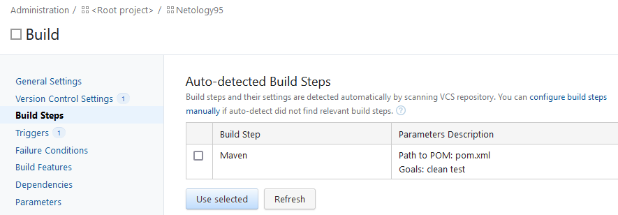

3. Сохраните необходимые шаги, запустите первую сборку master'a

    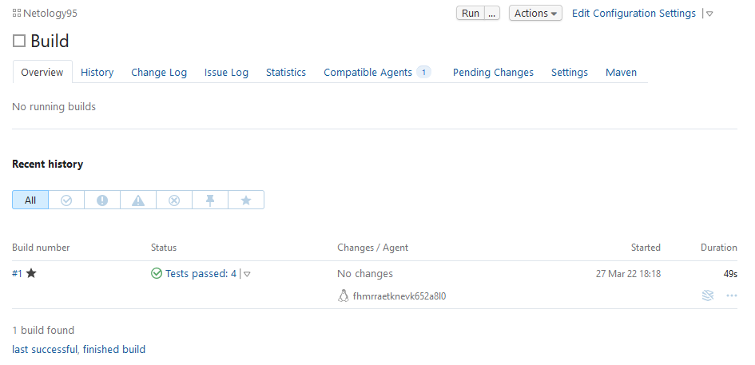

4. Поменяйте условия сборки: если сборка по ветке `master`, то должен происходит `mvn clean deploy`, иначе `mvn clean test`
    
    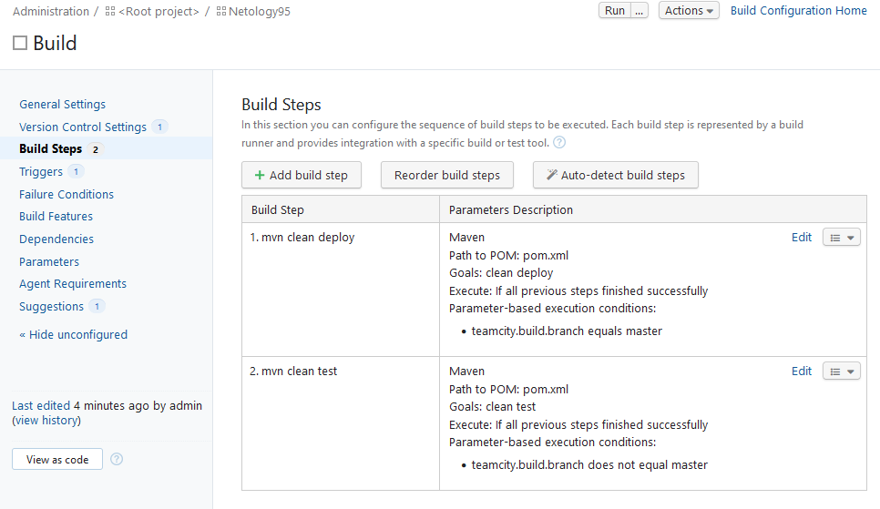
    
5. Для deploy будет необходимо загрузить [settings.xml](./teamcity/settings.xml) в набор конфигураций maven у teamcity, предварительно записав туда креды для подключения к nexus

    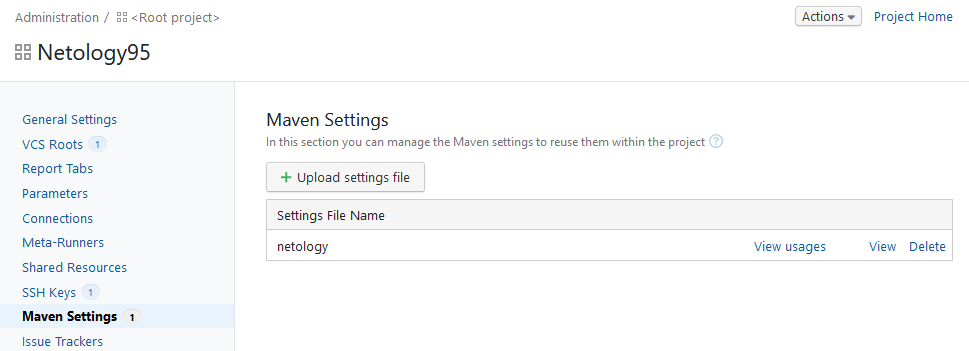

6. В pom.xml необходимо поменять ссылки на репозиторий и nexus

    https://github.com/run0ut/example-teamcity/commit/c43ebfaab15628a8e645e521ce685a0b8e31b2fd
    ```diff
    commit c43ebfaab15628a8e645e521ce685a0b8e31b2fd (origin/master, origin/HEAD, master)
    Author: Sergey Shadurskiy <s.shadurskiy@gmail.com>
    Date:   Tue Mar 29 16:51:40 2022 +0500

        fixed nexus link

    diff --git a/pom.xml b/pom.xml
    index 47bd4c1..01c5399 100644
    --- a/pom.xml
    +++ b/pom.xml
    @@ -15,7 +15,7 @@
            <distributionManagement>
                    <repository>
                                    <id>nexus</id>
    -                               <url>http://51.250.44.27:8081/repository/maven-releases</url>
    +                               <url>http://51.250.69.238:8081/repository/maven-releases</url>
                    </repository>
            </distributionManagement>
            <dependencies>
    ```

7. Запустите сборку по master, убедитесь что всё прошло успешно, артефакт появился в nexus

    - [Лог сборки](media/Netology95_Build_4.log)
    - Билд в Нексусе
    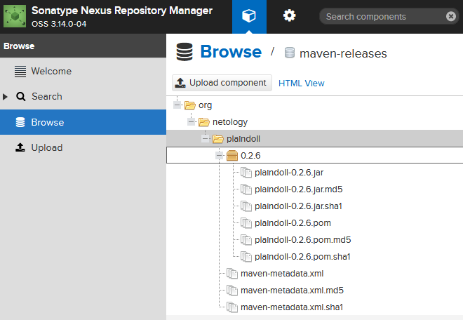

8. Мигрируйте `build configuration` в репозиторий

    - <details><summary>Скриншот</summary>

        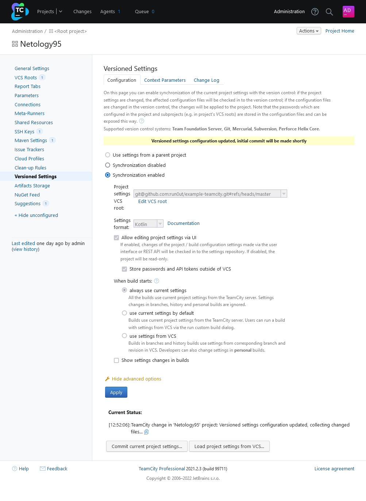

        </details>

9. Создайте отдельную ветку `feature/add_reply` в репозитории
    ```bash
    17:52:46 ~ sergey@Netangels-CSVM:~/git/example-teamcity (master=)
    $ git checkout -b feature/add_reply
    Switched to a new branch 'feature/add_reply'
    17:52:52 ~ sergey@Netangels-CSVM:~/git/example-teamcity (feature/add_reply)
    ```
10. Напишите новый метод для класса Welcomer: метод должен возвращать произвольную реплику, содержащую слово `hunter`
    ```java
        public String sayHunter() {
            return "Gretel, the famous witch hunter.";
        }
    ```
11. Дополните тест для нового метода на поиск слова `hunter` в новой реплике
```java
	@Test
	public void netologySaysHunter() {
		assertThat(welcomer.sayStatus(), containsString("status"));
	}
```
12. Сделайте push всех изменений в новую ветку в репозиторий
    https://github.com/run0ut/example-teamcity/commit/3d2641d9a743b5bfe4950e4bf8001b4e3c9d5e13
    ```diff
    commit 3d2641d9a743b5bfe4950e4bf8001b4e3c9d5e13 (HEAD -> feature/add_reply, origin/feature/add_reply)
    Author: Sergey Shadurskiy <s.shadurskiy@gmail.com>
    Date:   Tue Mar 29 18:35:12 2022 +0500

        Netology task

    diff --git a/src/main/java/plaindoll/Welcomer.java b/src/main/java/plaindoll/Welcomer.java
    index d8849fc..4a7d96f 100644
    --- a/src/main/java/plaindoll/Welcomer.java
    +++ b/src/main/java/plaindoll/Welcomer.java
    @@ -10,4 +10,7 @@ public class Welcomer{
            public String sayStatus() {
                    return "Hello! My status is Good";
            }
    +       public String sayHunter() {
    +               return "Gretel, the famous witch hunter.";
    +       }
    }
    diff --git a/src/test/java/plaindoll/WelcomerTest.java b/src/test/java/plaindoll/WelcomerTest.java
    index c2d2c3d..513426f 100644
    --- a/src/test/java/plaindoll/WelcomerTest.java
    +++ b/src/test/java/plaindoll/WelcomerTest.java
    @@ -26,4 +26,8 @@ public class WelcomerTest {
            public void welcomerSaysStatus() {
                    assertThat(welcomer.sayStatus(), containsString("status"));
            }
    +       @Test
    +       public void netologySaysHunter() {
    +               assertThat(welcomer.sayStatus(), containsString("status"));
    +       }
    }
    \ No newline at end of file
    ```
13. Убедитесь что сборка самостоятельно запустилась, тесты прошли успешно

    Сломалась сборка ветки `master`, т.к. релиз `0.2.6` уже был выложен. Я удалил релиз и запустил тест ветки вручную. После сделал скриншот.

    - Скриншот со сборками обеих веток

        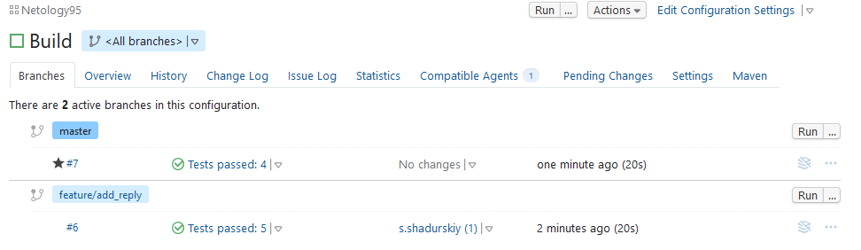

    - Скриншот билда мастера, видно что тригер - гит

        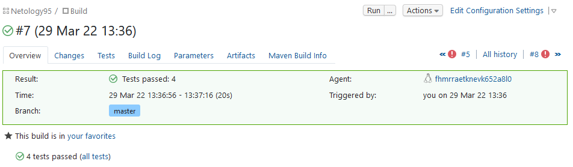


14. Внесите изменения из произвольной ветки `feature/add_reply` в `master` через `Merge`

    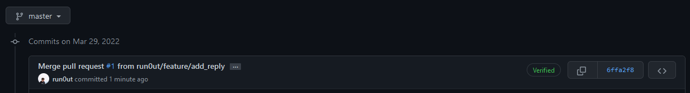

15. Убедитесь, что нет собранного артефакта в сборке по ветке `master`
16. Настройте конфигурацию так, чтобы она собирала `.jar` в артефакты сборки

    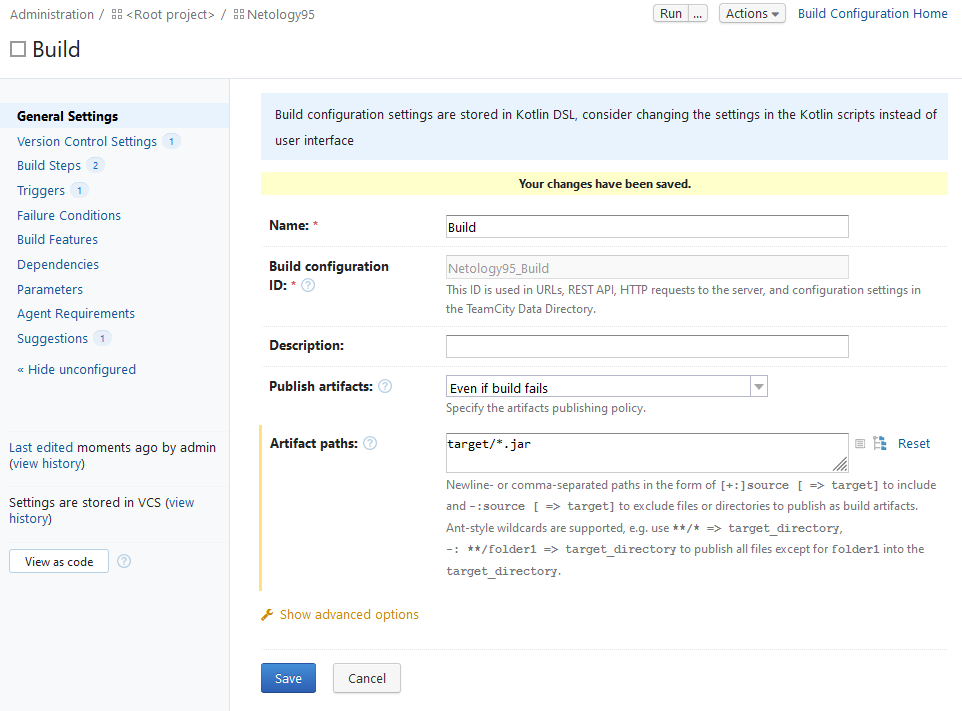

17. Проведите повторную сборку мастера, убедитесь, что сбора прошла успешно и артефакты собраны
    - Итог сборки мастера, запущенной вручную
        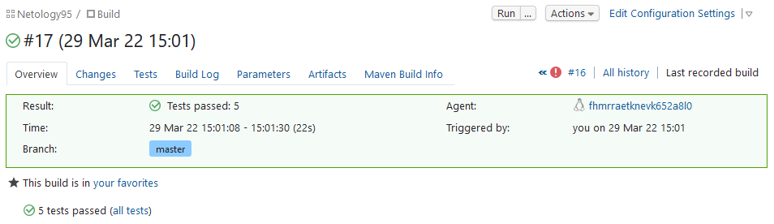
    - Артефакты этой сборки
        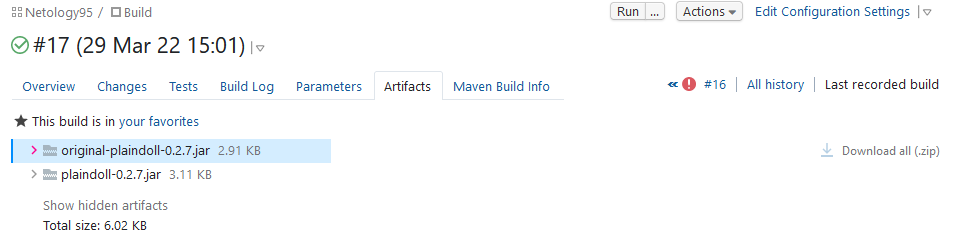
18. Проверьте, что конфигурация в репозитории содержит все настройки конфигурации из teamcity

    - Коммит https://github.com/run0ut/example-teamcity/commit/1ff4ce0ce61993705f567c813de4f8f1eb918b32
    - Скриншот дифа
        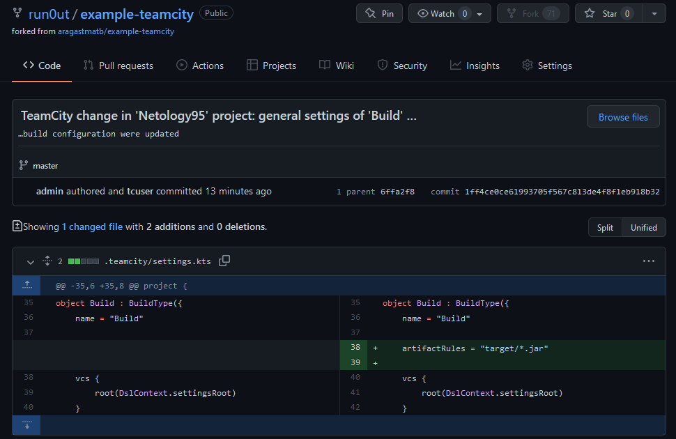

19. В ответ предоставьте ссылку на репозиторий

https://github.com/run0ut/example-teamcity

</details>

### 19. В ответ предоставьте ссылку на репозиторий

https://github.com/run0ut/example-teamcity