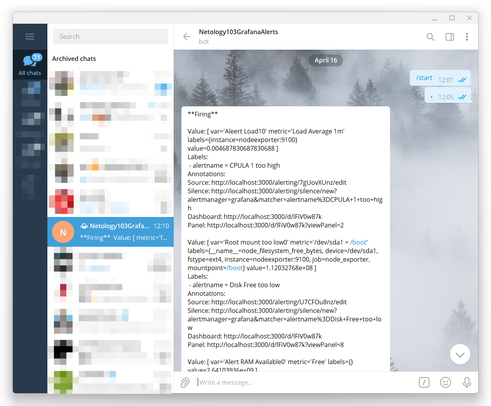
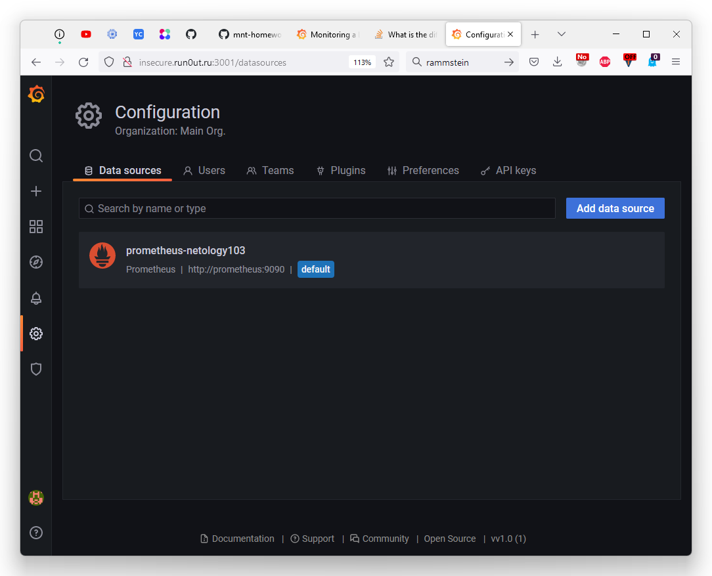
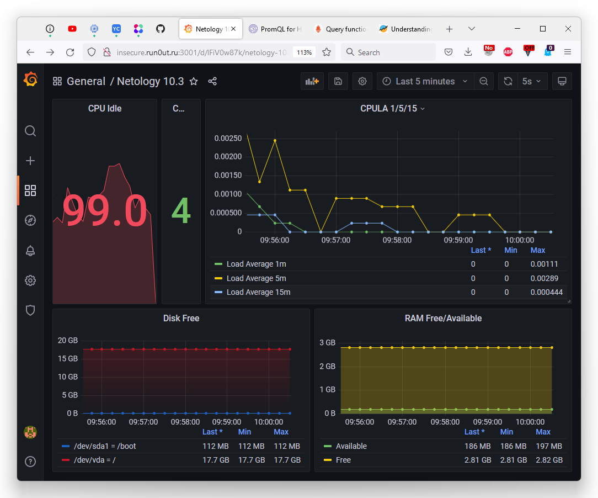
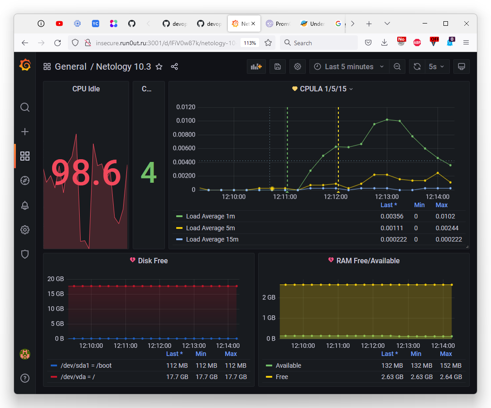
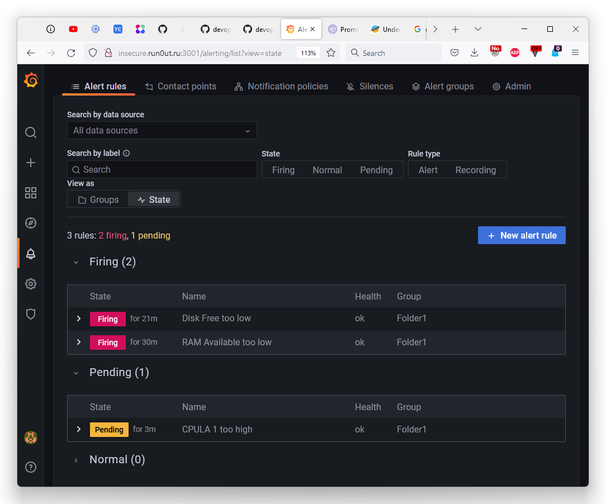

devops-netology
===============

# Домашнее задание к занятию "10.03. Grafana"

</details>  

## Задание повышенной сложности


#### В решении к домашнему заданию приведите также все конфигурации/скрипты/манифесты, которые вы использовали в процессе решения задания.

<details><summary>.</summary>

> **В части задания 1** не используйте директорию [help](./help) для > сборки проекта, самостоятельно разверните grafana, где в 
> роли источника данных будет выступать prometheus, а сборщиком данных > node-exporter:
> - grafana
> - prometheus-server
> - prometheus node-exporter
>
> За дополнительными материалами, вы можете обратиться в официальную документацию grafana и prometheus.
>
> В решении к домашнему заданию приведите также все конфигурации/скрипты/манифесты, которые вы использовали в процессе решения задания.

</details>  

[docker-compose](mystack/docker-compose.yml)

[Prometheus, конфиг prometheus.yml](mystack/prometheus.yml)

[Grafana, конфиг провижена датасорса](mystack/prometheus_datasource.yml)

[Grafana, конфиг провижена дешбордов](mystack/prometheus_dashboard_1860.yml)

[Grafana, дешборд в json](mystack/prometheus_dashboard_1860.json)

`docker-compose` составил по следующим источникам:
- [hub.docker.com, параметры для контейнера prometheus, как подключить волюм для данных](https://hub.docker.com/r/prom/prometheus)
- [prometheus.io, настройка таргета node exporter](https://prometheus.io/docs/guides/node-exporter/)
- [github.com, параметры контейнера node exporter](https://github.com/prometheus/node_exporter)
- [grafana.com, параметры контейнера grafana, как подключить волюм для данных](https://grafana.com/docs/grafana/latest/administration/configure-docker/)

Провижен `Grafana` по следующим:
- [grafana.com, общая инфа по провижену и не конкретизированные примеры](https://grafana.com/docs/grafana/latest/administration/provisioning/)
- [community.grafana.com, тред с примером конфига датасорса prometheus](https://community.grafana.com/t/solved-datasource-provisioning-prometheus/6300/9)
- [grafana.com, документация как добавить к провижену дешборд с примером](https://grafana.com/tutorials/provision-dashboards-and-data-sources/)
- [medium.com, статья с рецептом как именно провиженить связку grafana + prometheus](https://medium.com/56kcloud/provisioning-grafana-data-sources-and-dashboards-auto-magically-e27155d20652)
- [grafana.com, классный дешборд  для данных из node_exporter, был в лекции](https://grafana.com/grafana/dashboards/1860)

Нотификации настраивал по следующим:
- [youtube.com, видео с примером настройки нотификации через бота в Telegram](https://www.youtube.com/watch?v=etIX59oxlXs)

#### В решении приведите скриншоты тестовых событий из каналов отификаций.

<details><summary>.</summary>

> **В части задания 3** вы должны самостоятельно завести удобный для вас канал нотификации, например Telegram или Email и отправить туда тестовые события.
> 
> В решении приведите скриншоты тестовых событий из каналов отификаций.

</details>  



## Обязательные задания

### Задание 1

<details><summary>.</summary>

Используя директорию [help](./help) внутри данного домашнего задания - запустите связку prometheus-grafana.

Зайдите в веб-интерфейс графана, используя авторизационные данные, указанные в манифесте docker-compose.

Подключите поднятый вами prometheus как источник данных.

Решение домашнего задания - скриншот веб-интерфейса grafana со списком подключенных Datasource.

</details>  

### Решение домашнего задания - скриншот веб-интерфейса grafana со списком подключенных Datasource.



## Задание 2

<details><summary>.</summary>

> Изучите самостоятельно ресурсы:
> - [promql-for-humans](https://timber.io/blog/promql-for-humans/#cpu-usage-by-instance)
> - [understanding prometheus cpu metrics](https://www.robustperception.io/understanding-machine-cpu-usage)
> 
> Создайте Dashboard и в ней создайте следующие Panels:
> - Утилизация CPU для nodeexporter (в процентах, 100-idle)
> - CPULA 1/5/15
> - Количество свободной оперативной памяти
> - Количество места на файловой системе
> 
> Для решения данного ДЗ приведите promql запросы для выдачи этих метрик, а также скриншот получившейся Dashboard.

</details>  

- Утилизация CPU для nodeexporter (в процентах, 100-idle)

    ```
    avg by(instance)(rate(node_cpu_seconds_total{job="node_exporter",mode="idle"}[$__rate_interval])) * 100
    ```

- CPULA 1/5/15

    ```
    avg by (instance)(rate(node_load1{}[$__rate_interval]))
    avg by (instance)(rate(node_load5{}[$__rate_interval]))
    avg by (instance)(rate(node_load15{}[$__rate_interval]))

    ```

- Количество свободной оперативной памяти

    ```
    avg(node_memory_MemFree_bytes{instance="nodeexporter:9100",job="node_exporter"})
    avg(node_memory_MemAvailable_bytes{instance="nodeexporter:9100", job="node_exporter"})
    ```

- Количество места на файловой системе

    ```
    node_filesystem_free_bytes{fstype="ext4",instance="nodeexporter:9100",job="node_exporter"}
    ```

- скриншот получившейся Dashboard

    

## Задание 3

> Создайте для каждой Dashboard подходящее правило alert (можно обратиться к первой лекции в блоке "Мониторинг").
> 
> Для решения ДЗ - приведите скриншот вашей итоговой Dashboard.





## Задание 4

>Сохраните ваш Dashboard.
>
>Для этого перейдите в настройки Dashboard, выберите в боковом меню "JSON MODEL".
>
>Далее скопируйте отображаемое json-содержимое в отдельный файл и сохраните его.
>
> В решении задания - приведите листинг этого файла.

[Листинг](mystack/prometheus_bashboard_netology103.json)