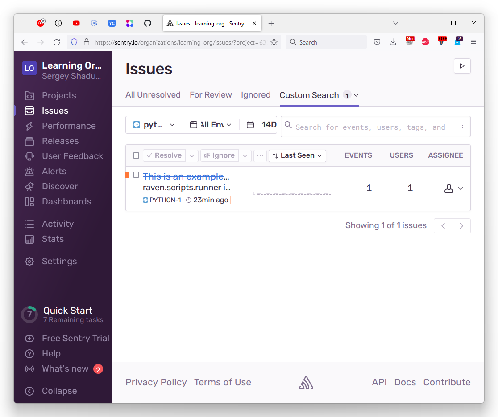

devops-netology
===============

# Домашнее задание к занятию "10.05. Sentry"

  

## Задание 1

.

Так как self-hosted Sentry довольно требовательная к ресурсам система, мы будем использовать Free cloud аккаунт.

Free cloud account имеет следующие ограничения:
- 5 000 errors
- 10 000 transactions
- 1 GB attachments

Для подключения Free cloud account:
- зайдите на sentry.io
- нажжмите "Try for free"
- используйте авторизацию через ваш github-account
- далее следуйте инструкциям

Для выполнения задания - пришлите скриншот меню Projects.

  

### Для выполнения задания - пришлите скриншот меню Projects.

## Задание 2

.

Создайте python проект и нажмите `Generate sample event` для генерации тестового события.

Изучите информацию, представленную в событии.

Перейдите в список событий проекта, выберите созданное вами и нажмите `Resolved`.

Для выполнения задание предоставьте скриншот `Stack trace` из этого события и список событий проекта, 
после нажатия `Resolved`.

  

### Для выполнения задание предоставьте скриншот `Stack trace` из этого события 

#### и список событий проекта, после нажатия `Resolved`.

## Задание 3

.

Перейдите в создание правил алёртинга.

Выберите проект и создайте дефолтное правило алёртинга, без настройки полей.

Снова сгенерируйте событие `Generate sample event`.

Если всё было выполнено правильно - через некоторое время, вам на почту, привязанную к github аккаунту придёт
оповещение о произошедшем событии.

Если сообщение не пришло - проверьте настройки аккаунта Sentry (например привязанную почту), что у вас не было 
`sample issue` до того как вы его сгенерировали и то, что правило алёртинга выставлено по дефолту (во всех полях all).
Также проверьте проект в котором вы создаёте событие, возможно алёрт привязан к другому.

Для выполнения задания - пришлите скриншот тела сообщения из оповещения на почте.

Дополнительно поэкспериментируйте с правилами алёртинга. 
Выбирайте разные условия отправки и создавайте sample events. 

  

### Для выполнения задания - пришлите скриншот тела сообщения из оповещения на почте.

## Задание повышенной сложности

.

Создайте проект на ЯП python или GO (небольшой, буквально 10-20 строк), подключите к нему sentry SDK и отправьте несколько тестовых событий.
Поэкспериментируйте с различными передаваемыми параметрами, но помните об ограничениях free учетной записи cloud Sentry.

Для выполнения задания пришлите скриншот меню issues вашего проекта и пример кода подключения sentry sdk/отсылки событий.

  

### Для выполнения задания пришлите скриншот меню issues вашего проекта 

### и пример кода подключения sentry sdk/отсылки событий.

[Пример кода](https://github.com/run0ut/devops-netology/blob/53d4820ac5ab35123fa18cdd5f2bdd7a354ab45d/03-mnt-homeworks/10-monitoring-05-sentry/gather_metrics.py#L11-L19)