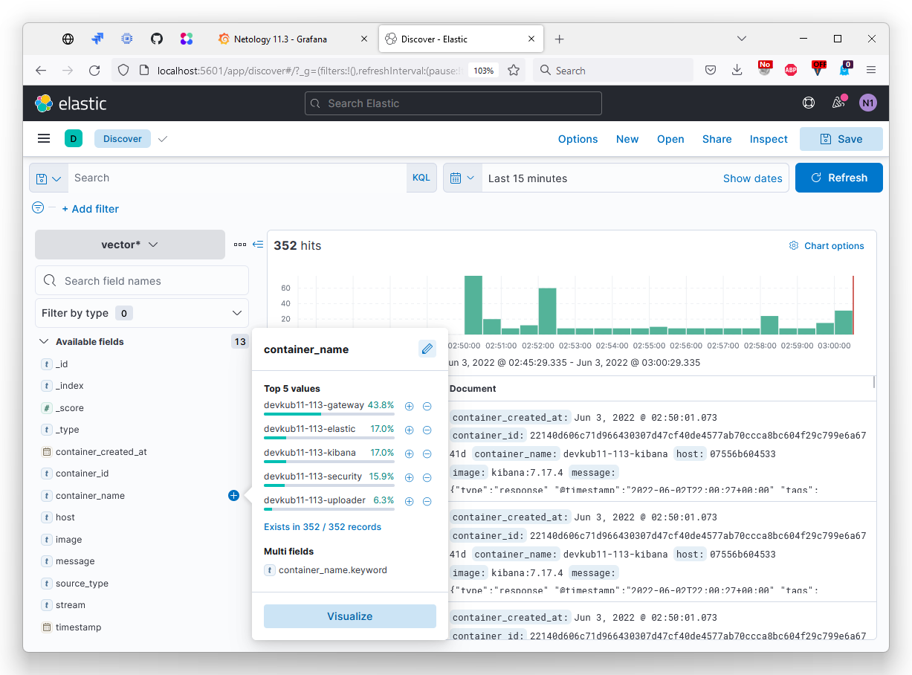
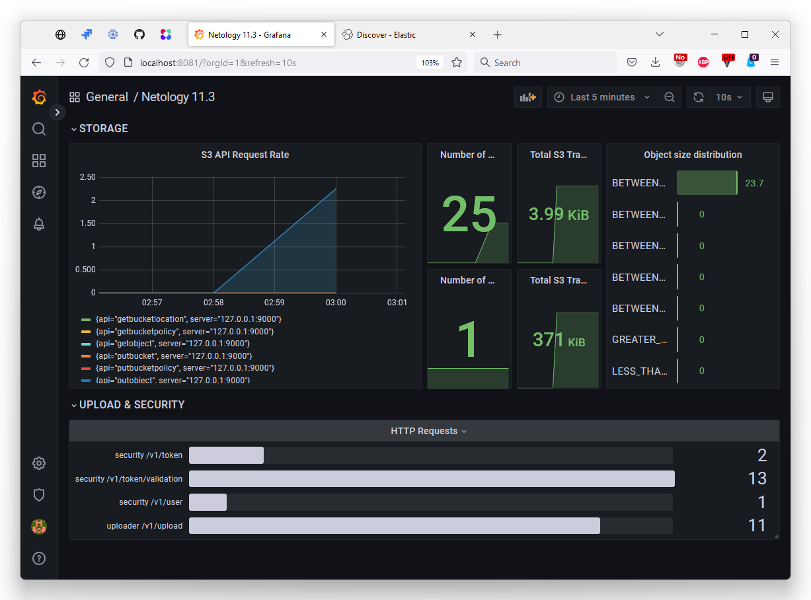

# Домашнее задание к занятию "11.03 Микросервисы: подходы"

> Вы работаете в крупной компанию, которая строит систему на основе микросервисной архитектуры.
> Вам как DevOps специалисту необходимо выдвинуть предложение по организации инфраструктуры, для разработки и эксплуатации.

## Задача 1: Обеспечить разработку

> Предложите решение для обеспечения процесса разработки: хранение исходного кода, непрерывная интеграция и непрерывная поставка. 
> Решение может состоять из одного или нескольких программных продуктов и должно описывать способы и принципы их взаимодействия.
> 
> Решение должно соответствовать следующим требованиям:
> - Облачная система;
> - Система контроля версий Git;
> - Репозиторий на каждый сервис;
> - Запуск сборки по событию из системы контроля версий;
> - Запуск сборки по кнопке с указанием параметров;
> - Возможность привязать настройки к каждой сборке;
> - Возможность создания шаблонов для различных конфигураций сборок;
> - Возможность безопасного хранения секретных данных: пароли, ключи доступа;
> - Несколько конфигураций для сборки из одного репозитория;
> - Кастомные шаги при сборке;
> - Собственные докер образы для сборки проектов;
> - Возможность развернуть агентов сборки на собственных серверах;
> - Возможность параллельного запуска нескольких сборок;
> - Возможность параллельного запуска тестов;
> 
> Обоснуйте свой выбор.

Подойдёт `GitLab`, возможно в связке с `HashiCorp Vault`:
- GitLab интегрированное решение, содержит и SCM и CI/CD, не нужно тратить ресурсы на интеграцию нескольких различных решений
- Хорошо интегрируется популярными IDE
- Хранить секреты можно в переменных GitLab, но если этих возможностей недостаточно, то подключить HashiCorp Vault
- Оба сервиса облачные, но имеют и open source версии, которые при необходимости можно развернуть on premises

## Задача 2: Логи

> Предложите решение для обеспечения сбора и анализа логов сервисов в микросервисной архитектуре.
> Решение может состоять из одного или нескольких программных продуктов и должно описывать способы и принципы их взаимодействия.
> 
> Решение должно соответствовать следующим требованиям:
> - Сбор логов в центральное хранилище со всех хостов обслуживающих систему;
> - Минимальные требования к приложениям, сбор логов из stdout;
> - Гарантированная доставка логов до центрального хранилища;
> - Обеспечение поиска и фильтрации по записям логов;
> - Обеспечение пользовательского интерфейса с возможностью предоставления доступа разработчикам для поиска по записям логов;
> - Возможность дать ссылку на сохраненный поиск по записям логов;
> 
> Обоснуйте свой выбор.

Если много ресурсов оптимальным будет ELK стек:
- `elastic beats` для отправки логов
- `logstash` для препроцессинга логов - фильтрации и модификации
- `elasticsearch` для хранения
- `kibana` в качестве пользовательского интерфейса

ELK хорошо известен, просто найти инженеров, которые с ним работали, просто найти документацию и информацию, широкое комьюнити. Есть облачный вариант с поддержкой вендора.

Если ресурсов не очень много, лучше выбрать PLG стек:
- `promtail` для отправки метрик и логов в хранилище
- `loki` для хранения
- `grafana` в качестве пользовательского интерфейса.

PLG стек более производителен, но язык LogQL менее функционален, чем Query DSL и Lucene query language. Promtail имеет нативную интеграцию с Kebernetis, что в купе с производительностью может оказаться более выгодным решением для нашей задачи, чем ELK.

## Задача 3: Мониторинг

> Предложите решение для обеспечения сбора и анализа состояния хостов и сервисов в микросервисной архитектуре.
> Решение может состоять из одного или нескольких программных продуктов и должно описывать способы и принципы их взаимодействия.
> 
> Решение должно соответствовать следующим требованиям:
> - Сбор метрик со всех хостов, обслуживающих систему;
> - Сбор метрик состояния ресурсов хостов: CPU, RAM, HDD, Network;
> - Сбор метрик потребляемых ресурсов для каждого сервиса: CPU, RAM, HDD, Network;
> - Сбор метрик, специфичных для каждого сервиса;
> - Пользовательский интерфейс с возможностью делать запросы и агрегировать информацию;
> - Пользовательский интерфейс с возможность настраивать различные панели для отслеживания состояния системы;
> 
> Обоснуйте свой выбор.

Оптимальной будет связка:
- `node_exporter` для предоставления метрик о состоянии узлов
- Интеграция [Prometheus client libraries](https://prometheus.io/docs/instrumenting/clientlibs/) в код микросервисов для экспорта специфичных метрик
- `Prometheus` для сбора и валидации метрик в единое хранилище
- `Grafana` для построения дешбордов

Почему этот стек:
- Производительное решение
- Много документации и широкое комьюнити
- Для всех популярных языков есть библиотеки, которые помогут добавить экспорт метрик собственных сервисов в формате Prometheus

## Задача 4: Логи * (необязательная)

> Продолжить работу по задаче API Gateway: сервисы используемые в задаче пишут логи в stdout. 
> 
> Добавить в систему сервисы для сбора логов Vector + ElasticSearch + Kibana со всех сервисов обеспечивающих работу API.

### Результат выполнения: 

> docker compose файл запустив который можно перейти по адресу http://localhost:8081 по которому доступна Kibana.
> Логин в Kibana должен быть admin пароль qwerty123456

Порт Kibana я оставил стандартным, 5601. Порт 8081 будет использоваться для Grafana.

- [Изменения docker-compose.yaml](https://github.com/run0ut/devops-netology/blob/1a44f4a35c9e255dbbbe5e5817b23a69feb73050/04-devkub-homeworks/11-microservices-03-approaches/docker-compose.yaml#L12-L90)
- [vector.toml](./11-microservices-03-approaches/logs/vector.toml)

Для настройки пользователя admin в Эластике и создания паттерна индекса Kibana пришлось создать скрипты, т.к. их провижен не предусмотрен конфигами или передачей в переменных окружения:
- [скрипт настройки пользователя Elastic](./11-microservices-03-approaches/logs/elasticuserpassword.sh)
- [скрипт создания паттерна индекса Kibana](./11-microservices-03-approaches/logs/createindex.sh)

## Задача 5: Мониторинг * (необязательная)

> Продолжить работу по задаче API Gateway: сервисы используемые в задаче предоставляют набор метрик в формате prometheus:
> 
> - Сервис security по адресу /metrics
> - Сервис uploader по адресу /metrics
> - Сервис storage (minio) по адресу /minio/v2/metrics/cluster
> 
> Добавить в систему сервисы для сбора метрик (Prometheus и Grafana) со всех сервисов обеспечивающих работу API.
> Построить в Graphana dashboard показывающий распределение запросов по сервисам.

### Результат выполнения: 

> docker compose файл запустив который можно перейти по адресу http://localhost:8081 по которому доступна Grafana с настроенным Dashboard.
> Логин в Grafana должен быть admin пароль qwerty123456

- [Изменения docker-compose.yaml](https://github.com/run0ut/devops-netology/blob/044f237c9f7c3c84e3910a80b129d191a182bbe1/04-devkub-homeworks/11-microservices-03-approaches/docker-compose.yaml#L180-L208)
- [Изменения nginx.conf](https://github.com/run0ut/devops-netology/blob/044f237c9f7c3c84e3910a80b129d191a182bbe1/04-devkub-homeworks/11-microservices-03-approaches/gateway/nginx.conf#L52-L63)
- [Конфигурация Prometheus](./11-microservices-03-approaches/mon/prometheus.yml)
- [Конфигурация Grafana](./11-microservices-03-approaches/mon/grafana.ini)
- [Дешборд в JSON](./11-microservices-03-approaches/mon/prometheus_dashboard.json)

Провижен Grafana:
- [Datasource](./11-microservices-03-approaches/mon/prometheus_datasource.yml)
- [Dashboard](./11-microservices-03-approaches/mon/prometheus_dashboards.yml)

