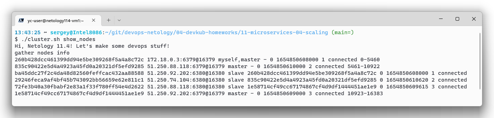
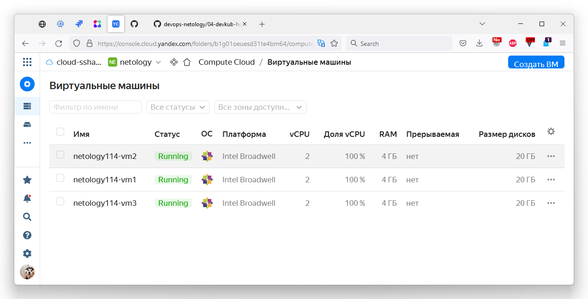
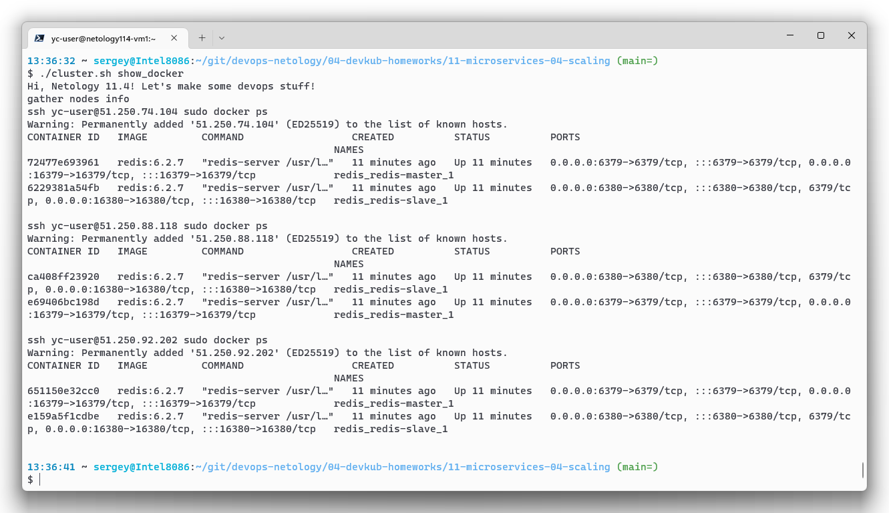

# Домашнее задание к занятию "11.04 Микросервисы: масштабирование"

Вы работаете в крупной компанию, которая строит систему на основе микросервисной архитектуры.
Вам как DevOps специалисту необходимо выдвинуть предложение по организации инфраструктуры, для разработки и эксплуатации.

## Задача 1: Кластеризация

> Предложите решение для обеспечения развертывания, запуска и управления приложениями.
> Решение может состоять из одного или нескольких программных продуктов и должно описывать способы и принципы их взаимодействия.
> 
> Решение должно соответствовать следующим требованиям:
> - Поддержка контейнеров;
> - Обеспечивать обнаружение сервисов и маршрутизацию запросов;
> - Обеспечивать возможность горизонтального масштабирования;
> - Обеспечивать возможность автоматического масштабирования;
> - Обеспечивать явное разделение ресурсов доступных извне и внутри системы;
> - Обеспечивать возможность конфигурировать приложения с помощью переменных среды, в том числе с возможностью безопасного хранения чувствительных данных таких как пароли, ключи доступа, ключи шифрования и т.п.
> 
> Обоснуйте свой выбор.

|  | Kubernetes | Docker Swarm | Nomad | OpenShift |
| --- | --- | --- | --- | --- |
| **Поддержка контейнеров** | Да, OCI совместимые, включая Docker | Да, только Docker | Да, Docker, OCI совместимые (с Podman), LXC, systemd-nspawn | [Да](https://docs.openshift.com/container-platform/4.9/openshift_images/index.html#images-about_overview-of-images), OCI и Docker |
| **Обеспечивать обнаружение сервисов и маршрутизацию запросов** | Да, с использованием встроенного DNS-сервера | Да, с использованием встроенного DNS-сервера | Да, с 05.2022 [встроенная поддержка](https://www.hashicorp.com/blog/nomad-1-3-adds-native-service-discovery-and-edge-workload-support), ранее только с [Consul](https://www.nomadproject.io/docs/integrations/consul-integration) | [Да](https://docs.openshift.com/container-platform/4.8/networking/dns-operator.html) |
| **Обеспечивать возможность горизонтального масштабирования** | Да, автоматический (HPA) | Да, вручную, `docker service scale`  | [Да](https://www.nomadproject.io/tools/autoscaling) | [Да](https://docs.openshift.com/container-platform/4.7/nodes/pods/nodes-pods-autoscaling.html)|
| **Обеспечивать возможность автоматического масштабирования** | Да, вертикальное (VPA) и горизонтальное (HPA) | Нет | [Да](https://www.nomadproject.io/tools/autoscaling) | Да, горизонтальное и [вертикальное](https://docs.openshift.com/container-platform/4.7/nodes/pods/nodes-pods-autoscaling.html) |
| **Обеспечивать явное разделение ресурсов доступных извне и внутри системы** | Да, доступ извне через [Services](https://kubernetes.io/docs/tutorials/kubernetes-basics/expose/expose-intro/) изоляция внутри и снаружи обеспечивается через [Namespaces](https://www.qovery.com/blog/basic-network-isolation-in-kubernetes) | Да, для [publish](https://docs.docker.com/engine/swarm/services/#publish-ports) для доступа извне, [overlay network](https://docs.docker.com/engine/swarm/services/#connect-the-service-to-an-overlay-network) для разграничения внутри swarm | [Да](https://www.nomadproject.io/docs/job-specification/network) | Да, [внутри](https://miminar.fedorapeople.org/_preview/openshift-enterprise/registry-redeploy/admin_guide/managing_networking.html#isolating-project-networks), [извне](https://miminar.fedorapeople.org/_preview/openshift-enterprise/registry-redeploy/admin_guide/managing_networking.html#admin-guide-managing-networking-ingress) |
| **Обеспечивать возможность конфигурировать приложения с помощью переменных среды** | Да | Да | [Да](https://www.nomadproject.io/docs/runtime/environment) | [Да](https://docs.openshift.com/container-platform/3.11/dev_guide/environment_variables.html) |
| **Возможность безопасного хранения чувствительных данных таких как пароли, ключи доступа, ключи шифрования и т.п** | [Да](https://kubernetes.io/docs/concepts/configuration/secret/#working-with-secrets) | Да, `docker secret` | Нет, только с использованием сторонних сервисов, [например Vault](https://www.nomadproject.io/docs/integrations/vault-integration) | [Да](https://docs.openshift.com/container-platform/4.10/nodes/pods/nodes-pods-secrets.html) |

По-умолчанию следует выбирать самый "хайповый" инструмент, на текущий момент это вероятно Kebernetes, т.к. много всего: документации, специалистов, комьюнити и тд.
Опять же, всё зависит от задачи, и если есть какие-то особые требования или ситуации, можно выбрать что-то другое, например:
* Docker Swarm выгодно использовать когда: а) небольшой нетребовательный сервис, который нужно максимально быстро поднять; б)оркестратор нужен только для обучения и/или разработки локально. Большое преимущество - нативно использует docker compose файлы, такие готовые файлы можно найти буквально для всего, а ещё с него просто мигрировать на Kubernetes, когда требования по возможностям оркестратора вырастут
* Nomad, если компания хорошо знакома с продуктами HashiCorp и массово их использует, так как: а) он обещает бОльшую производительность (за счёт компактности и меньшей "комбайности"), чем Кубер; б) команда уже знакома с языком HCL; в) вероятно в компании считают удобной и [философию](https://www.hashicorp.com/tao-of-hashicorp) продуктов HashiCorp - просто, модульно, хорошо интегрируется
* Nomad, если необходимо единое решение для оркестрации гетерогенной среды виртуализации - QEMU, контейнеры, JVM
* OpenShift, если компания готова инвестировать в более удобный вариант Kubernetes с дополнительными фишками и интегрированными инструментами из коробки: [CI/CD](https://cloud.redhat.com/blog/cicd-with-openshift), [мониторинг](https://docs.openshift.com/container-platform/4.10/monitoring/monitoring-overview.html), [сторедж](https://docs.openshift.com/container-platform/4.7/logging/config/cluster-logging-storage-considerations.html) и [визуализацию](https://docs.openshift.com/container-platform/4.7/logging/config/cluster-logging-visualizer.html) логов и т.д.

## Задача 2: Распределенный кэш * (необязательная)

> Разработчикам вашей компании понадобился распределенный кэш для организации хранения временной информации по сессиям пользователей.
> Вам необходимо построить Redis Cluster состоящий из трех шард с тремя репликами.
> 
> ### Схема:
> 
> 

`CLUSTER INFO` из консоли

Кластер развернул в Яндекс.Облаке: 
* Создал ноды и установил ПО с помощью Ansible: [playbook.yml](./11-microservices-04-scaling/ansible/playbook.yml)
* В качестве среды выбрал Docker: [docker-compose.yml](./11-microservices-04-scaling/docker/docker-compose.yml), он разворачивается тем же плейбуком.
* Для взаимодействия с Yandex использовал собственную коллекцию, сделанную в рамках курса на [08.06](../03-mnt-homeworks/08-ansible-06-module/README.md): модуль [инвентаризации](https://github.com/run0ut/my_own_collection/blob/main/plugins/inventory/yc_inventory.py) и модуль [работы с Compute Cloud](https://github.com/run0ut/my_own_collection/blob/main/plugins/modules/yc_create_instance.py)
* Объединение нод в кластер и настройку реплик автоматизировал скриптом [cluster.sh](./11-microservices-04-scaling/cluster.sh), у него есть команды:
    - `provision` развернёт стек целиком и настроит кластер
    - `show_nodes` выполнит `CLUSTER INFO`, подключившись к первой ноде
    - `show_docker` выполнит `docker ps` на первой ноде
    - `destroy_nodes` удалит виртуальные машины
* [Пример лога](./11-microservices-04-scaling/media/provision.log) выполнения скрипта `cluster.sh` с командой `provision`

Скриншот ВМ в Яндекс.Облаке

Вывод `docker ps` со всех нод

