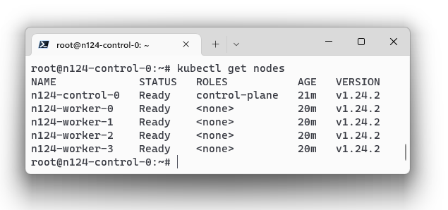
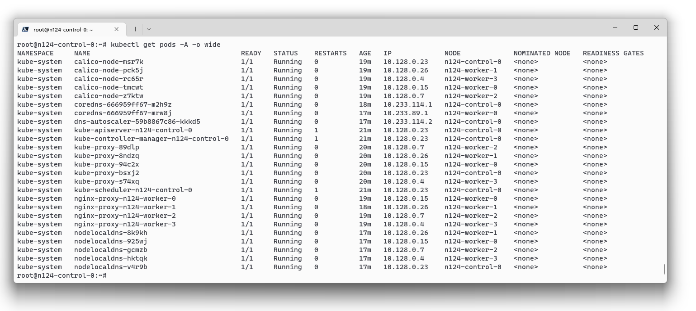
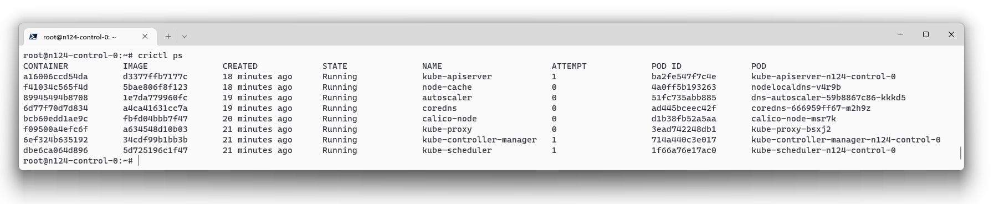
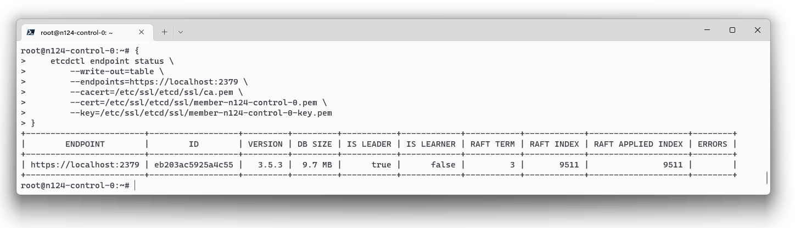

# Домашнее задание к занятию "12.4 Развертывание кластера на собственных серверах, лекция 2"

> Новые проекты пошли стабильным потоком. Каждый проект требует себе несколько кластеров: под тесты и продуктив. Делать все руками — не вариант, поэтому стоит автоматизировать подготовку новых кластеров.

## Задание 1: Подготовить инвентарь kubespray

> Новые тестовые кластеры требуют типичных простых настроек. Нужно подготовить инвентарь и проверить его работу. Требования к инвентарю:
> * подготовка работы кластера из 5 нод: 1 мастер и 4 рабочие ноды;
> * в качестве CRI — containerd;
> * запуск etcd производить на мастере.

### 5 нод: 1 мастер и 4 рабочие ноды

* [inventory](./12-kubernetes-04-install-part-2/kubespray/inventory/mycluster/inventory.ini) файл
* Ноды

    
* Поды

    

### В качестве CRI — containerd;

* Листинг контейнеров в `crictl` на control ноде

    

### Запуск etcd производить на мастере

* etcd на control ноде

    

## Задание 2 (*): подготовить и проверить инвентарь для кластера в AWS

> Часть новых проектов хотят запускать на мощностях AWS. Требования похожи:
> * разворачивать 5 нод: 1 мастер и 4 рабочие ноды;
> * работать должны на минимально допустимых EC2 — t3.small.

Весь стек, включая ноды и кластер, поднимаются Терраформом:
1. [prepare.tf](./12-kubernetes-04-install-part-2/prepare.tf) выполняет `git clone` Kubespray, ставит зависимости и копирует папку для инвентори из шаблона
1. [yandex.tf](./12-kubernetes-04-install-part-2/yandex.tf) разворачивает ноды
1. [inventory.tf](./12-kubernetes-04-install-part-2/inventory.tf) подготавливает [inventory.ini](./12-kubernetes-04-install-part-2/kubespray/inventory/mycluster/inventory.ini) из шаблона [inventory.tpl](./12-kubernetes-04-install-part-2/templates/inventory.tpl) с помощью модулей `template_file` и `null_resource`
1. [ansible.tf](./12-kubernetes-04-install-part-2/ansible.tf) разворачивает кластер с помощь Kubespray