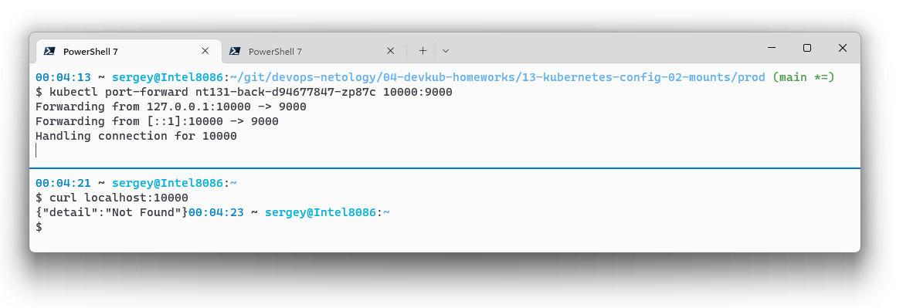
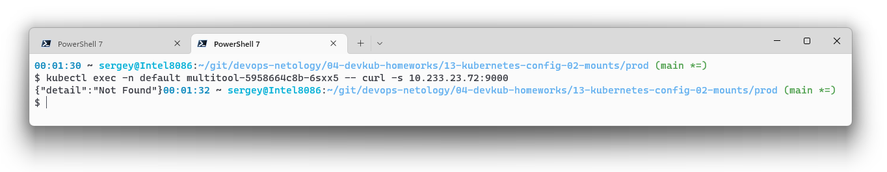
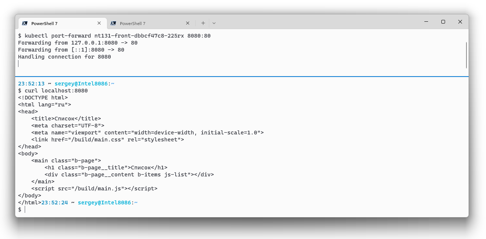
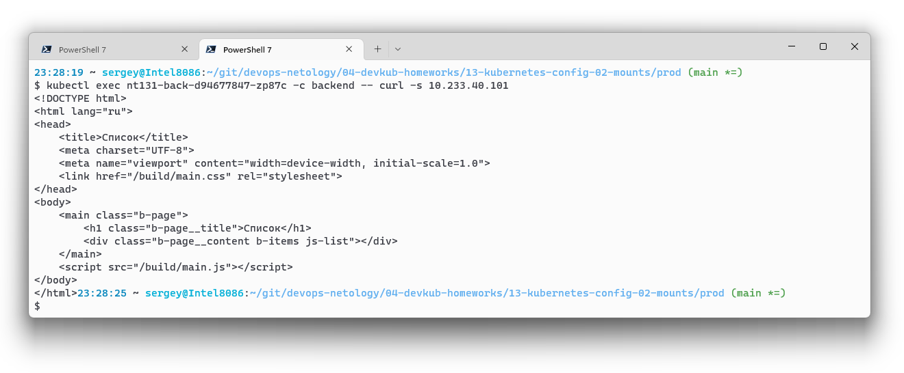
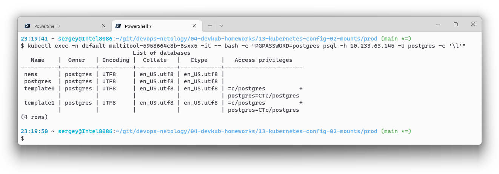

# Домашнее задание к занятию "13.3 работа с kubectl"
## Задание 1: проверить работоспособность каждого компонента

> Для проверки работы можно использовать 2 способа: port-forward и exec. Используя оба способа, проверьте каждый компонент:
> * сделайте запросы к бекенду;
> * сделайте запросы к фронту;
> * подключитесь к базе данных.

За основу взял стек `prod` из [13.2](./13-kubernetes-config-02-mounts.md), для запросов добавил `multitool`.

### Сделайте запросы к бекенду

* port-forward
    
* exec из мультитула в бек
    
### Сделайте запросы к фронту

* port-forward
    
* exec от бека во фронт
    

### Подключитесь к базе данных

Подключение к базе из мультитула.

## Задание 2: ручное масштабирование

> При работе с приложением иногда может потребоваться вручную добавить пару копий. Используя команду kubectl scale, попробуйте увеличить количество бекенда и фронта до 3. Проверьте, на каких нодах оказались копии после каждого действия (kubectl describe, kubectl get pods -o wide). После уменьшите количество копий до 1.
