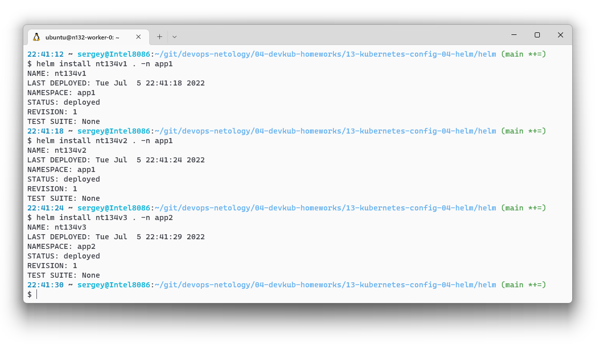
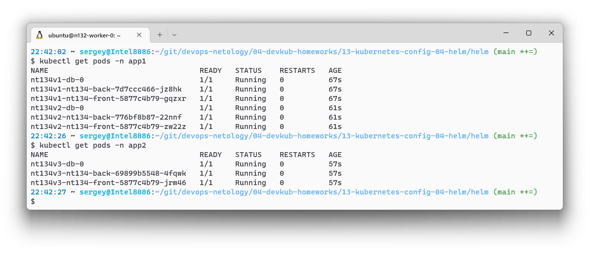

# Домашнее задание к занятию "13.4 инструменты для упрощения написания конфигурационных файлов. Helm и Jsonnet"

> В работе часто приходится применять системы автоматической генерации конфигураций. Для изучения нюансов использования разных инструментов нужно попробовать упаковать приложение каждым из них.

## Задание 1: подготовить helm чарт для приложения

> Необходимо упаковать приложение в чарт для деплоя в разные окружения. Требования:
> * каждый компонент приложения деплоится отдельным deployment’ом/statefulset’ом;
> * в переменных чарта измените образ приложения для изменения версии.

[Чарт](./13-kubernetes-config-04-helm/helm/):
- [ deployment | back ](./13-kubernetes-config-04-helm/helm/templates/deployments/back.yml)
- [ deployment | front ](./13-kubernetes-config-04-helm/helm/templates/deployments/front.yml)
- [ statefulset | db ](./13-kubernetes-config-04-helm/helm/templates/statefulsets/db.yml)
- [ service | back ](./13-kubernetes-config-04-helm/helm/templates/services/back.yml)
- [ service | front ](./13-kubernetes-config-04-helm/helm/templates/services/front.yml)
- [ service | db ](./13-kubernetes-config-04-helm/helm/templates/services/db.yml)

## Задание 2: запустить 2 версии в разных неймспейсах
> Подготовив чарт, необходимо его проверить. Попробуйте запустить несколько копий приложения:
> * одну версию в namespace=app1;
> * вторую версию в том же неймспейсе;
> * третью версию в namespace=app2.

* Установка приложения разных версий в неймспейсы `app1` и `app2`
    
* Поды после установки приложения
    
## Задание 3 (*): повторить упаковку на jsonnet

> Для изучения другого инструмента стоит попробовать повторить опыт упаковки из задания 1, только теперь с помощью инструмента jsonnet.

Jsonnet manifest:
- [nt134.jsonnet](./13-kubernetes-config-04-helm/jsonnet/nt134.jsonnet)