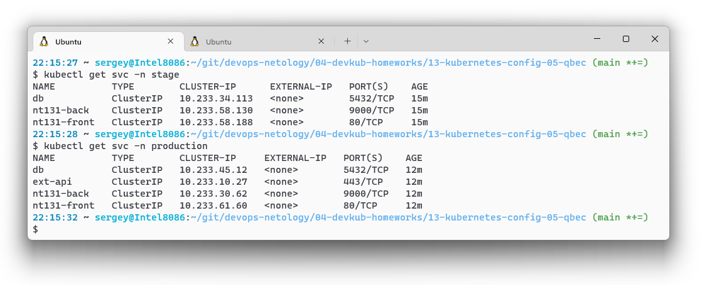

# Домашнее задание к занятию "13.5 поддержка нескольких окружений на примере Qbec"

> Приложение обычно существует в нескольких окружениях. Для удобства работы следует использовать соответствующие инструменты, например, Qbec.

## Задание 1: подготовить приложение для работы через qbec

> Приложение следует упаковать в qbec. Окружения должно быть 2: stage и production. 
> 
> Требования:
> * stage окружение должно поднимать каждый компонент приложения в одном экземпляре;
> * production окружение — каждый компонент в трёх экземплярах;
> * для production окружения нужно добавить endpoint на внешний адрес.

### Упакованное приложение

[qbec application](./13-kubernetes-config-05-qbec/):

* [components](./13-kubernetes-config-05-qbec/components)
  * [back.jsonnet](./13-kubernetes-config-05-qbec/components/back.jsonnet)
  * [db.jsonnet](./13-kubernetes-config-05-qbec/components/db.jsonnet)
  * [endp.jsonnet](./13-kubernetes-config-05-qbec/components/endp.jsonnet)
  * [front.jsonnet](./13-kubernetes-config-05-qbec/components/front.jsonnet)

* [environments](./13-kubernetes-config-05-qbec/components/)
  * [base.libsonnet](./13-kubernetes-config-05-qbec/environments/base.libsonnet)
  * [production.libsonnet](./13-kubernetes-config-05-qbec/environments/production.libsonnet)
  * [prosuction.libsonnet](./13-kubernetes-config-05-qbec/environments/prosuction.libsonnet)
  * [stage.libsonnet](./13-kubernetes-config-05-qbec/environments/stage.libsonnet)
* [params.libsonnet](./13-kubernetes-config-05-qbec/params.libsonnet)
* [qbec.yaml](./13-kubernetes-config-05-qbec/qbec.yaml)

### Проверка

Проверка, что файлы валидны с помощью `qbec validate`:
* `stage`

* `production`

### Деплой

* `stage`
  
* `production`
  

### Проверка деплоя

* `deployments`
  
* `pods`
  
* `services`
  
* `endpoints`
  

### Endpoint

Эндпоинт взял из [первого](./13-kubernetes-config-01-objects.md) задания 13-го блока, он [исключён](https://github.com/run0ut/devops-netology/blob/7b51e2def09b7cd308ea38f84989015423f86fd4/04-devkub-homeworks/13-kubernetes-config-05-qbec/qbec.yaml#L19-L20) по-умолчанию и включен для [production](https://github.com/run0ut/devops-netology/blob/7b51e2def09b7cd308ea38f84989015423f86fd4/04-devkub-homeworks/13-kubernetes-config-05-qbec/qbec.yaml#L13-L17).

Проверка, что работает:
* [Ссылка для контроля](https://api.bigdatacloud.net/data/reverse-geocode-client?latitude=37.42159&longitude=-122.0837&localityLanguage=en)
* Тест курлом из пода
  