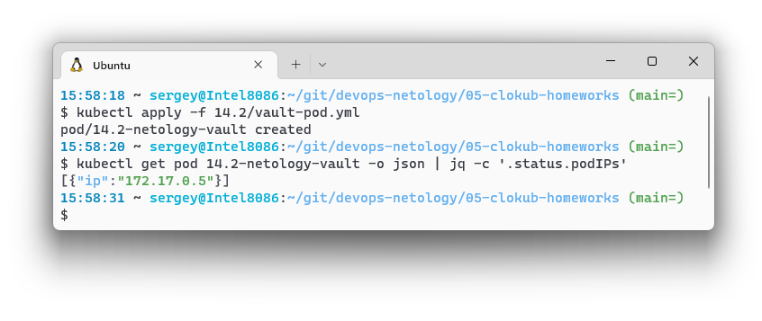
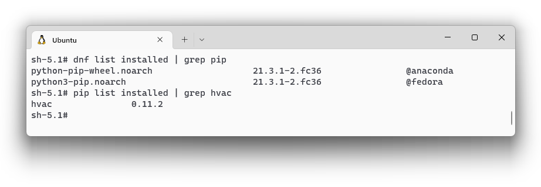
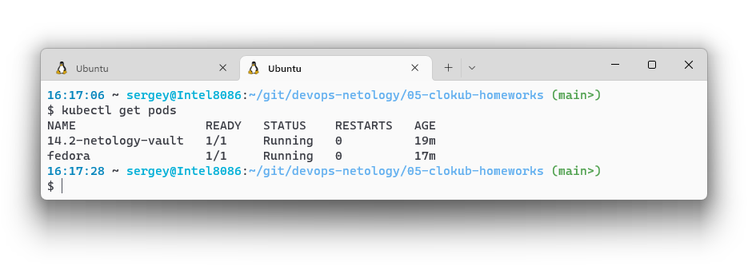
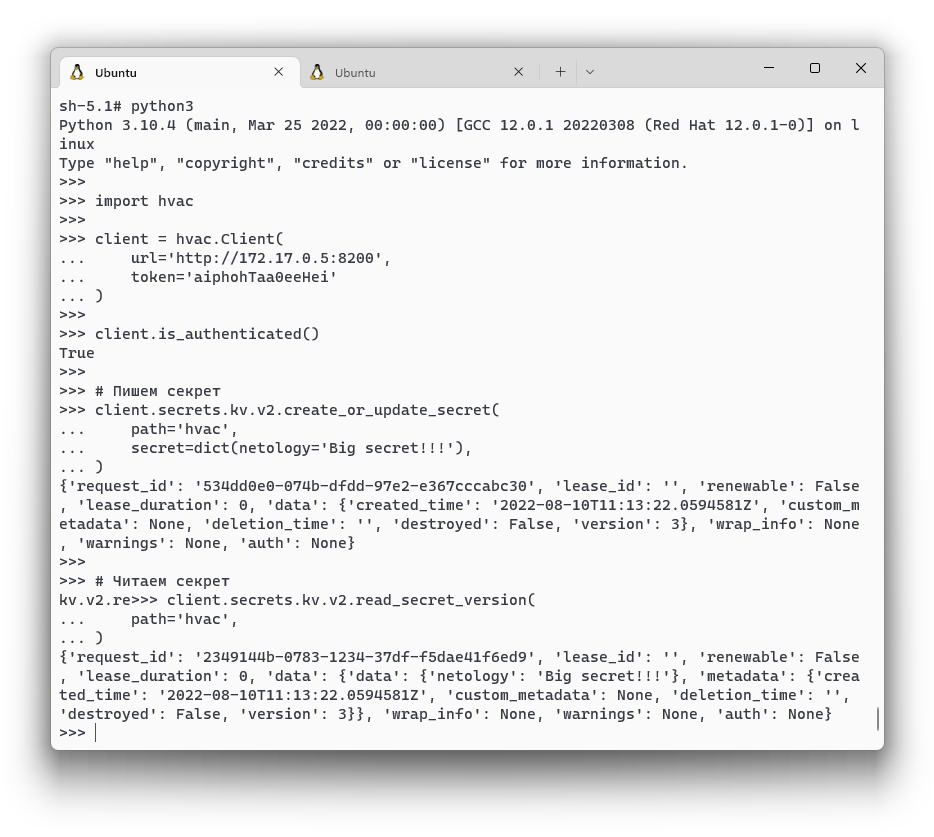
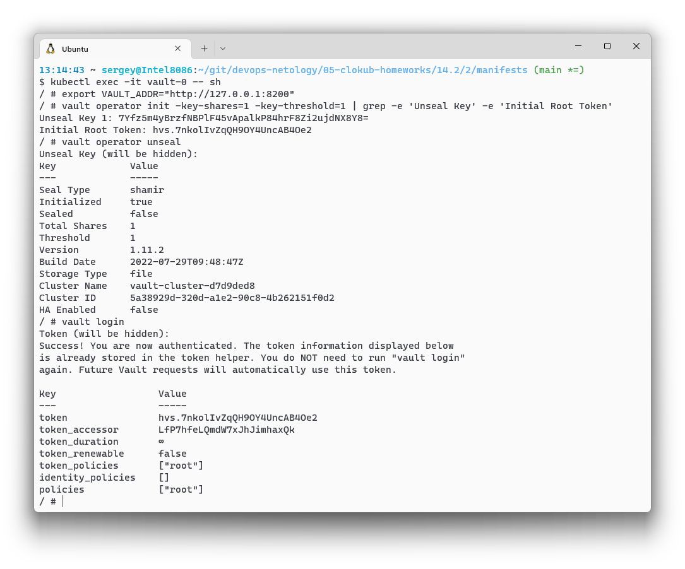
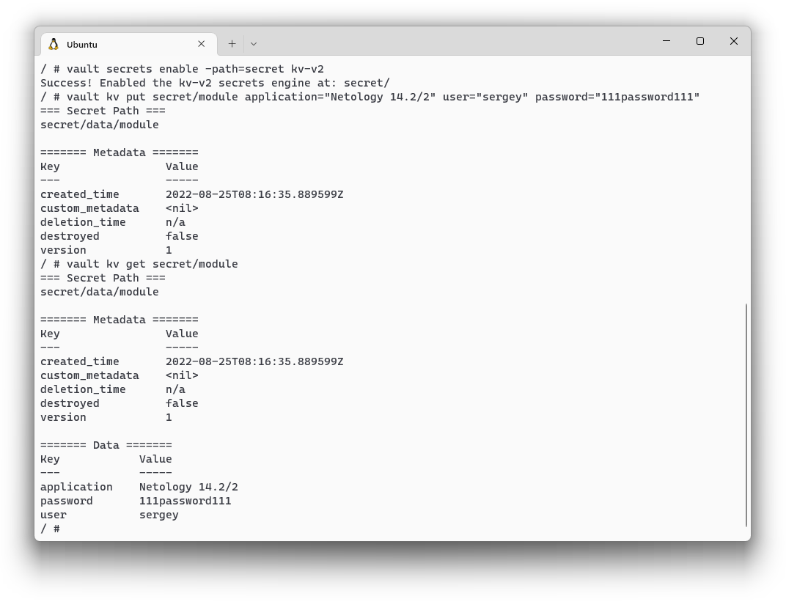
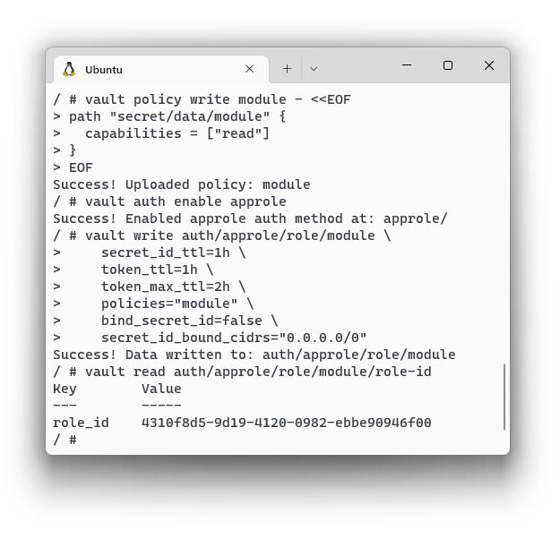
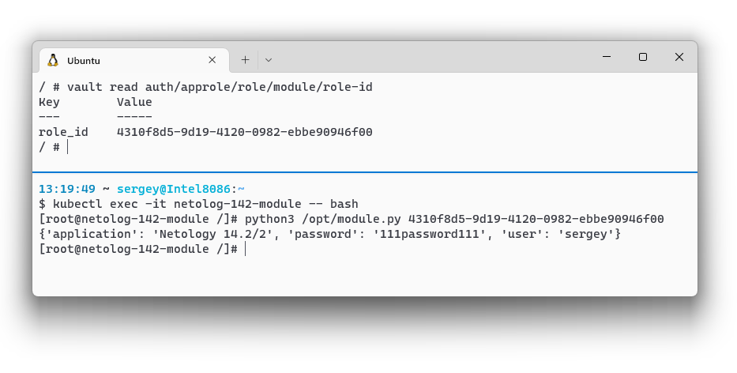

# Домашнее задание к занятию "14.2 Синхронизация секретов с внешними сервисами. Vault"

## Задача 1: Работа с модулем Vault

> Запустить модуль Vault конфигураций через утилиту kubectl в установленном minikube
> 
> ```
> kubectl apply -f 14.2/vault-pod.yml
> ```
> 
> Получить значение внутреннего IP пода
> 
> ```
> kubectl get pod 14.2-netology-vault -o json | jq -c '.status.podIPs'
> ```
> 
> Примечание: jq - утилита для работы с JSON в командной строке



> Запустить второй модуль для использования в качестве клиента
> 
> ```
> kubectl run -i --tty fedora --image=fedora --restart=Never -- sh
> ```
> 
> Установить дополнительные пакеты
> 
> ```
> dnf -y install pip
> pip install hvac
> ```



> Прикрепите скриншоты вывода команды kubectl со списком запущенных объектов каждого типа

Запущено два пода:




> Запустить интепретатор Python и выполнить следующий код, предварительно
> поменяв IP и токен
> 
> ```
> import hvac
> client = hvac.Client(
>     url='http://10.10.133.71:8200',
>     token='aiphohTaa0eeHei'
> )
> client.is_authenticated()
> 
> # Пишем секрет
> client.secrets.kv.v2.create_or_update_secret(
>     path='hvac',
>     secret=dict(netology='Big secret!!!'),
> )
> 
> # Читаем секрет
> client.secrets.kv.v2.read_secret_version(
>     path='hvac',
> )
> ```



## Задача 2 (*): Работа с секретами внутри модуля

> * На основе образа fedora создать модуль;
> * Создать секрет, в котором будет указан токен;
> * Подключить секрет к модулю;v
> * Запустить модуль и проверить доступность сервиса Vault.

Я модифицировал модуль, сделал авторизацию по AppRole как в лекции, ID approle передаётся модулю первым аргументом. 

* [Изменённый модуль](./14.2/2/module.py)
* [Dockerfile](./14.2/2/Dockerfile)
* [Docker Hub](https://hub.docker.com/repository/docker/runout/netology-142)
* [Модуль, Pod](./14.2/2/manifests/40-pod-module.yml)

Vault запускаю в Standalone режиме с постоянным хранилищем. Манифесты:
* [PersistentVolume](./14.2/2/manifests/00-pv.yml)
* [PersistentVolumeClaim](./14.2/2/manifests/10-pvc.yml)
* [Vault Statefulset](./14.2/2/manifests/20-stset-vault.yml)
* [Vault Service](./14.2/2/manifests/30-svc.yml)

Проверка, что работает:
1. Инициализировал Vault. Для простоты настроил распечатывание хранилища одним ключом.

2. Включил KV хранилище версии 2 и добавил секрет `secret/module`

3. Добавил политику `module` для доступа к секрету на чтение и роль `module`. Последней командой получил ID роли для авторизации приложения. Политика создана с доступом без `secret_id` от любого IP, в продакшене так, конечно, делать не стоит.

4. Получил секрет из приложения по `role_id`


