# Домашнее задание к занятию "15.1. Организация сети"

> Домашнее задание будет состоять из обязательной части, которую необходимо выполнить на провайдере Яндекс.Облако и дополнительной части в AWS по желанию. Все домашние задания в 15 блоке связаны друг с другом и в конце представляют пример законченной инфраструктуры.  
> Все задания требуется выполнить с помощью Terraform, результатом выполненного домашнего задания будет код в репозитории. 
> 
> Перед началом работ следует настроить доступ до облачных ресурсов из Terraform используя материалы прошлых лекций и [ДЗ](https://github.com/netology-code/virt-homeworks/tree/master/07-terraform-02-syntax ). А также заранее выбрать регион (в случае AWS) и зону.

---
## Задание 1. Яндекс.Облако (обязательное к выполнению)

> 1. Создать VPC.
>       - Создать пустую VPC. Выбрать зону.
> 2. Публичная подсеть.
>       - Создать в vpc subnet с названием public, сетью 192.168.10.0/24.
>       - Создать в этой подсети NAT-инстанс, присвоив ему адрес 192.168.10.254. В качестве image_id использовать fd80mrhj8fl2oe87o4e1
>       - Создать в этой публичной подсети виртуалку с публичным IP и подключиться к ней, убедиться что есть доступ к интернету.
> 3. Приватная подсеть.
>       - Создать в vpc subnet с названием private, сетью 192.168.20.0/24.
>       - Создать route table. Добавить статический маршрут, направляющий весь исходящий трафик private сети в NAT-инстанс
>       - Создать в этой приватной подсети виртуалку с внутренним IP, подключиться к ней через виртуалку, созданную ранее и убедиться что есть доступ к интернету
> 
> Resource terraform для ЯО
> - [VPC subnet](https://registry.terraform.io/providers/yandex-cloud/yandex/latest/docs/resources/vpc_subnet)
> - [Route table](https://registry.terraform.io/providers/yandex-cloud/yandex/latest/docs/resources/vpc_route_table)
> - [Compute Instance](https://registry.terraform.io/providers/yandex-cloud/yandex/latest/docs/resources/compute_instance)

Файлы Terraform:

* [versions.tf](./15.1/yandex/versions.tf) - подключение провайдера
* [provider.tf](./15.1/yandex/provider.tf) - настройка провайдера
* [variables.tf](./15.1/yandex/variables.tf) - переменные
* [network.tf](./15.1/yandex/network.tf) - сети и подсети
* [instances.tf](./15.1/yandex/instances.tf) - инстансы

Проверяю:
1. Генерирую ssh-ключи
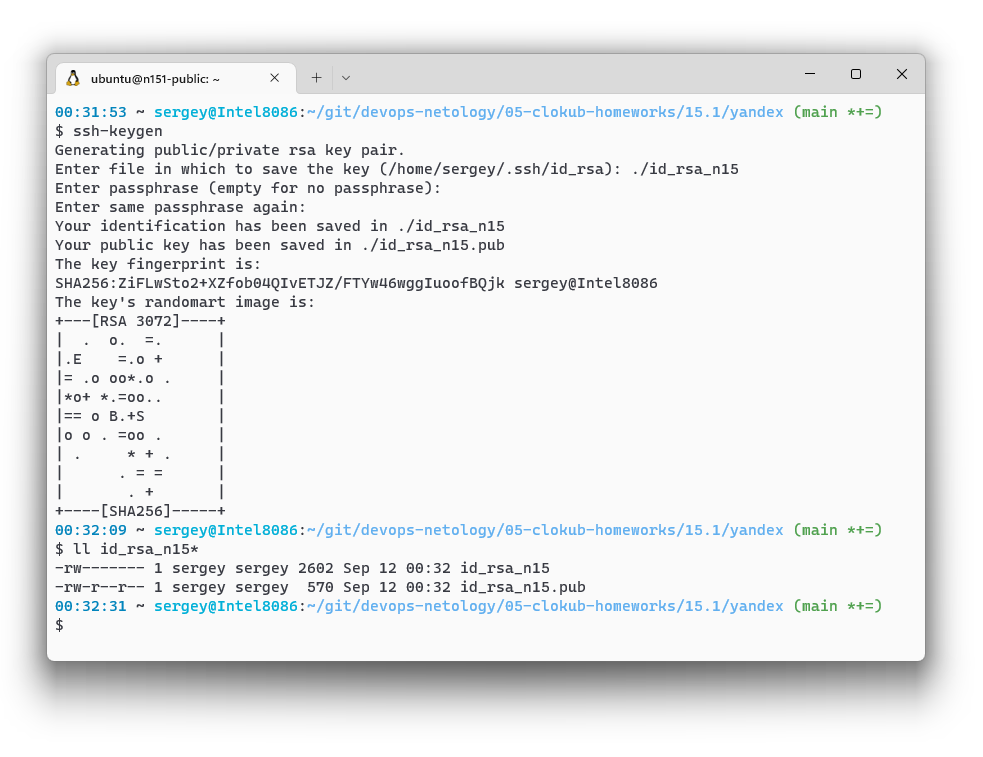
1. Применяю конфиг Terraform
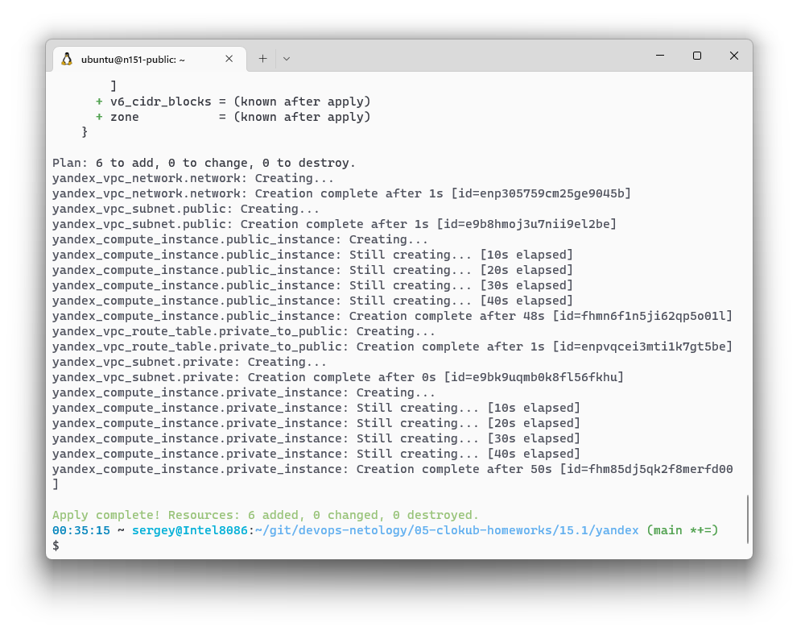
1. VPC в консоли
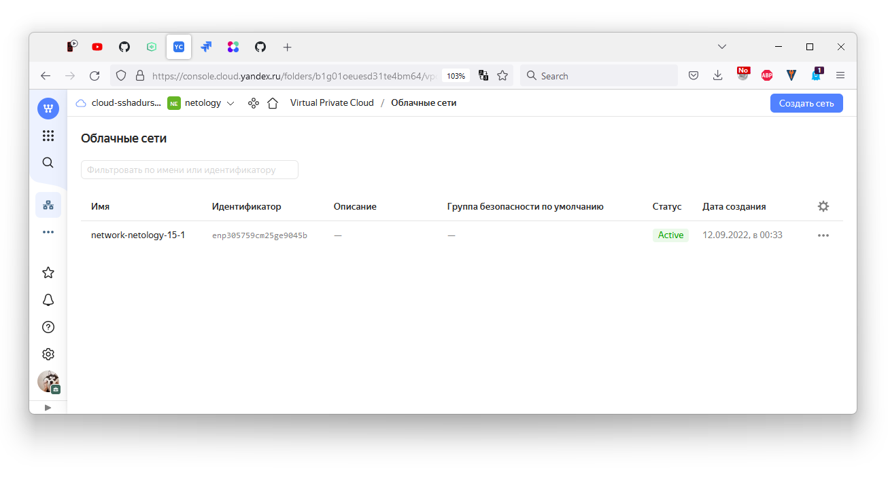
1. Подсети. К приватной подсети подключена таблица маршрутизации `private to public`
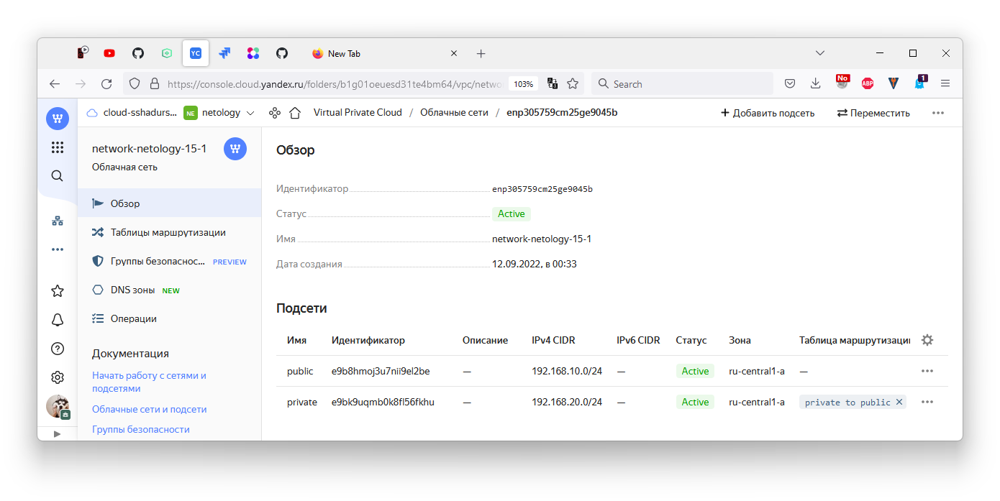
1. Таблица маршрутизации. Добавлен маршрут в интернет через хост из сети `192.168.10.0/24`
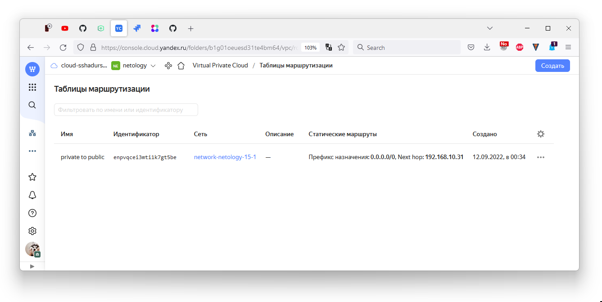
1. Хосты. Внешний IP есть только у `n151-public`
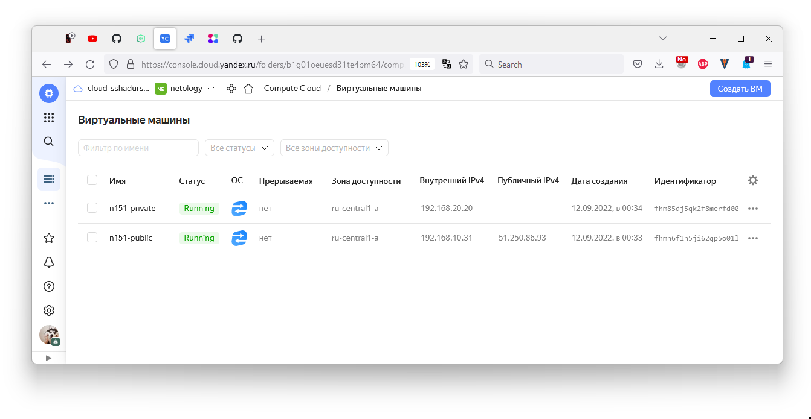
1. Хост `n151-public`, подключен к сети `public`
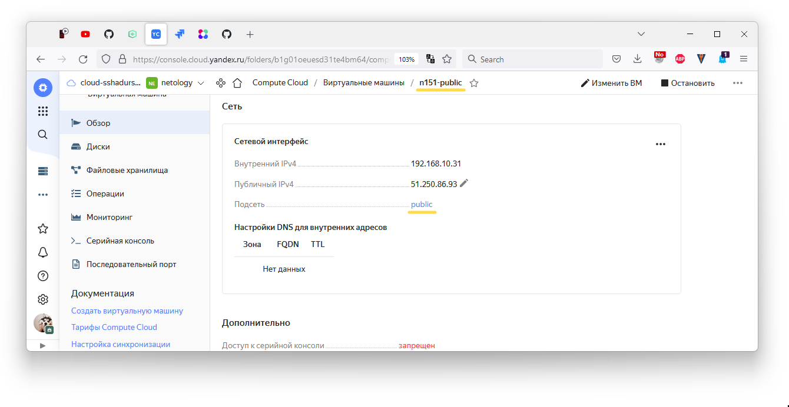
1. Хост `n151-private`, подключен к сети `private`
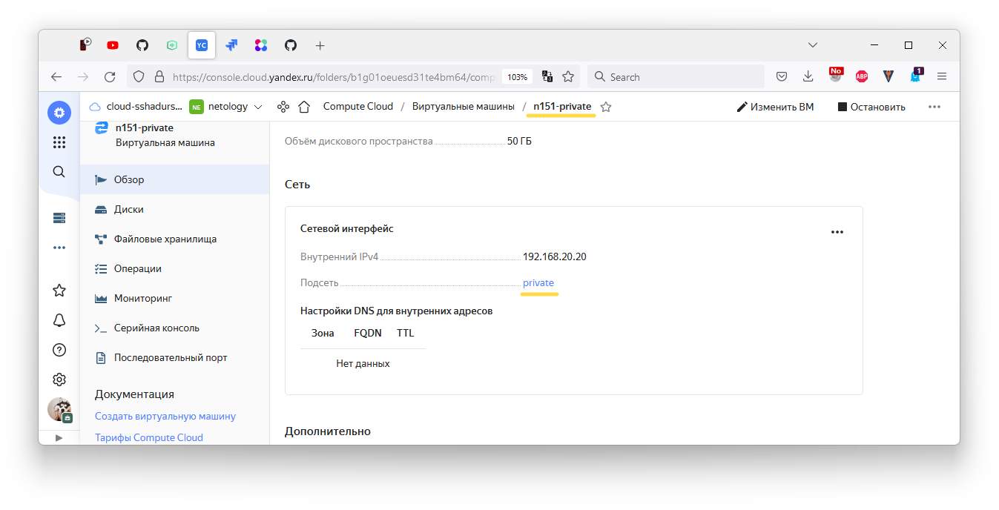
1. Копирую приватный ключ на хост `public`, чтобы с него подключиться к хосту `private`. Подключаюсь к `public` по ключу, созданному ранее.
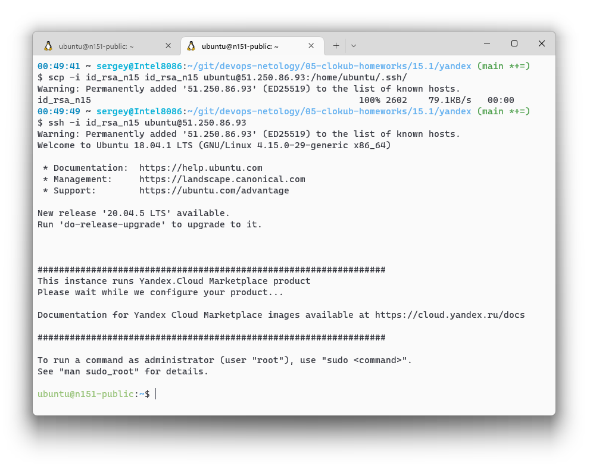
1. Ставлю правильные права на приватный ключ. Подключаюсь с хоста `public` к `private`.
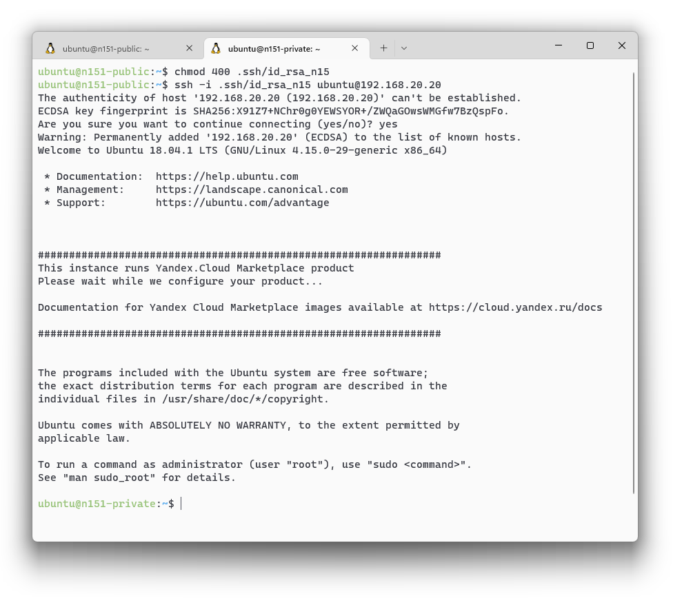
1. Проверяю доступ в интернет с хоста `private`. Доступ есть. По `tcpdump` хоста `public` видно, что через него идёт трафик хоста `private`.
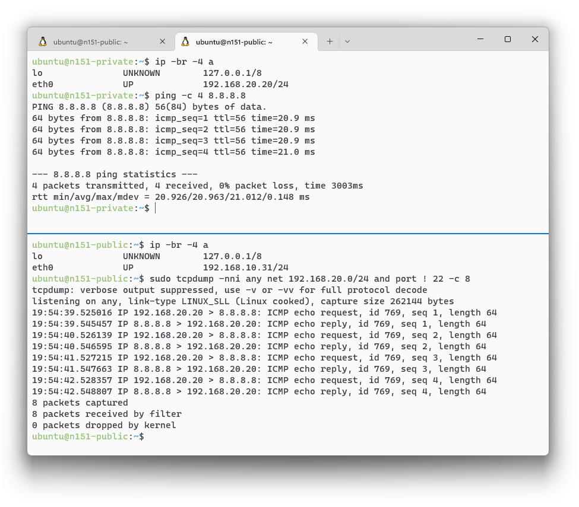

## Задание 2*. AWS (необязательное к выполнению)

> 1. Создать VPC.
>       - Cоздать пустую VPC с подсетью 10.10.0.0/16.
> 2. Публичная подсеть.
>       - Создать в vpc subnet с названием public, сетью 10.10.1.0/24
>       - Разрешить в данной subnet присвоение public IP по-умолчанию. 
>       - Создать Internet gateway 
>       - Добавить в таблицу маршрутизации маршрут, направляющий весь исходящий трафик в Internet gateway.
>       - Создать security group с разрешающими правилами на SSH и ICMP. Привязать данную security-group на все создаваемые в данном ДЗ виртуалки
>       - Создать в этой подсети виртуалку и убедиться, что инстанс имеет публичный IP. Подключиться к ней, убедиться что есть доступ к интернету.
>       - Добавить NAT gateway в public subnet.
> 3. Приватная подсеть.
>       - Создать в vpc subnet с названием private, сетью 10.10.2.0/24
>       - Создать отдельную таблицу маршрутизации и привязать ее к private-подсети
>       - Добавить Route, направляющий весь исходящий трафик private сети в NAT.
>       - Создать виртуалку в приватной сети.
>       - Подключиться к ней по SSH по приватному IP через виртуалку, созданную ранее в публичной подсети и убедиться, что с виртуалки есть выход в интернет.
> 
> Resource terraform
> - [VPC](https://registry.terraform.io/providers/hashicorp/aws/latest/docs/resources/vpc)
> - [Subnet](https://registry.terraform.io/providers/hashicorp/aws/latest/docs/resources/subnet)
> - [Internet Gateway](https://registry.terraform.io/providers/hashicorp/aws/latest/docs/resources/internet_gateway)

У меня нет возможности использовать ресурсы AWS, и я решил выбрать облако из доступных в РФ - Sber Cloud. Кто-то из преподавателей говорил, к сожалению не помню кто, что из российских облаков Сбер наиболее близок к Амазону.

В сети Сбера нет сущности, подобной Internet Gateway: хотя IGW есть на схеме в [документации](https://docs.sbercloud.ru/vpc/ug/index.html), в описании он не упоминается. Возможно доступ к нему появится в будущем. 

Чтобы подключить инстанс к интернету, ему нужно:
1. [Настроить](https://docs.sbercloud.ru/ecs/ug/topics/faq_net-settings_access-to-internet.html) `inbound` правило Security Group
2. Дать IP:
    - либо напрямую привязать внешний IP - [Elastic IP](https://docs.sbercloud.ru/network-elastic_ip/ug/index.html)
    - либо [дать доступ через NAT Gateway](https://docs.sbercloud.ru/ecs/ug/topics/faq_net-settings_ecs-access-to-internet.html)

Файлы Terraform:
* [provider.tf](./15.1/sber/provider.tf) - подключение и настройка провайдера
* [variables.tf](./15.1/sber/variables.tf) - переменные
* [network.tf](./15.1/sber/network.tf) - настройки VPC, включая создание VPC, сабнетов, Security Group, NAT Gateway, таблицы маршрутизации и добавление внешних IP
* [compute.tf](./15.1/sber/compute.tf) - инстансы, включая добавление key-pair для ssh, двух инстансов и подключение внешнего IP к инстансу `public`

* [id_rsa_n15.pub](./15.1/yandex/id_rsa_n15.pub) - публичный ssh-ключ, созданный в первом задании

Проверяю:
1) Применяю конфиг Terraform.
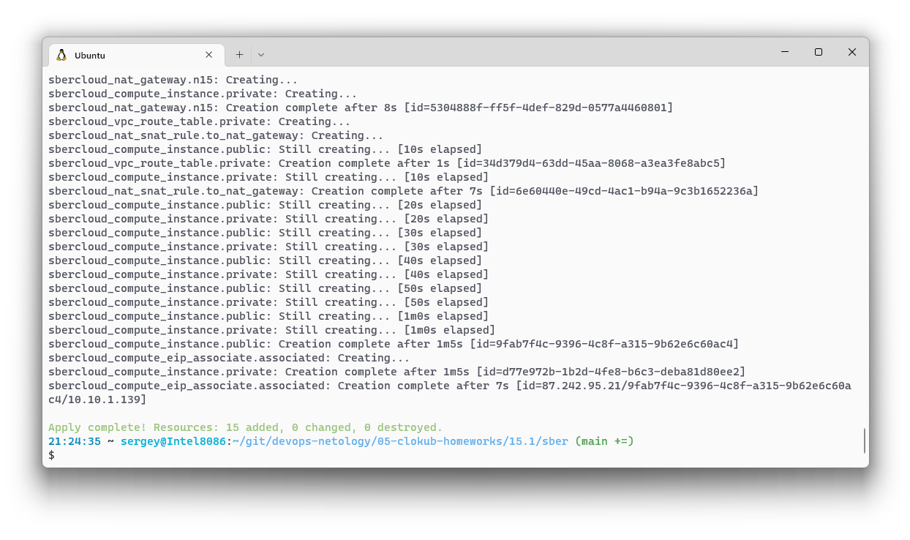
2) Созданный VPC
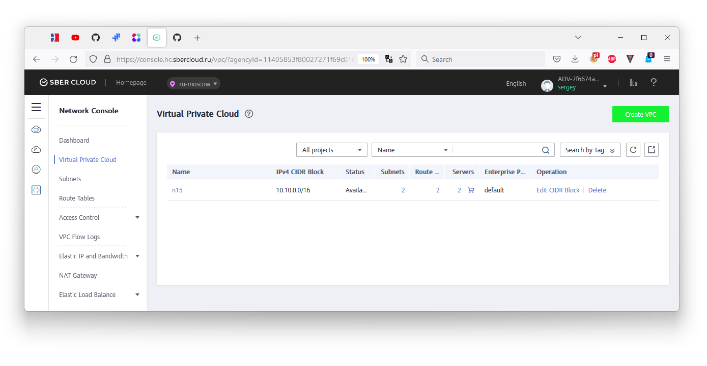
3) Сабнеты
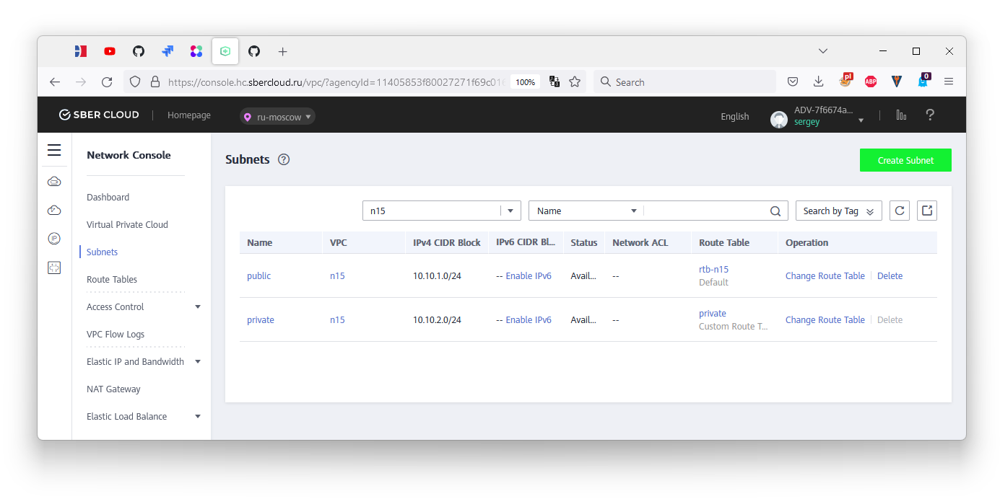
4) Таблицы маршрутизации, дефолтная используется для инстанса `public`, своя для инстанса `private`. В таблицу `private` добавлен маршрут через NAT Gateway 
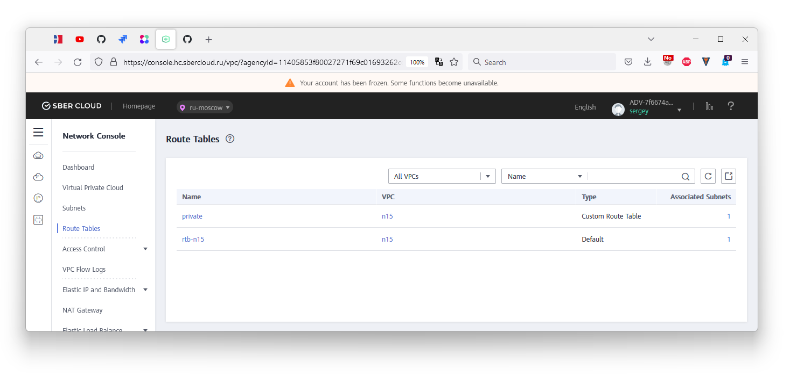
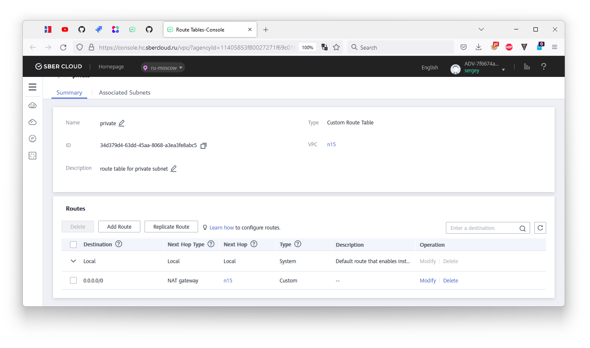
5) Группы безопасности. Группа `n15` используется для обоих инстансов. Дефолтная группа создаётся сама автоматический вместе с VPC, её невозможно удалить.
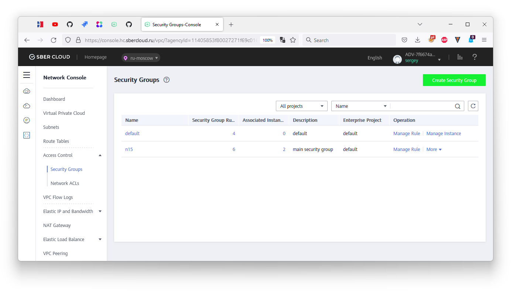
Правила входящего трафика. Два дефолтных, для связи инстансов внутри группы и два, созданных Тераформом, для ICMP и SSH.
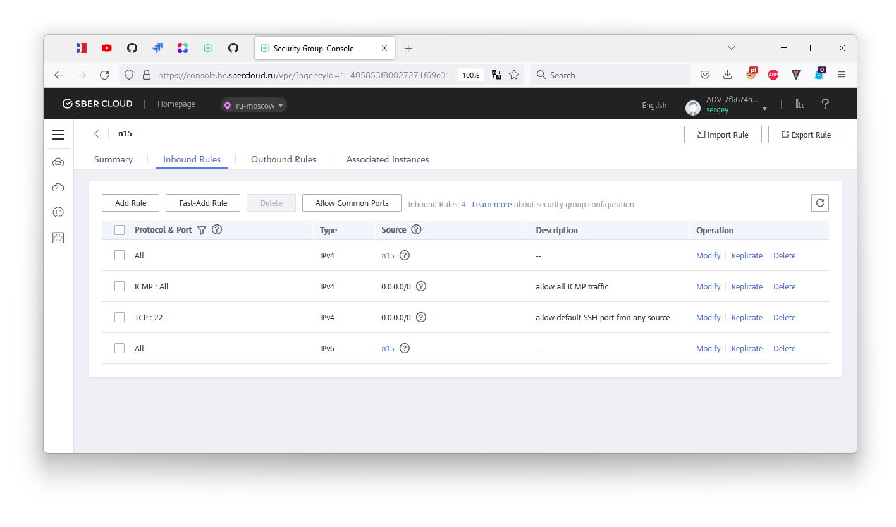
Правила исходящего трафика. Оба создаются автоматический с группой и разрешают любой исходящий трафик.
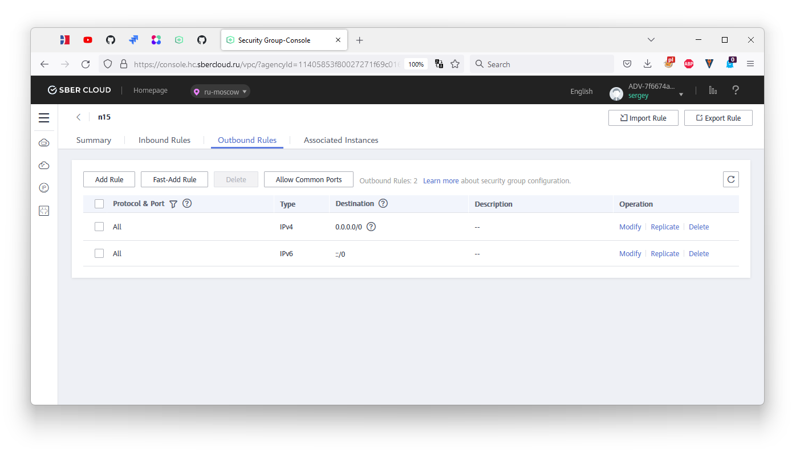
Инстансы, привязанные к группе.
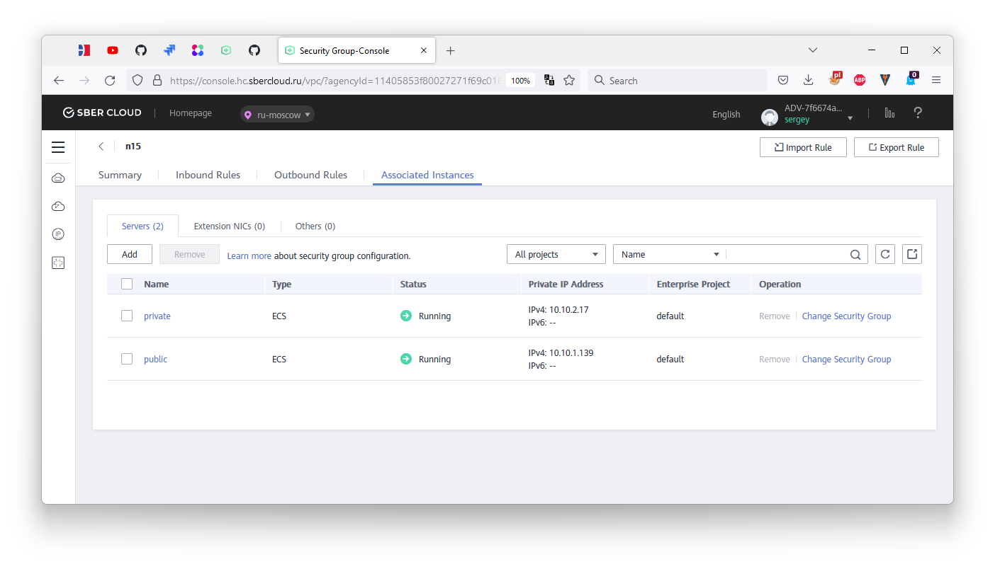
6) NAT Gateway для сети `private`
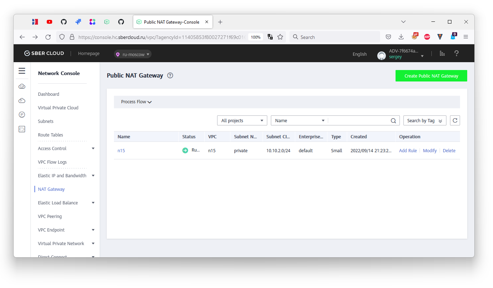
Добавлено правило SNAT для сети через один из внешних IP.
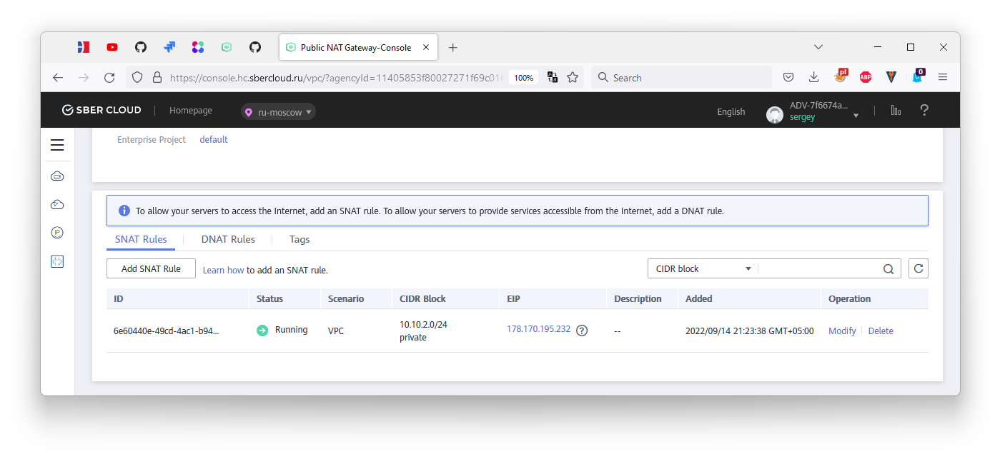
7) Внешние IP. Видно, что один привязан к инстансу ECS `public`, другой к NAT Gateway `n15`.
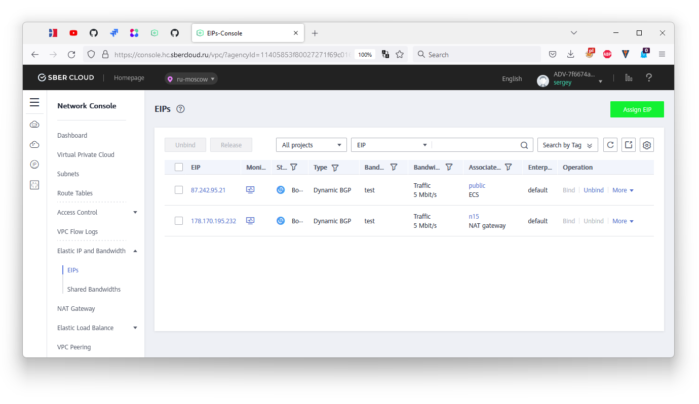
8) Инстансы:
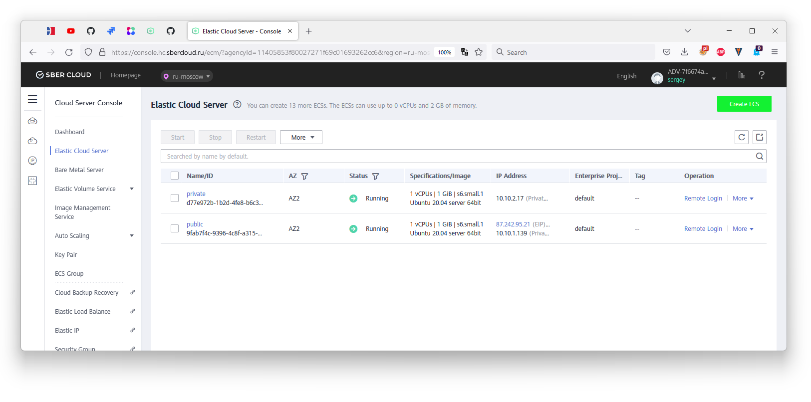
    - `private` с серым адресом 10.10.2.17
    - `public` с серым адресом 10.10.1.139 и белым 87.242.95.21
10) Подключаюсь к хосту `public`:
    - Копирую приватный ключ, чтобы по нему подключиться к приватному хосту с публичного
    - Проверяю, что проходит пинг
    - Подключаюсь
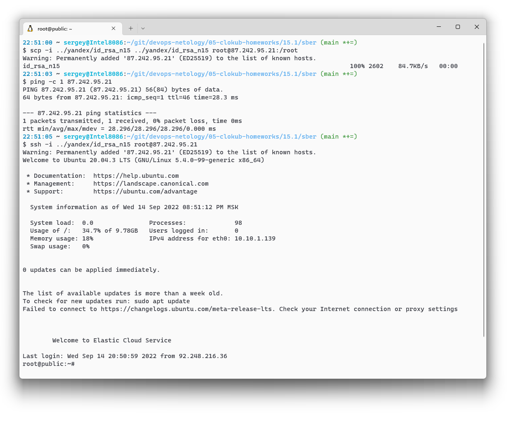
11) Подключаюсь к хосту `private`:
    - Проверяю, что проходит пинг
    - Ставлю права на ключ, чтобы им можно было воспользоваться
    - Подключаюсь по SSH
    - Проверяю, что у хоста `private` есть доступ в интернет.
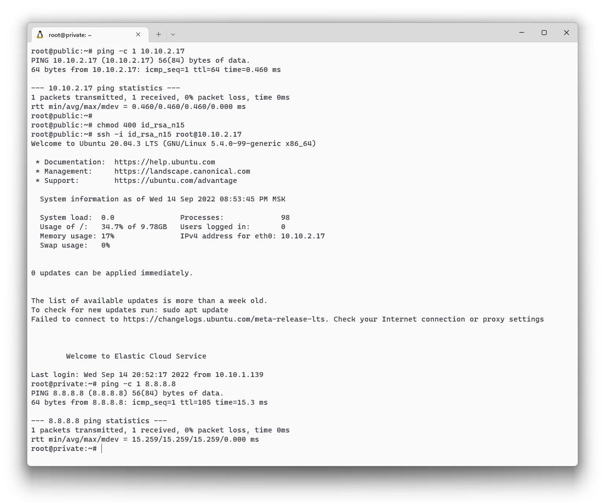
