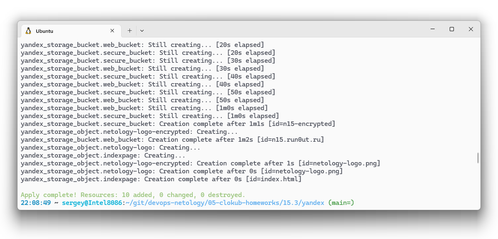
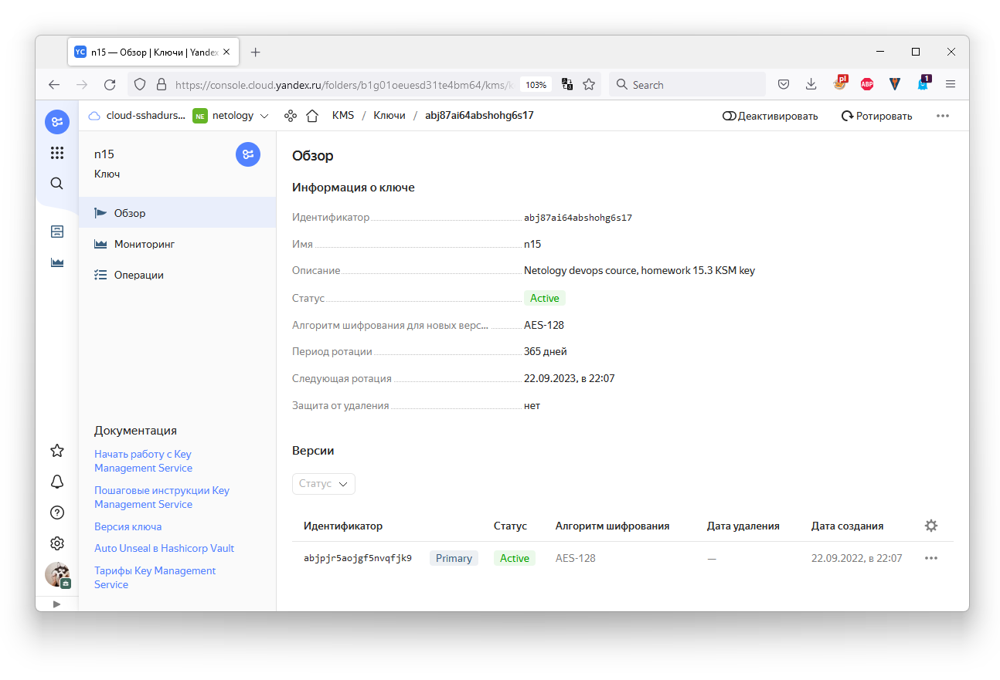
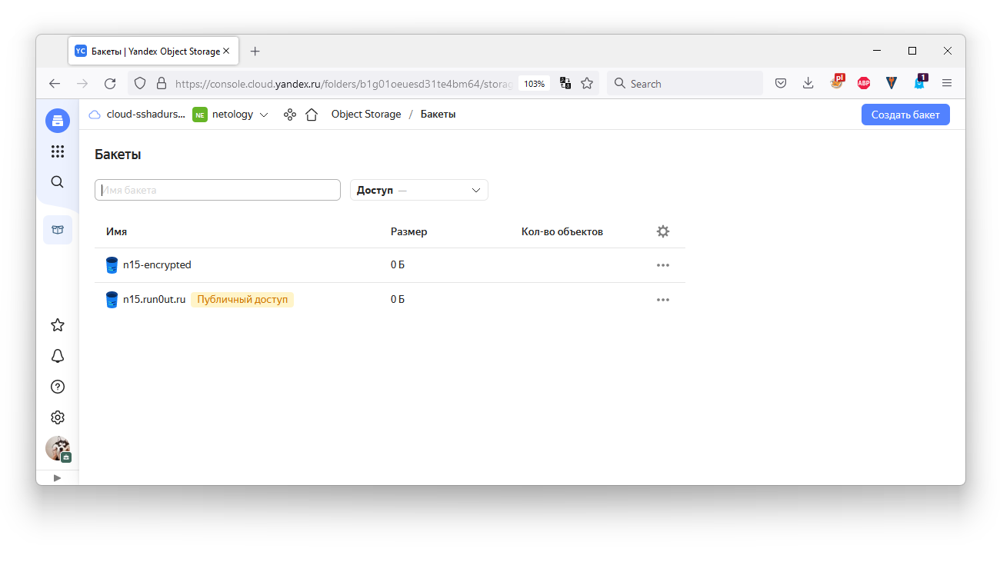
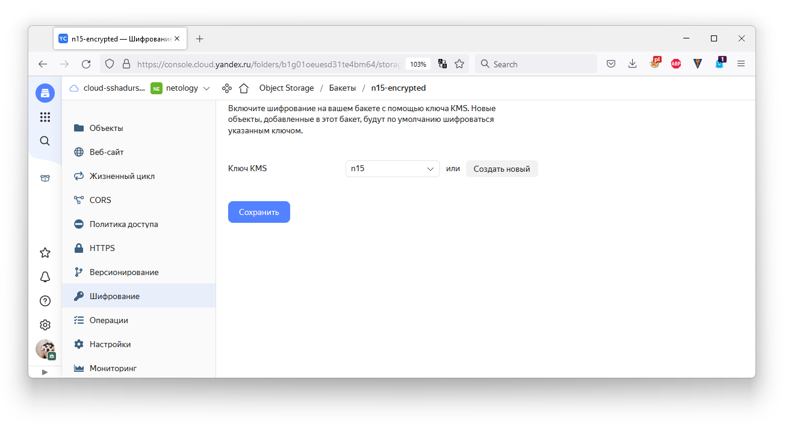
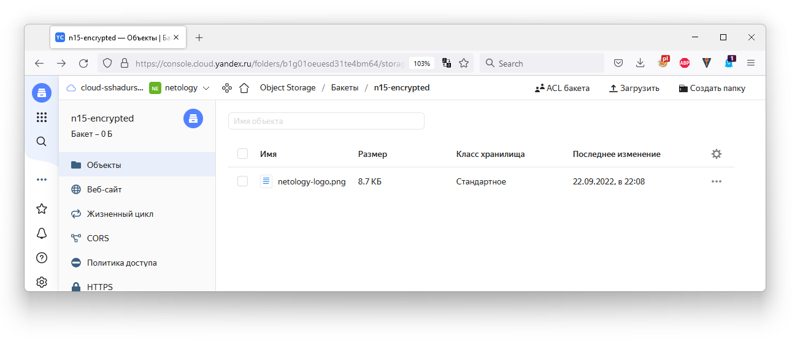
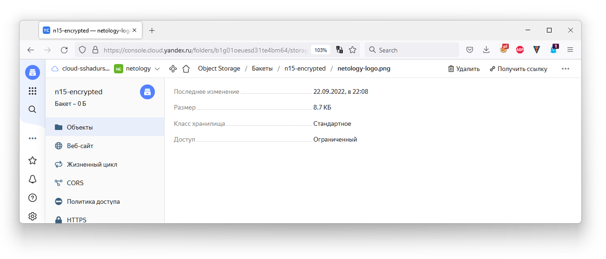

# Домашнее задание к занятию 15.3 "Безопасность в облачных провайдерах"
Используя конфигурации, выполненные в рамках предыдущих домашних заданиях, нужно добавить возможность шифрования бакета.

---
## Задание 1. Яндекс.Облако (обязательное к выполнению)

> 1. С помощью ключа в KMS необходимо зашифровать содержимое бакета:
> - Создать ключ в KMS,
> - С помощью ключа зашифровать содержимое бакета, созданного ранее.

Я не нашел способа дать публичный доступ к бакету с шифрованными данными, полагаю это не подразумевается сутью шифрования - хачем шифровать, если доступ публичный? Поэтому создал два бакета: для шифрованных данных и не шифрованных. 

Судя по [руководству](https://cloud.yandex.ru/docs/storage/tutorials/server-side-encryption) шифроваться будут только новые объекты, поэтом бакет и файл созданы заново.

1. Применяю манифест

1. Ключ добавлен

1. Добавлены бакеты

1. Для бакета `n15-encrypted` настроено шифрование

1. В бакете один файл, по общему описанию не понять, он зашифрован или нет

1. По "более детальному", но всё равно бедному описанию тоже не понятно, зашифрован объёкт или нет.



> 2. (Выполняется НЕ в terraform) *Создать статический сайт в Object Storage c собственным публичным адресом и сделать доступным по HTTPS
> - Создать сертификат,
> - Создать статическую страницу в Object Storage и применить сертификат HTTPS,
> - В качестве результата предоставить скриншот на страницу с сертификатом в заголовке ("замочек").
>
> <details><summary>.</summary>
>
> Документация
> - [Настройка HTTPS статичного сайта](https://cloud.yandex.ru/docs/storage/operations/hosting/certificate)
> - [Object storage bucket](https://registry.terraform.io/providers/yandex-cloud/yandex/latest/docs/resources/storage_bucket)
> - [KMS key](https://registry.terraform.io/providers/yandex-cloud/yandex/latest/docs/resources/kms_symmetric_key)
>
> </details>

--- 
## Задание 2*. AWS (необязательное к выполнению)

1. С помощью роли IAM записать файлы ЕС2 в S3-бакет:
- Создать роль в IAM для возможности записи в S3 бакет;
- Применить роль к ЕС2-инстансу;
- С помощью бутстрап скрипта записать в бакет файл web-страницы.
2. Организация шифрования содержимого S3-бакета:
- Используя конфигурации, выполненные в рамках ДЗ на предыдущем занятии, добавить к созданному ранее bucket S3 возможность шифрования Server-Side, используя общий ключ;
- Включить шифрование SSE-S3 bucket S3 для шифрования всех вновь добавляемых объектов в данный bucket.
3. *Создание сертификата SSL и применение его к ALB:
- Создать сертификат с подтверждением по email;
- Сделать запись в Route53 на собственный поддомен, указав адрес LB;
- Применить к HTTPS запросам на LB созданный ранее сертификат.

Resource terraform
- [IAM Role](https://registry.terraform.io/providers/hashicorp/aws/latest/docs/resources/iam_role)
- [AWS KMS](https://registry.terraform.io/providers/hashicorp/aws/latest/docs/resources/kms_key)
- [S3 encrypt with KMS key](https://registry.terraform.io/providers/hashicorp/aws/latest/docs/resources/s3_bucket_object#encrypting-with-kms-key)

Пример bootstrap-скрипта:
```
#!/bin/bash
yum install httpd -y
service httpd start
chkconfig httpd on
cd /var/www/html
echo "<html><h1>My cool web-server</h1></html>" > index.html
aws s3 mb s3://mysuperbacketname2021
aws s3 cp index.html s3://mysuperbacketname2021
```


