# Домашнее задание к занятию 15.3 "Безопасность в облачных провайдерах"

> Используя конфигурации, выполненные в рамках предыдущих домашних заданиях, нужно добавить возможность шифрования бакета.

---
## Задание 1. Яндекс.Облако (обязательное к выполнению)

### KMS

> 1. С помощью ключа в KMS необходимо зашифровать содержимое бакета:
> - Создать ключ в KMS,
> - С помощью ключа зашифровать содержимое бакета, созданного ранее.

Я не нашел способа дать публичный доступ к бакету с шифрованными данными, полагаю это не подразумевается by-design. Создал два бакета: для шифрованных данных и не шифрованных. 

Судя по [руководству](https://cloud.yandex.ru/docs/storage/tutorials/server-side-encryption) шифроваться будут только новые объекты, бакет и объект созданы заново.

Манифесты:
- [provider.tf](./15.3/yandex/provider.tf) - провайдер и его настройка
- [variables.tf](./15.3/yandex/variables.tf) - переменные
- [serviceaccount.tf](./15.3/yandex/serviceaccount.tf) - сервис аккаунт, он необходим чтобы работать с Object Storage через Terraform
- [storage.tf](./15.3/yandex/storage.tf) - бакеты и объекты в Object Storage, интеграция с KMS
- [kms.tf](./15.3/yandex/kms.tf) - ключ KMS

1. Применяю манифест

1. Ключ добавлен

1. Добавлены бакеты

1. Для бакета `n15-encrypted` настроено шифрование

1. В бакете один файл, по общему описанию непонятно, он зашифрован или нет

1. Если "провалиться" в файл, то там будут те же данные, что в таблице в общем списке, и непонятно зашифрован объёкт или нет.


### Статический сайт

> 2. (Выполняется НЕ в terraform) *Создать статический сайт в Object Storage c собственным публичным адресом и сделать доступным по HTTPS
> - Создать сертификат,
> - Создать статическую страницу в Object Storage и применить сертификат HTTPS,
> - В качестве результата предоставить скриншот на страницу с сертификатом в заголовке ("замочек").
>
> <details><summary>.</summary>
>
> Документация
> - [Настройка HTTPS статичного сайта](https://cloud.yandex.ru/docs/storage/operations/hosting/certificate)
> - [Object storage bucket](https://registry.terraform.io/providers/yandex-cloud/yandex/latest/docs/resources/storage_bucket)
> - [KMS key](https://registry.terraform.io/providers/yandex-cloud/yandex/latest/docs/resources/kms_symmetric_key)
>
> </details>

У меня уже был домен и сертификат, поэтому я воспользовался [этой инструкцией](https://cloud.yandex.ru/docs/storage/operations/hosting/own-domain).

1. Загрузил сертификат
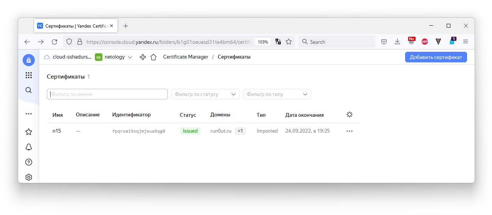
1. Настройл HTTPS
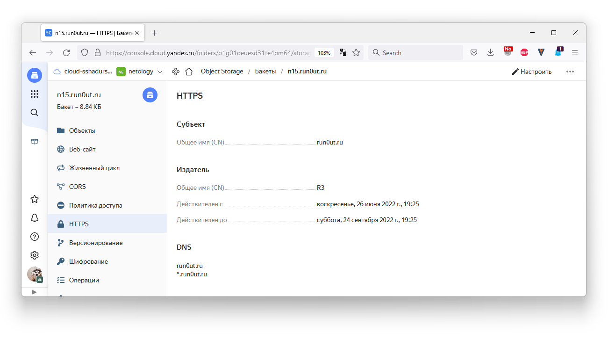
1. Настроил хостинг для статики
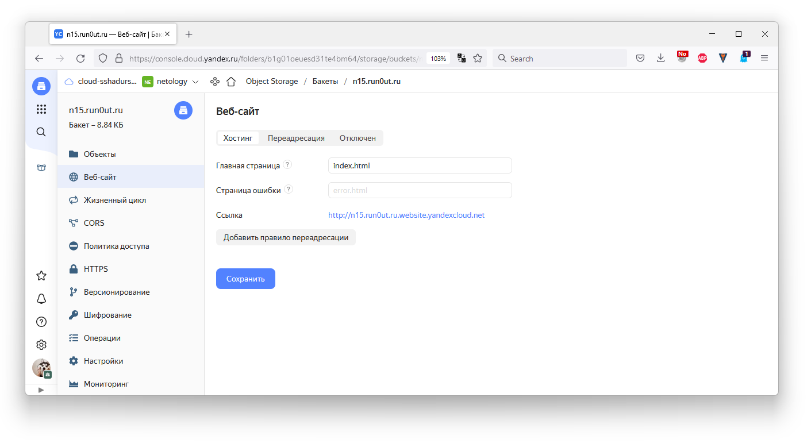
1. Файлы были загружены тераформом в первой части задания
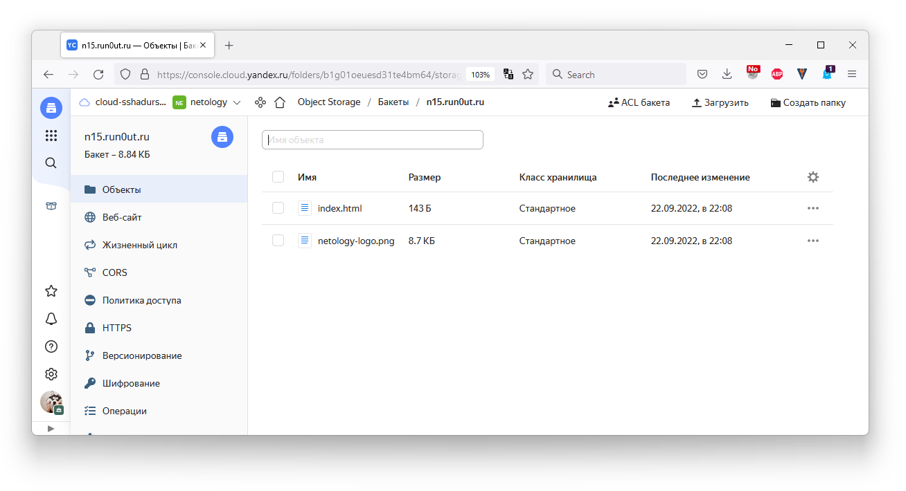
1. По инструкции, настроил CNAME запись в DNS домена, ссылающуюся на бакет в Яндексе
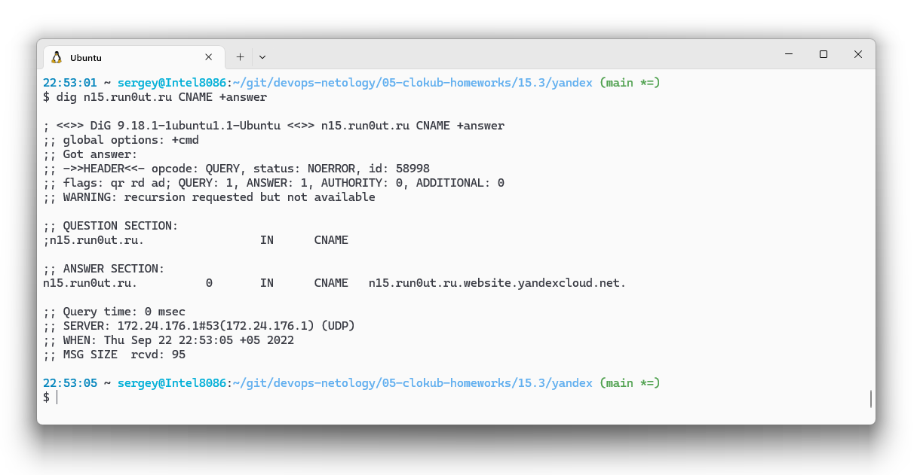
1. Проверил, что страница загружается и защищена сертификатом.
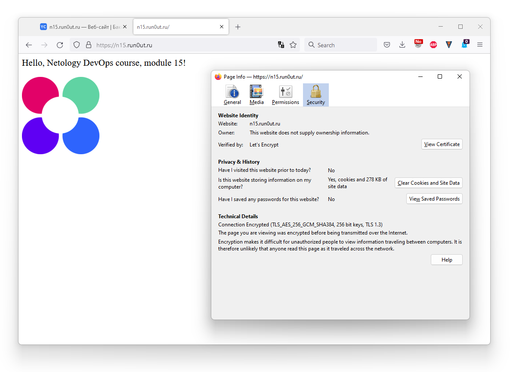

--- 
## Задание 2*. AWS (необязательное к выполнению)

Манифесты Терраформ:
* [provider.tf](./15.3/sber/provider.tf) - подключение и настсройка провайдера 
* [variables.tf](./15.3/sber/variables.tf) - переменные
* [network.tf](./15.3/sber/network.tf) - настройка сети и запрос внешних IP
* [compute.tf](./15.3/sber/compute.tf) - инстанс для копирования файлов между бакетами 
* [kms.tf](./15.3/sber/kms.tf) - настройка KMS
* [storage.tf](./15.3/sber/storage.tf) - бакеты и файл для зашифрованного бакета
* [loadbalancer.tf](./15.3/sber/loadbalancer.tf) - настойка балансировщика и сертификата
* [autoscale.tf](./15.3/sber/autoscale.tf) - инстансы для балансировщика

### Запись в S3 из EC2 инстанса

> 1. С помощью роли IAM записать файлы ЕС2 в S3-бакет:
> - Создать роль в IAM для возможности записи в S3 бакет;
> - Применить роль к ЕС2-инстансу;
> - С помощью бутстрап скрипта записать в бакет файл web-страницы.

У SberCloud, в отличие от Яндекса и AWS, нет cli-утилиты, но для работы с S3 можно использовать [obsutil](https://docs.sbercloud.ru/obs/ug/topics/obsutil.html).

Для доступа к бакету, использовал IAM ключи из настроек провайдера.

Я использовал немного другую схему для файлов:
* Создал два бакета: зашифрованный и публичный. 
* Тераформ манифестом поместил файл-картинку в зашифрованный бакет. 
* Бутстрап скриптом для инстанса я скопировал этот файл из зашифрованного бакета в публичный.

Этот файл потом отобразится на страничках нод балансировщика, как в [задании 15.2](./15.2.md)

1. Применяю манифест Terraform
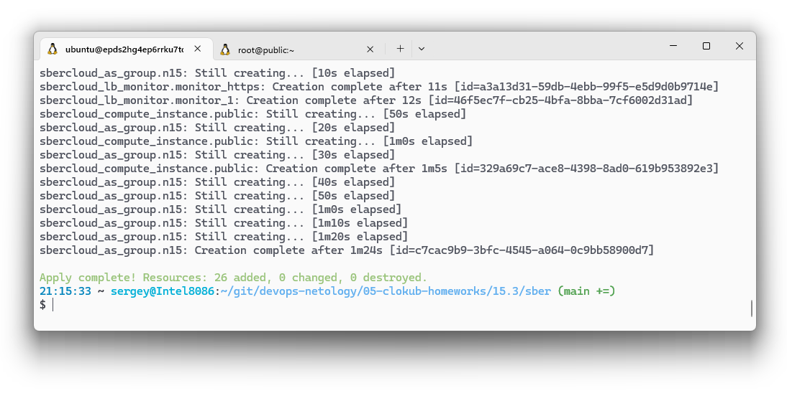
1. Подключаюсь к ВМ, проверяю что [bootstrap скрипт](https://github.com/run0ut/devops-netology/blob/d5084a0ba2ec843d46c957ede72b21754573e4f1/05-clokub-homeworks/15.3/sber/compute.tf#L32-L39) для cloud-init загрузился
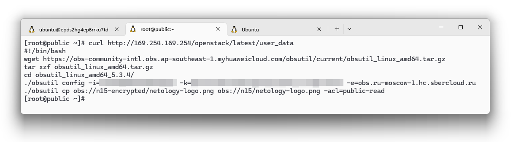
1. Проверяю по логу cloud-init, что скрипт выполнился и файл скопирован из зашифрованного бакета в публичный.
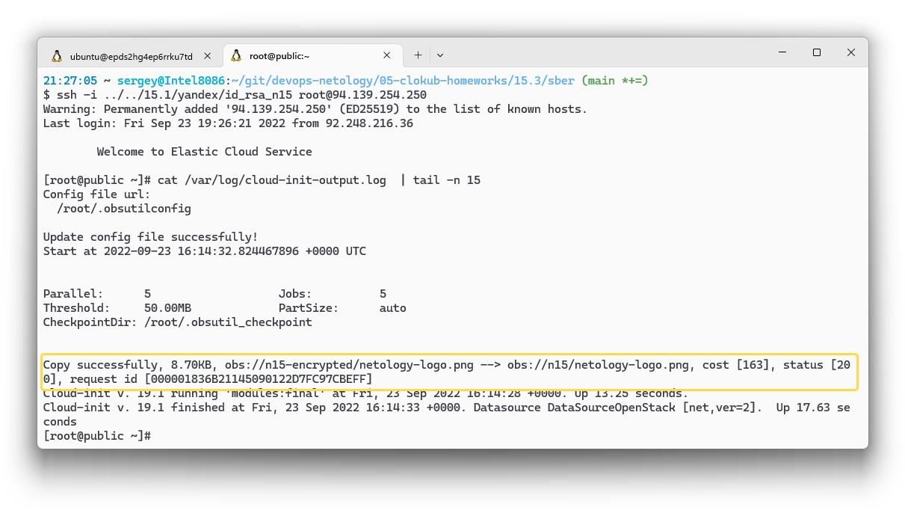

### Шифрование S3 бакета

> 2. Организация шифрования содержимого S3-бакета:
> - Используя конфигурации, выполненные в рамках ДЗ на предыдущем занятии, добавить к созданному ранее bucket S3 возможность шифрования Server-Side, используя > общий ключ;
> - Включить шифрование SSE-S3 bucket S3 для шифрования всех вновь добавляемых объектов в данный bucket.

Интеграция с KMS не описана в [документации провайдера](https://registry.terraform.io/providers/sbercloud-terraform/sbercloud/latest/docs/resources/obs_bucket), но оказалось что Sber Cloud - это Huawei Cloud в РФ, и многие коммиты в код провайдера [делались](https://github.com/sbercloud-terraform/terraform-provider-sbercloud/commits?author=Jason-Zhang9309) [программистами](https://github.com/sbercloud-terraform/terraform-provider-sbercloud/commits?author=niuzhenguo) Huawei. В [документации](https://registry.terraform.io/providers/huaweicloud/huaweicloud/latest/docs/resources/obs_bucket) Huawei Cloud я нашел нужные ключи: `encryption` и `kms_key_id`.

1. Ключ KMS
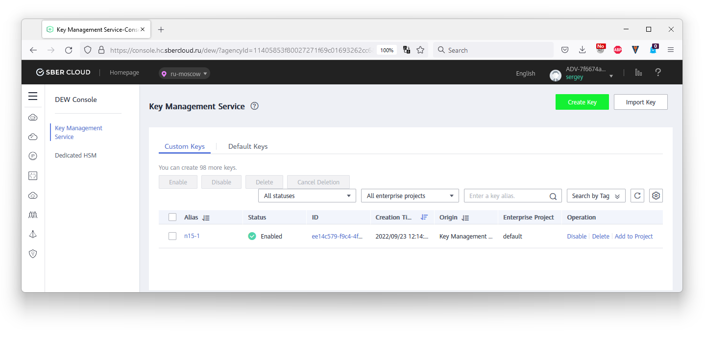
1. Бакеты
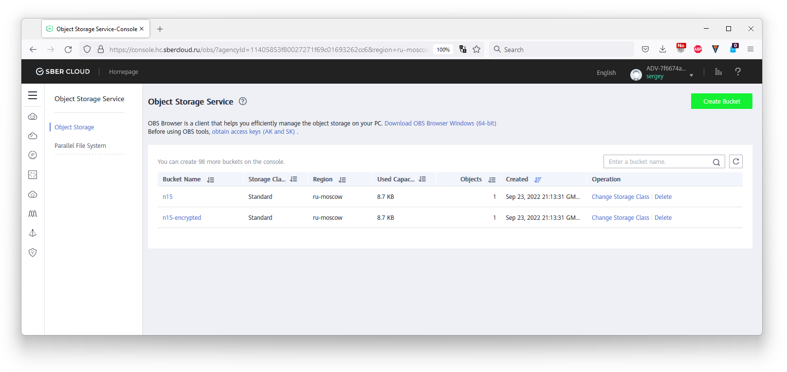
1. Метаданные зашифрованного бакета: в средней колонке видно, что включено шифрование
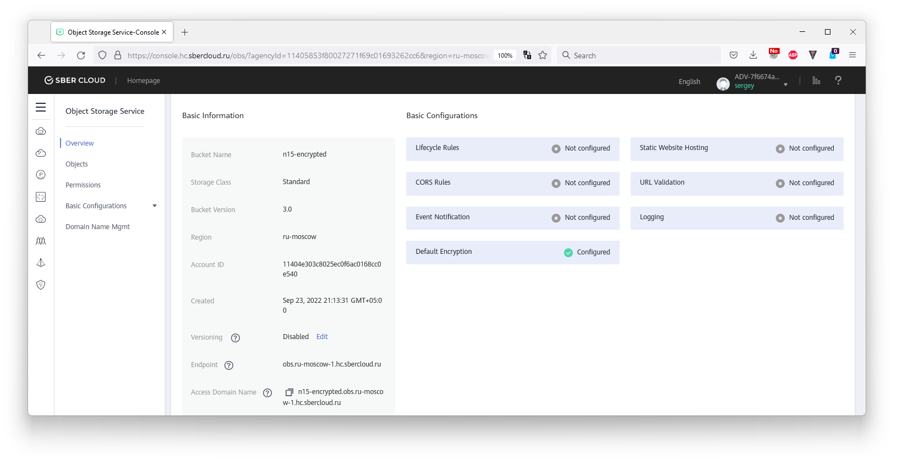
1. Настройки шифрования, выбран ключ `n15-1`
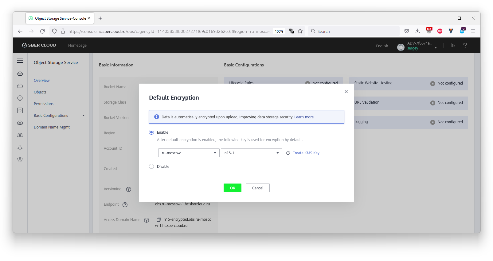

### Настройка SSL сертификата на балансировщике

> 3. *Создание сертификата SSL и применение его к ALB:
> - Создать сертификат с подтверждением по email;
> - Сделать запись в Route53 на собственный поддомен, указав адрес LB;
> - Применить к HTTPS запросам на LB созданный ранее сертификат.
> 
> <details><summary>.</summary>
>
> Resource terraform
> - [IAM Role](https://registry.terraform.io/providers/hashicorp/aws/latest/docs/resources/iam_role)
> - [AWS KMS](https://registry.terraform.io/providers/hashicorp/aws/latest/docs/resources/kms_key)
> - [S3 encrypt with KMS key](https://registry.terraform.io/providers/hashicorp/aws/latest/docs/resources/s3_bucket_object#encrypting-with-kms-key)
> 
> Пример bootstrap-скрипта:
> ```
> #!/bin/bash
> yum install httpd -y
> service httpd start
> chkconfig httpd on
> cd /var/www/html
> echo "<html><h1>My cool web-server</h1></html>" > index.html
> aws s3 mb s3://mysuperbacketname2021
> aws s3 cp index.html s3://mysuperbacketname2021
> ```
>
> </details>

1. Сертификат и домен у меня уже были, добавил в облако `certificate_1`
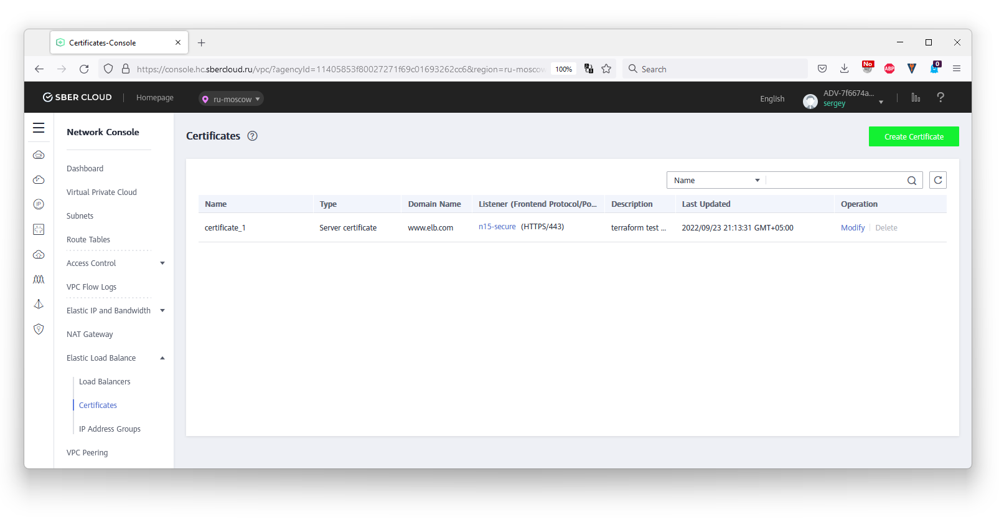
1. Настройки балансировщика, метаданные листнера HTTPS, видно что подключен `certificate_1`
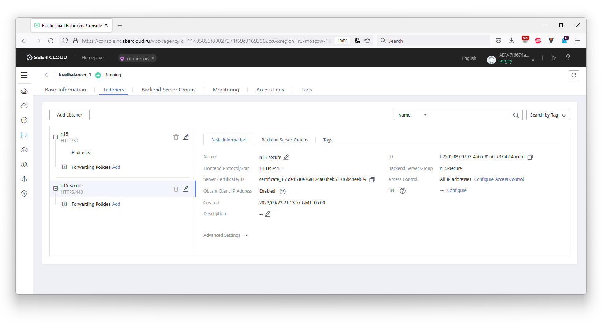
1. Группа бекендов, все доступны по порту 80, т.к. балансировщик терминирует TLS.
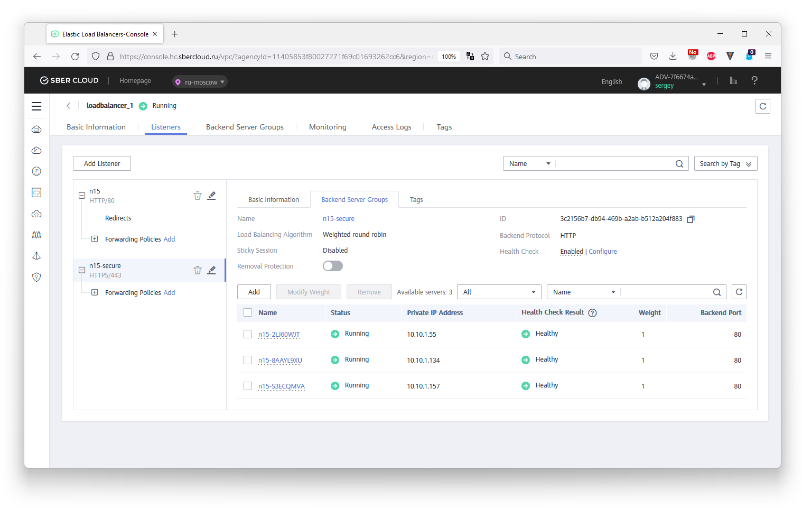
1. Внешний IP. Балансировщик находится на адресе `46.243.201.53`
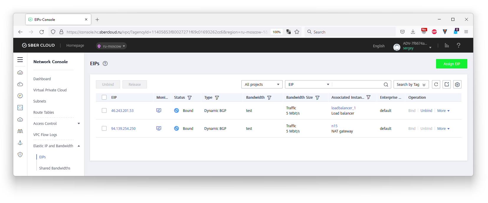
1. Добавил в настройках DNS домена (другой хостер, не Сбер) A-запись для IP балансировщика и дождался, пока обновятся DNS-записи
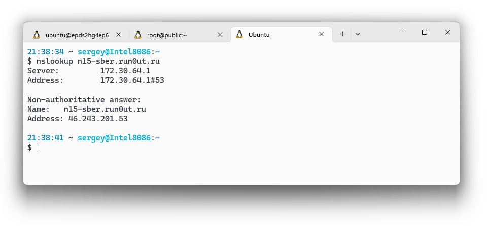
1. Проверяю, что страница открывается и сертификат подгрузился.
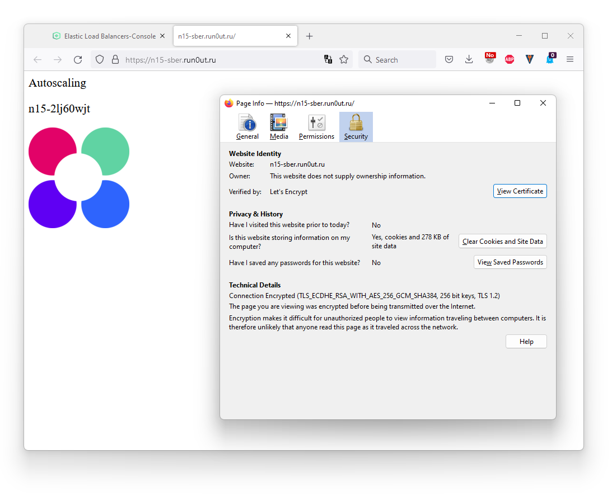