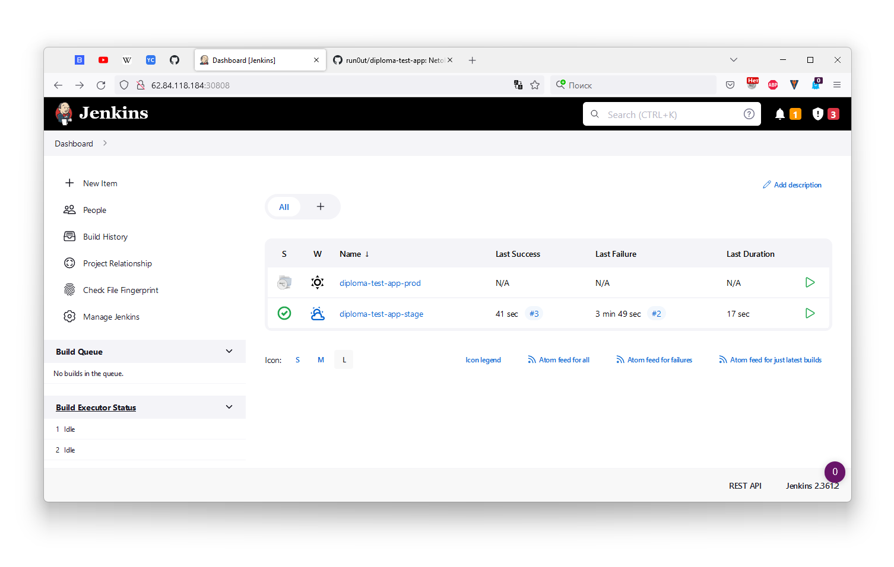
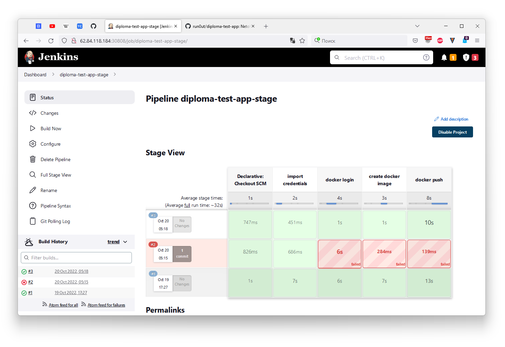

# Дипломный практикум в Yandex.Cloud

>  * [Цели:](#цели)
>  * [Этапы выполнения:](#этапы-выполнения)
>     * [Создание облачной инфраструктуры](#создание-облачной-инфраструктуры)
>     * [Создание Kubernetes кластера](#создание-kubernetes-кластера)
>     * [Создание тестового приложения](#создание-тестового-приложения)
>     * [Подготовка cистемы мониторинга и деплой приложения](#подготовка-cистемы-мониторинга-и-деплой-приложения)
>     * [Установка и настройка CI/CD](#установка-и-настройка-cicd)
>  * [Что необходимо для сдачи задания?](#что-необходимо-для-сдачи-задания)
>  * [Как правильно задавать вопросы дипломному руководителю?](#как-правильно-задавать-вопросы-дипломному-руководителю)

Как правильно задавать вопросы дипломному руководителю?

## Как правильно задавать вопросы дипломному руководителю?

> Что поможет решить большинство частых проблем:
> 
> 1. Попробовать найти ответ сначала самостоятельно в интернете или в материалах курса и ДЗ и только после этого спрашивать у дипломного руководителя. Скилл поиска ответов пригодится вам в профессиональной деятельности.
> 2. Если вопросов больше одного, то присылайте их в виде нумерованного списка. Так дипломному руководителю будет проще отвечать на каждый из них.
> 3. При необходимости прикрепите к вопросу скриншоты и стрелочкой покажите, где не получается.
> 
> Что может стать источником проблем:
> 
> 1. Вопросы вида «Ничего не работает. Не запускается. Всё сломалось». Дипломный руководитель не сможет ответить на такой вопрос без дополнительных уточнений. Цените своё время и время других.
> 2. Откладывание выполнения курсового проекта на последний момент.
> 3. Ожидание моментального ответа на свой вопрос. Дипломные руководители работающие разработчики, которые занимаются, кроме преподавания, своими проектами. Их время ограничено, поэтому постарайтесь задавать правильные вопросы, чтобы получать быстрые ответы :)

---
## Цели

> 1. Подготовить облачную инфраструктуру на базе облачного провайдера Яндекс.Облако.
> 2. Запустить и сконфигурировать Kubernetes кластер.
> 3. Установить и настроить систему мониторинга.
> 4. Настроить и автоматизировать сборку тестового приложения с использованием Docker-контейнеров.
> 5. Настроить CI для автоматической сборки и тестирования.
> 6. Настроить CD для автоматического развёртывания приложения.

---
## Этапы выполнения

### Создание облачной инфраструктуры

Задание

> Для начала необходимо подготовить облачную инфраструктуру в ЯО при помощи [Terraform](https://www.terraform.io/).
> 
> Особенности выполнения:
> 
> - Бюджет купона ограничен, что следует иметь в виду при проектировании инфраструктуры и использовании ресурсов;
> - Следует использовать последнюю стабильную версию [Terraform](https://www.terraform.io/).
> 
> Предварительная подготовка к установке и запуску Kubernetes кластера.
> 
> 1. Создайте сервисный аккаунт, который будет в дальнейшем использоваться Terraform для работы с инфраструктурой с необходимыми и достаточными правами. Не стоит использовать права суперпользователя
> 2. Подготовьте [backend](https://www.terraform.io/docs/language/settings/backends/index.html) для Terraform:  
>    а. Рекомендуемый вариант: [Terraform Cloud](https://app.terraform.io/)  
>    б. Альтернативный вариант: S3 bucket в созданном ЯО аккаунте
> 3. Настройте [workspaces](https://www.terraform.io/docs/language/state/workspaces.html)  
>    а. Рекомендуемый вариант: создайте два workspace: *stage* и *prod*. В случае выбора этого варианта все последующие шаги должны учитывать факт существования нескольких workspace.  
>    б. Альтернативный вариант: используйте один workspace, назвав его *stage*. Пожалуйста, не используйте workspace, создаваемый Terraform-ом по-умолчанию (*default*).
> 4. Создайте VPC с подсетями в разных зонах доступности.
> 5. Убедитесь, что теперь вы можете выполнить команды `terraform destroy` и `terraform apply` без дополнительных ручных действий.
> 6. В случае использования [Terraform Cloud](https://app.terraform.io/) в качестве [backend](https://www.terraform.io/docs/language/settings/backends/index.html) убедитесь, что применение изменений успешно проходит, используя web-интерфейс Terraform cloud.
> 

> Ожидаемые результаты:
> 
> 1. Terraform сконфигурирован и создание инфраструктуры посредством Terraform возможно без дополнительных ручных действий.
> 2. Полученная конфигурация инфраструктуры является предварительной, поэтому в ходе дальнейшего выполнения задания возможны изменения.

- Сеть

    

- ВМ

    

- Atlantis

    

- Pull request

    

    

---
### Создание Kubernetes кластера

Задание

> На этом этапе необходимо создать [Kubernetes](https://kubernetes.io/ru/docs/concepts/overview/what-is-kubernetes/) кластер на базе предварительно созданной инфраструктуры.   Требуется обеспечить доступ к ресурсам из Интернета.
> 
> Это можно сделать двумя способами:
> 
> 1. Рекомендуемый вариант: самостоятельная установка Kubernetes кластера.  
>   а. При помощи Terraform подготовить как минимум 3 виртуальных машины Compute Cloud для создания Kubernetes-кластера. Тип виртуальной машины следует выбрать самостоятельно с учётом требовании к производительности и стоимости. Если в дальнейшем поймете, что необходимо сменить тип инстанса, используйте Terraform для внесения изменений.  
>   б. Подготовить [ansible](https://www.ansible.com/) конфигурации, можно воспользоваться, например [Kubespray](https://kubernetes.io/docs/setup/production-environment/tools/kubespray/)  
>   в. Задеплоить Kubernetes на подготовленные ранее инстансы, в случае нехватки каких-либо ресурсов вы всегда можете создать их при помощи Terraform.
> 2. Альтернативный вариант: воспользуйтесь сервисом [Yandex Managed Service for Kubernetes](https://cloud.yandex.ru/services/managed-kubernetes)  
>   а. С помощью terraform resource для [kubernetes](https://registry.terraform.io/providers/yandex-cloud/yandex/latest/docs/resources/kubernetes_cluster) создать региональный мастер kubernetes с размещением нод в разных 3 подсетях      
>   б. С помощью terraform resource для [kubernetes node group](https://registry.terraform.io/providers/yandex-cloud/yandex/latest/docs/resources/kubernetes_node_group)

> Ожидаемый результат:
> 
> 1. Работоспособный Kubernetes кластер.
> 2. В файле `~/.kube/config` находятся данные для доступа к кластеру.
> 3. Команда `kubectl get pods --all-namespaces` отрабатывает без ошибок.

`config` сохранил в отдельную папку, т.к. их два - для воркспейса `stage` и воркспейса `prod`

- `kubectl` для кластера `prod` с флагом `--all-namespaces`

    

- Сравнение вывода списка подов для неймспейса `default` воркспейсов `prod` и `stage`

    

---
### Создание тестового приложения

Задание

> Для перехода к следующему этапу необходимо подготовить тестовое приложение, эмулирующее основное приложение разрабатываемое вашей компанией.
> 
> Способ подготовки:
> 
> 1. Рекомендуемый вариант:  
>    а. Создайте отдельный git репозиторий с простым nginx конфигом, который будет отдавать статические данные.  
>    б. Подготовьте Dockerfile для создания образа приложения.  
> 2. Альтернативный вариант:  
>    а. Используйте любой другой код, главное, чтобы был самостоятельно создан Dockerfile.

> Ожидаемый результат:
> 1. Git репозиторий с тестовым приложением и Dockerfile.
> 2. Регистр с собранным docker image. В качестве регистра может быть DockerHub или [Yandex Container Registry](https://cloud.yandex.ru/services/container-registry), созданный также с помощью terraform.

---
### Подготовка cистемы мониторинга и деплой приложения

Задание

> Уже должны быть готовы конфигурации для автоматического создания облачной инфраструктуры и поднятия Kubernetes кластера.  
> Теперь необходимо подготовить конфигурационные файлы для настройки нашего Kubernetes кластера.
> 
> Цель:
> 1. Задеплоить в кластер [prometheus](https://prometheus.io/), [grafana](https://grafana.com/), [alertmanager](https://github.com/prometheus/alertmanager), [экспортер](https://github.com/prometheus/node_exporter) основных метрик Kubernetes.
> 2. Задеплоить тестовое приложение, например, [nginx](https://www.nginx.com/) сервер отдающий статическую страницу.
> 
> Рекомендуемый способ выполнения:
> 1. Воспользовать пакетом [kube-prometheus](https://github.com/prometheus-operator/kube-prometheus), который уже включает в себя [Kubernetes оператор](https://operatorhub.io/) для [grafana](https://grafana.com/), [prometheus](https://prometheus.io/), [alertmanager](https://github.com/prometheus/alertmanager) и [node_exporter](https://github.com/prometheus/node_exporter). При желании можете собрать все эти приложения отдельно.
> 2. Для организации конфигурации использовать [qbec](https://qbec.io/), основанный на [jsonnet](https://jsonnet.org/). Обратите внимание на имеющиеся функции для интеграции helm конфигов и [helm charts](https://helm.sh/)
> 3. Если на первом этапе вы не воспользовались [Terraform Cloud](https://app.terraform.io/), то задеплойте в кластер [atlantis](https://www.runatlantis.io/) для отслеживания изменений инфраструктуры.
> 
> Альтернативный вариант:
> 1. Для организации конфигурации можно использовать [helm charts](https://helm.sh/)

> Ожидаемый результат:
> 1. Git репозиторий с конфигурационными файлами для настройки Kubernetes.
> 2. Http доступ к web интерфейсу grafana.
> 3. Дашборды в grafana отображающие состояние Kubernetes кластера.
> 4. Http доступ к тестовому приложению.

- Grafana

    

- Приложение

    

---
### Установка и настройка CI/CD

Задание

> Осталось настроить ci/cd систему для автоматической сборки docker image и деплоя приложения при изменении кода.
> 
> Цель:
> 
> 1. Автоматическая сборка docker образа при коммите в репозиторий с тестовым приложением.
> 2. Автоматический деплой нового docker образа.
> 
> Можно использовать [teamcity](https://www.jetbrains.com/ru-ru/teamcity/), [jenkins](https://www.jenkins.io/) либо [gitlab ci](https://about.gitlab.com/stages-devops-lifecycle/continuous-integration/)
> 
> Ожидаемый результат:
> 
> 1. Интерфейс ci/cd сервиса доступен по http.
> 2. При любом коммите в репозиторие с тестовым приложением происходит сборка и отправка в регистр Docker образа.
> 3. При создании тега (например, v1.0.0) происходит сборка и отправка с соответствующим label в регистр, а также деплой соответствующего Docker образа в кластер Kubernetes.

> Ожидаемый результат:
> 
> 1. Интерфейс ci/cd сервиса доступен по http.
> 2. При любом коммите в репозиторие с тестовым приложением происходит сборка и отправка в регистр Docker образа.
> 3. При создании тега (например, v1.0.0) происходит сборка и отправка с соответствующим label в регистр, а также деплой соответствующего Docker образа в кластер Kubernetes.

- Jenkins

    

- Задание, которое собирает и отправляет latest образ при любом коммите

    

- Задание, которое отслеживает появление новых тегов, собирает образ, отправляет в регистри и разворачивает в Kubernetes

    

---
## Что необходимо для сдачи задания?

> 1. Репозиторий с конфигурационными файлами Terraform и готовность продемонстрировать создание всех ресурсов с нуля.

[Репозиторий](https://github.com/run0ut/diploma-terraform)

> 2. Пример pull request с комментариями созданными atlantis'ом или снимки экрана из Terraform Cloud.

[Pull request](https://github.com/run0ut/diploma-terraform/pull/1)

[Atlantis](http://62.84.118.184:30141/)

> 3. Репозиторий с конфигурацией ansible, если был выбран способ создания Kubernetes кластера при помощи ansible.

Использовал Kubespray, который [разворачиваю терафомом](https://github.com/run0ut/devops-netology/blob/main/06-devops-diplom-yandexcloud/02/01-yandex/40-k8s.tf). Вся конфигурация [из шаблонов](https://github.com/run0ut/devops-netology/blob/c120303a4521b0d13c15ed94e17da13b0664a658/06-devops-diplom-yandexcloud/02/01-yandex/00-prepare.tf#L19-L27), сгенерировал только файлы инвентаризации и [один файл](https://github.com/run0ut/devops-netology/blob/59492fb07a8b8be69b864cc92bd3b06a4e90bb07/06-devops-diplom-yandexcloud/02/01-yandex/kubespray/inventory/diplomacluster/group_vars/k8s_cluster/k8s-cluster.yml#L279) с переменными для доступа в кластер по внешнему IP

[Ссылка на конфигурацию](https://github.com/run0ut/devops-netology/tree/main/06-devops-diplom-yandexcloud/02/01-yandex/kubespray/inventory/diplomacluster)

> 4. Репозиторий с Dockerfile тестового приложения и ссылка на собранный docker image.

[Репозиторий](https://github.com/run0ut/diploma-test-app)

[DockerHub](https://hub.docker.com/repository/docker/runout/diploma-test-app)

> 5. Репозиторий с конфигурацией Kubernetes кластера.

- [Тестовое приложение](https://github.com/run0ut/devops-netology/tree/main/06-devops-diplom-yandexcloud/02/02-app/manifests)
- [Service и NetworkPolicy](https://github.com/run0ut/devops-netology/tree/main/06-devops-diplom-yandexcloud/02/03-monitoring/grafana-nodeport) для доступа к Grafana извне; воспользовался [kube-prometheus](https://github.com/prometheus-operator/kube-prometheus), который [разворачиваю с Teraform](https://github.com/run0ut/devops-netology/blob/main/06-devops-diplom-yandexcloud/02/01-yandex/50-monitoring.tf) 
- [Atlantis](https://github.com/run0ut/devops-netology/tree/main/06-devops-diplom-yandexcloud/02/04-atlantis/manifests)
- [Jenkins](https://github.com/run0ut/devops-netology/tree/main/06-devops-diplom-yandexcloud/02/05-jenkins/manifests); Jenkins разворачивается сразу с заданиями, которые [разворачиваются](https://github.com/run0ut/devops-netology/blob/main/06-devops-diplom-yandexcloud/02/01-yandex/80-jenkins.tf) Тераформом из шаблонов

> 6. Ссылка на тестовое приложение и веб интерфейс Grafana с данными доступа.

- [Приложение](http://62.84.118.184:30080/)
- [Grafana](http://62.84.118.184:30300/login)
    - Логин `admin`
    - Пароль `admin`
- [Jenkins](http://62.84.118.184:30808/)
